# 1 A Tour of Computer Systems

## 目录

-   [英语](#英语)
-   [1.1 Information Is Bits + Context](#11-Information-Is-Bits--Context)
    -   [1.1.1 Source File](#111-Source-File)
-   [1.2 Programs Are Translated by Other Programs into Different Forms](#12-Programs-Are-Translated-by-Other-Programs-into-Different-Forms)
-   [1.3 It Pays to Understand How Compilation Systems Work](#13-It-Pays-to-Understand-How-Compilation-Systems-Work)
    -   [1.3.1 Why do programmers need to understand how compilation systems work？](#131-Why-do-programmers-need-to-understand-how-compilation-systems-work)
-   [1.4 Processors Read and Interpret Instructions Stored in Memory](#14-Processors-Read-and-Interpret-Instructions-Stored-in-Memory)
    -   [1.4.1 Hardware Organization of a System](#141-Hardware-Organization-of-a-System)
        -   [1.4.1.1 Buses](#1411-Buses)
        -   [1.4.1.2 I/O Devices](#1412-IO-Devices)
        -   [1.4.1.3 Main Memory](#1413-Main-Memory)
        -   [1.4.1.4 Processor](#1414-Processor)
    -   [1.4.2 Running the hello Program](#142-Running-the-hello-Program)
-   [1.5 Caches Matter](#15-Caches-Matter)
-   [1.6 Storage Devices Form a Hierarchy](#16-Storage-Devices-Form-a-Hierarchy)
-   [1.7 The Operating System Manages the Hardware](#17-The-Operating-System-Manages-the-Hardware)
    -   [1.7.1 Processes](#171-Processes)
    -   [1.7.2 Threads](#172-Threads)
    -   [1.7.3 Virtual Memory](#173-Virtual-Memory)
    -   [1.7.4 Files](#174-Files)
-   [1.8 Systems Communicate with Other Systems Using Networks](#18-Systems-Communicate-with-Other-Systems-Using-Networks)
-   [1.9 Important Themes](#19-Important-Themes)
    -   [1.9.1 Amdahl's Law](#191-Amdahls-Law)
    -   [1.9.2 Concurrency and Parallelism](#192-Concurrency-and-Parallelism)
        -   [1.9.2.1 Thread-Level Concurrency](#1921-Thread-Level-Concurrency)
        -   [1.9.2.2 Instruction-Level Parallelism](#1922-Instruction-Level-Parallelism)
        -   [1.9.2.3 Single-Instruction, Multiple-Data (SIMD) Parallelism](#1923-Single-Instruction-Multiple-Data-SIMD-Parallelism)
    -   [1.9.3 The Importance of Abstractions in Computer Systems](#193-The-Importance-of-Abstractions-in-Computer-Systems)

# 英语

1.  *craft*手艺、技能
2.  *dedicate*致力于
3.  *exploit*利用
4.  *nasty*令人讨厌的
5.  average普通的、平均的
6.  in concert异口同声地
7.  exclusively唯一地
8.  ratify批准
9.  quirky古怪
10. be referred to 被称为
11. incur发生
12. and scariest of all更可怕的是
13. constitute构成
14. omit忽略
15. an order of magnitude一个数量级
16. exclusive专用的
17. sustain维持
18. *be poised for* 准备
19. *enlighten*启蒙
20. plague危害
21. confound使困惑
22. pitfall陷阱
23. come into play发挥作用
24. approximations近似
25. affectionately亲切地
26. flawed有缺陷的
27. gibberish混乱的
28. perplexing令人费解的
29. back and forth来来回回
30. revolve围绕
31. overhead开销
32. illusion假象
33. advent出现

***

> **计算机系统由硬件和软件组成，硬件和软件协同工作来运行程序**

我们通过追踪下面hello程序的生命周期来完成计算机系统之旅，hello程序的生命周期从程序员创建、运行、打印“hello,world\n”到终止

```verilog
#include <stdio.h>
int main(){
  printf("hello, world\n");
  return 0;
}
```

# 1.1 *Information Is Bits + Context*

hello程序以程序员编写的源文件[^注释1]的形式诞生

### 1.1.1 Source File

源文件是一串值是0或1的二进制序列；每8位二进制组成一个字节，每个字节来表示源文件中的一个采用ASCII编码的字符

目前来说大多数计算机都是使用标准的ASCII编码[^注释2]来用一个字节表示字符，但是随着技术的发展，也逐渐有采用Unicode编码用2个字节来表示更多的字符（包括中文）

需要注意的是换行符'\n'，在源文件的编写过程中的每次回车，都会有一个不可见的换行符[^注释3]存储在源文件的二进制序列中

> 📌像hello源文件这种只由ASCII字符组成的文件称为文本文件，其他文件称为二进制文件

> ✨hello源程序的表示说明了一个很基本的思想：计算机系统中所有的信息（包括磁盘文件、主存中的程序和数据、网络之间传递的数据）都是用二进制表示的。
>
> 同一个二进制序列可以表示整数、浮点数、字符串以及指令等。区分这些二进制意义唯一的方法是结合我们能看到的上下文。
>
> 计算机中的数字是对真值的有限近似值，这个说法对于浮点数尤为易懂

# 1.2 *Programs Are Translated by Other Programs into Different Forms*

> ✨为了运行hello程序，需要使用一系列的程序工具将hello源程序[^注释4]转换为hello可执行文件[^注释5]

在Unix系统中，从源文件到可执行文件的转换是通过编译器驱动程序实现的

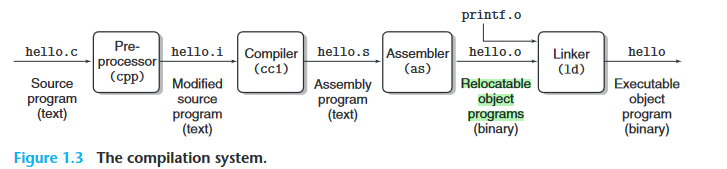

比如可以使用gcc工具来对C语言程序编译链接`gcc -o hello hello.c`，该命令将hello.c源文件编译成hello程序。如上图Figure 1.3所示，该转换过程分为4段：**预处理、编译、汇编、链接**[^注释6]

预处理阶段cpp：使用预处理器程序根据初始的hello.c文件中以“#”开头的指令对hello.c文件进行修改——将“#”所定义的内容直接插入到hello.c文件中。预处理器的结果仍是C语言程序，一般后缀是“.i”

编译阶段cl：使用编译器将预处理后的高级语言程序编译为较低级的汇编语言程序。汇编语言程序的后缀一般是“.s”。汇编语言很有用，因为它为不同高级语言的不同编译器提供了通用的输出语言[^注释7]

汇编阶段as：使用汇编器将汇编程序汇编为可重定位的二进制文件，后缀一般是“.o”

链接阶段ld：将该程序所有涉及到的可重定位的二进制文件（比如一些C链接库函数）均合并组成可执行文件

> ✨高级语言程序均需要转换至机器语言程序，但有的是直接转换，有的是需要转换到汇编语言这个中间层，因此汇编阶段不一定有，但一定有编译链接。

# 1.3 *It Pays to Understand How Compilation Systems Work*

### 1.3.1 Why do programmers need to understand how compilation systems work？

1.  优化程序的性能
2.  理解链接时错误
3.  避免安全漏洞——需要限制从不可信的数据源得到的数据的格式和数量

# 1.4 *Processors Read and Interpret Instructions Stored in Memory*

要运行已经转换好的hello可执行文件，需要使用shell脚本程序

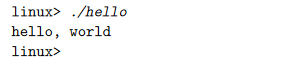

shell 是一个命令行解释器，它会打印提示符，等待用户键入命令行，然后执行命令。如果键入命令行的第一个单词并不是对应于内置的shell命令，那么shell程序会假设该单词是一个可执行文件的名称，然后加载该可执行文件到主存并运行

## 1.4.1 Hardware Organization of a System

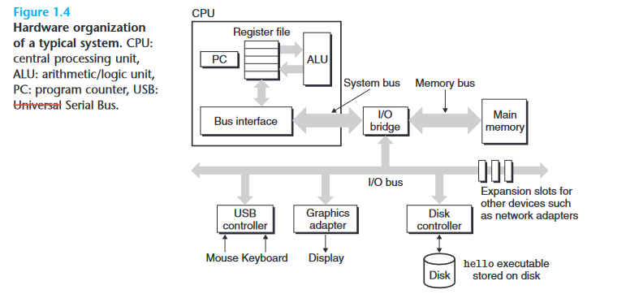

为了理解当运行hello程序时发生了什么，我们需要了解典型系统的硬件组成，如上图Figure 1.4所示

### 1.4.1.1 Buses

贯穿整个系统的是一组称为总线的电子管道，它们在组件之间来回传送字节信息。总线被设计为是传送**固定大小的字节（字）**。

### 1.4.1.2 I/O Devices

I/O设备是系统和外部世界联系的桥梁

每个 I/O 设备通过控制器或适配器连接到 I/O 总线。两者的区别主要在于**包装**上。控制器是设备本身或系统主印刷电路板（通常称为主板）上的芯片组。适配器是插入主板插槽中的卡。

### 1.4.1.3 Main Memory

主存储器是一个临时存储设备，在处理器执行程序时，它保存程序及其操作的数据

物理上来说，主存是许多DRAM芯片的集成；但从逻辑上来说主存是一个线性的字节序列，每一个字节都有唯一对应的一个地址（地址是从0开始）

### 1.4.1.4 Processor

中央处理单元 (CPU)，或简称处理器，是解释（或执行）主存中存储的指令的引擎。CPU中有一个字宽的称作PC的寄存器，任何时候PC都指向（包含着）主存中某个指令的地址

> ✨处理器的指令集结构描述的是每条机器代码指令的效果
>
> 处理器的微体系结构描述的是处理器实际上是怎么实现的

## 1.4.2 Running the hello Program

1.  CPU执行shell程序，等待用户键入shell命令

    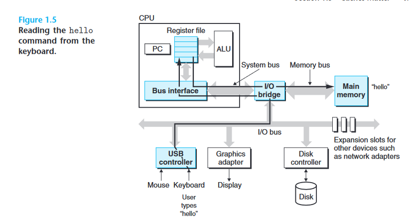

    键盘输入的"hello"会一个一个字符读入USB 控制器，然后经过I/O总线传至CPU内的寄存器再传至主存（load-store架构），寄存器中的字符数据也会输出到Display I/O设备进行显示
    ```mermaid
    stateDiagram-v2
          
      
          键盘键入 --> CPU内寄存器
          CPU内寄存器 --> 主存
          CPU内寄存器 --> Display
    ```
2.  按动回车后，shell程序识别到键入完成且键入的第一个word并不是内置的shell命令，因此CPU控制从Disk中读取hello程序至主存(DMA直接传递)

    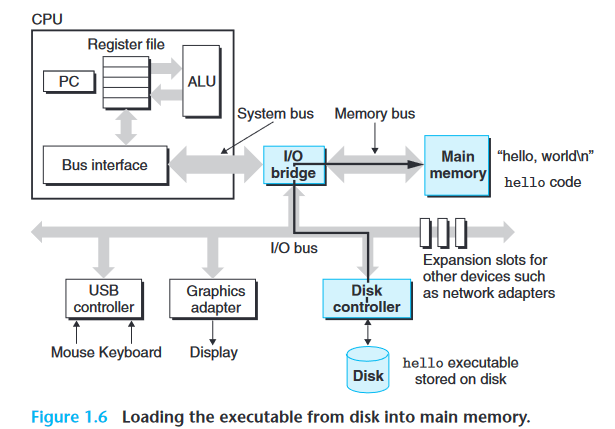
3.  加载至主存完成后，CPU内的PC指向程序入口地址开始执行hello程序，将主存上的"hello,world\n"加载至寄存器并输出至Display上

    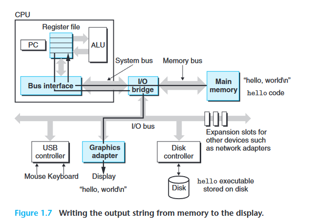

# 1.5 *Caches Matter*

> ✨为了解决处理器与内存之间的差距，系统设计人员利用局部性原理，采用了更小、更快的SRAM存储设备，称为高速缓存（或简称为高速缓存），用作处理器在不久的将来可能需要的信息的临时暂存区域
>
> 一般来说，一级Cache是构建在处理器芯片上的，二级Cache是通过一个特殊的总线和处理器芯片相连

# 1.6 *Storage Devices Form a Hierarchy*

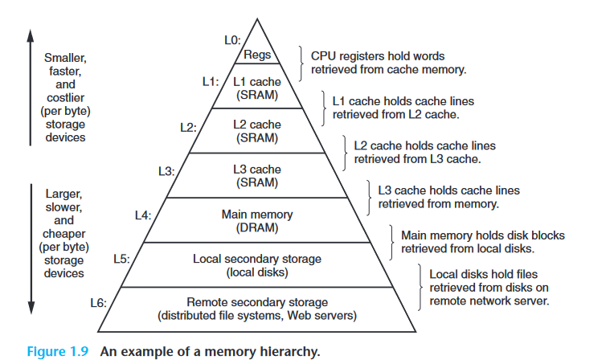

存储层次结构的主要思想是，**某级别的存储充当其下一个较低级别的存储的缓存。**

# 1.7 *The Operating System Manages the Hardware*

> *Back to our hello example. When the shell loaded and ran the hello program, and when the hello program printed its message, neither program accessed the keyboard, display, disk, or main memory directly. Rather, they relied on the services provided by the operating system.*

> ✨可以将操作系统当作软硬件之间的交界面，如下图Figure1.10。应用依赖于操作系统提供的各种服务来使用硬件，应用程序操作硬件的所有尝试也都需要经过操作系统
>
> 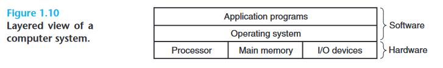

操作系统有两个主要目的：(1) 保护硬件免遭失控应用程序的误用；(2) 为应用程序提供简单且统一的机制来操作复杂且通常差异很大的低级硬件设备

操作系统实现这两个主要目的都是通过三个基本的抽象：进程、文件、虚拟存储 ,如下图

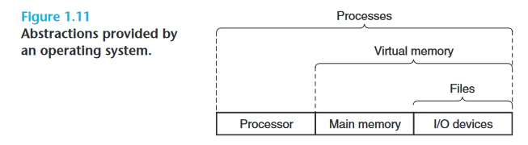

进程→"CPU+主存+I/O"，虚拟存储→"主存+I/O"，文件→"I/O"&#x20;

## 1.7.1 Processes

> 进程可以提供给像hello这样的程序一些假象：
>
> 1.  系统中只有当前程序正在运行
> 2.  程序对处理器、主存和外设有唯一的使用权
> 3.  程序所涉及到的的指令不被打扰地一条一条的在执行
> 4.  程序的代码和数据是主存中唯一的存储对象

多个进程可以在单核CPU系统上宏观同时运行——微观上进程之间交替执行指令，也就是说对于单核CPU而言，一个时刻只能执行一个进程。但是先进的多核CPU可以微观同时执行多个进程，这是通过处理器在进程之间切换使用来实现的。

**处理器在进程之间切换的这种机制称为“****上下文切换****”是通过操作系统实现的**

**上下文即进程运行所需要的全部状态信息**，比如PC值、寄存器文件内容和主存内容。操作系统需要跟踪这些信息来实现上下文的切换。当操作系统决定将控制权从当前进程转移到某个新进程时，它会通过保存当前进程的上下文、恢复新进程的上下文以及将控制权交给新进程。

以hello程序为例，下图展示了hello程序的基本思想：

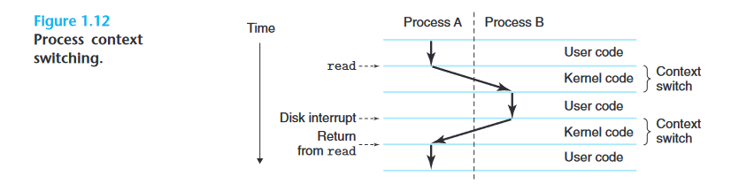

起初shell程序拥有CPU的执行权，等待用户键入命令（每一次键入也涉及到了进程切换请求操作系统的I/O服务）；当键入完成后，shell程序通过一个系统调用，将控制权交给CPU，CPU保存shell的上下文，并将hello程序从disk加载到memory，然后加载hello的上下文，并将控制权交给hello。hello终止后，再通过系统调用操作系统恢复 shell 进程的上下文并将控制权传回给它，等待下一个命令行输入。

系统调用请求的是操作系统内核的服务，**内核是操作系统代码中始终驻留在内存中的部分**。当应用程序需要操作系统执行某些操作（例如读取或写入文件）时，它会执行特殊的系统调用指令，将控制权转移给内核。然后内核执行请求的操作并返回到应用程序。**请注意，内核不是一个单独的进程。相反，它是系统用来管理所有进程的代码和数据结构的集合。**

## 1.7.2 Threads

尽管我们通常认为进程具有单个控制流，但在现代系统中，**进程实际上可以由多个执行单元（称为线程）组成，每个执行单元都在进程的上下文中运行并共享相同的代码和全局数据**

## 1.7.3 Virtual Memory

虚拟内存是一种抽象，它为每个进程提供了它独占使用主存的错觉。**每个进程都有相同的统一主存视图，称为虚拟地址空间。** Linux进程的虚拟存储空间结构如下图Figure1.13所示

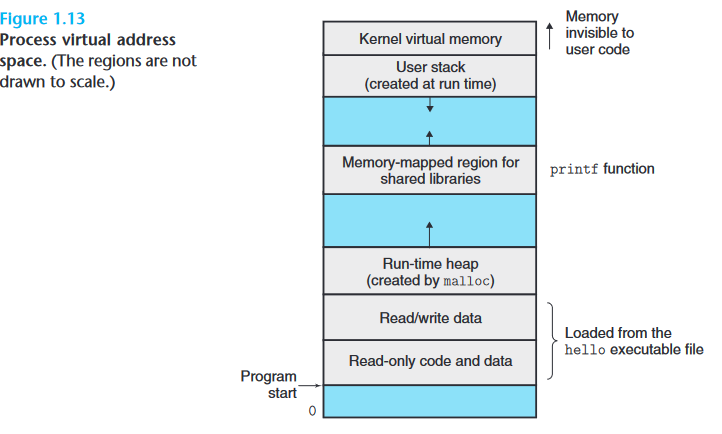

虚拟存储空间的最顶层是操作系统内核代码所驻留的空间，其下面的部分空间[^注释8]是用户虚拟存储空间。从上至下用户虚拟存储空间依次是：栈、链接库、堆、程序的代码和数据

程序的代码和数据：从上至下是可读写数据、代码以及全局数据

堆：向上增加，大小随着malloc、free类似的系统调用而动态收缩

共享链接库：例如C标准库和数学库

栈：向下增加，随着函数调用、返回而动态收缩

## 1.7.4 Files

每个 I/O 设备，包括磁盘、键盘、显示器，甚至网络，都被构建为文件。

文件的抽象为系统中的所有I/O设备提供了一个统一的访问接口——系统中的所有输入和输出都是通过 Unix I/O 系统调用来读取和写入文件执行的

# 1.8 *Systems Communicate with Other Systems Using Networks*

网络这种外设也可以抽象为文件，不同的系统、计算机都可以通过网络来传递信息

# 1.9 *Important Themes*

## 1.9.1 Amdahl's Law

Amdahl's Law的主要思想是当我们加速系统的某一部分时，**对整个系统性能的影响取决于该部分的重要性以及它的加速程度（极限取决于重要性）**。其公式如下：

考虑一个系统，其中执行某些应用程序需要 $T_{old}$时间。假设系统的某些部分需要该时间的一小部分 α，并且我们将这部分性能提高了 k 倍。也就是说，该组件原来需要时间$\alpha T_{old}$，现在需要时间$\frac{\alpha T_{old}}{k}$。因此，总执行时间$T_{new}$为$\begin{aligned} T_{\text {new }} & =(1-\alpha) T_{\text {old }}+\left(\alpha T_{\text {old }}\right) / k
 & =T_{\text {old }}[(1-\alpha)+\alpha / k]\end{aligned}$

则最终的系统加速比S是$S=T_{old}/T_{new}=\frac{1}{(1-\alpha)+\alpha / k}$

假设k趋近于∞，则可以得到加速比的瓶颈是$\frac{1}{1-\alpha}$

## 1.9.2 Concurrency and Parallelism

> ✨并发是指一个同时具有多个活动运行的系统
>
> 并行是指用并发来使一个系统运行得更快

### 1.9.2.1 Thread-Level Concurrency

传统的并发执行只是让一台计算机快速地在其执行进程之间切换来模拟实现的，这种系统称为单处理器系统。而将多个CPU集成到一个电路芯片上的单操作系统——多处理器系统实现了真正意义上的并发

多处理器系统有两种组织形式，如下图所示

多核：多个CPU[^注释9]集成到一个电路芯片上，有多个CPU的完整副本。

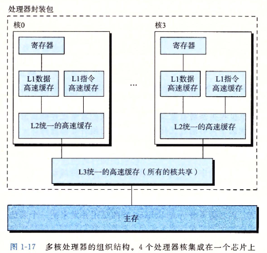

多线程：又称为同时多线程，是一项允许一个CPU执行多个控制流的技术。这种技术使得多个线程拥有CPU某些硬件的等量副本，比如PC和寄存器文件。而其他比如算术逻辑单元功能部件只有一个。

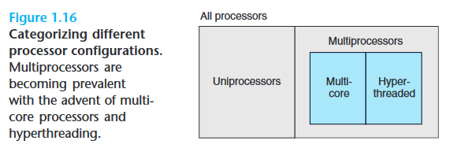

### 1.9.2.2 Instruction-Level Parallelism

在较低的抽象级别上，现代处理器可以同时执行多个指令，这一特性称为指令级并行性

所涉及到的技术有：流水线技术、超标量技术、超长指令字技术

### 1.9.2.3 Single-Instruction, Multiple-Data (SIMD) Parallelism

在最低级别，许多现代处理器都具有特殊硬件，允许单个指令对多个数据并行执行多个操作，这种模式称为单指令多数据 (SIMD) 并行性。一般这种数据是媒体、音频等向量数据

## 1.9.3 *The Importance of Abstractions in Computer Systems*

之前已经介绍了3种抽象：进程、虚拟内存和文件。这里再进行一些补充

对于进程这个层次的抽象是对“处理器、主存和I/O”的抽象，而“主存和I/O”可以抽象为虚拟内存，“处理器”可以抽象为指令集。

此外增加了虚拟机这层抽象，虚拟机是对“操作系统+处理器+主存+I/O”的抽象

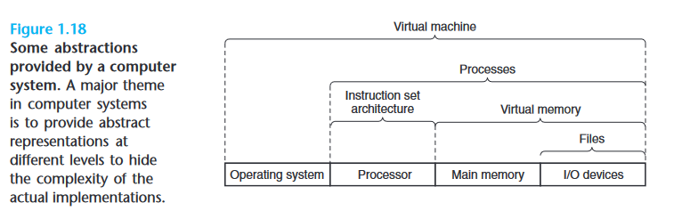

[^注释1]: 这个源文件可以是任何的ASCII文本文件最后只需要使用相对应高级语言的后缀名保存即可

[^注释2]: 需要记住常用的ASCII码
    '\n':10,'a'是97,'A'是65

[^注释3]: ASCII码值是10

[^注释4]: 比较方便程序员理解和阅读的高级语言程序

[^注释5]: 可执行文件封装了机器语言指令序列，以磁盘二进制文件的形式存储

[^注释6]: 这4段一起被称为“编译系统”

[^注释7]: For example, C compilers and Fortran compilers both generate output files in the same assembly language.

[^注释8]: 虚拟存储空间最底部并不对用户开放。用户虚拟空间的范围是“程序开始到内核程序前”

[^注释9]: 这里的CPU也可以是超线程CPU
