# 2 Representing and Manipulating Information

## 目录

-   [英语](#英语)
-   [2.1 Information Storage](#21-Information-Storage)
    -   [2.1.1 Hexadecimal Notation](#211-Hexadecimal-Notation)
    -   [2.1.2 Data Sizes](#212-Data-Sizes)
    -   [2.1.3 Addressing and Byte Ordering](#213-Addressing-and-Byte-Ordering)
    -   [2.1.4 Representing Strings](#214-Representing-Strings)
    -   [2.1.5 Representing Code](#215-Representing-Code)
    -   [2.1.6 Introduction to Boolean Algebra](#216-Introduction-to-Boolean-Algebra)
    -   [2.1.7 Bit-Level Operations in C](#217-Bit-Level-Operations-in-C)
    -   [2.1.8 Logical Operations in C](#218-Logical-Operations-in-C)
    -   [2.1.9 Shift Operations in C](#219-Shift-Operations-in-C)
        -   [2.1.9.1 Left shift](#2191-Left-shift)
        -   [2.1.9.2 Right shift](#2192-Right-shift)
-   [2.2 Integer Representations](#22-Integer-Representations)
    -   [2.2.1 Integral Data Types](#221-Integral-Data-Types)
    -   [2.2.2 Unsigned Encodings](#222-Unsigned-Encodings)
    -   [2.2.3 Two’s-Complement Encodings](#223-Twos-Complement-Encodings)
    -   [2.2.4 Conversions between Signed and Unsigned](#224-Conversions-between-Signed-and-Unsigned)
    -   [2.2.5 Signed versus Unsigned in C](#225-Signed-versus-Unsigned-in-C)
    -   [2.2.6 Expanding the Bit Representation of a Number](#226-Expanding-the-Bit-Representation-of-a-Number)
    -   [2.2.7 Truncating Numbers](#227-Truncating-Numbers)
    -   [2.2.8 Advice on Signed versus Unsigned](#228-Advice-on-Signed-versus-Unsigned)
-   [2.3 Integer Arithmetic](#23-Integer-Arithmetic)
    -   [2.3.1 Unsigned Addition](#231-Unsigned-Addition)
    -   [2.3.2 Two’s-Complement Addition](#232-Twos-Complement-Addition)
    -   [2.3.3 Two’s-Complement Negation](#233-Twos-Complement-Negation)
    -   [2.3.4 Unsigned Multiplication](#234-Unsigned-Multiplication)
    -   [2.3.5 Two’s-Complement Multiplication](#235-Twos-Complement-Multiplication)
    -   [2.3.6 Multiplying by Constants](#236-Multiplying-by-Constants)
    -   [2.3.7 Dividing by Powers of 2](#237-Dividing-by-Powers-of-2)
    -   [2.3.8 Final Thoughts on Integer Arithmetic](#238-Final-Thoughts-on-Integer-Arithmetic)
-   [2.4 Floating Point](#24-Floating-Point)
    -   [2.4.1 Fractional Binary Numbers](#241-Fractional-Binary-Numbers)
    -   [2.4.2 IEEE Floating-Point Representation](#242-IEEE-Floating-Point-Representation)
        -   [2.4.2.1 Normalized Values——most common](#2421-Normalized-Valuesmost-common)
        -   [2.4.2.2 Denormalized Values](#2422-Denormalized-Values)
        -   [2.4.2.3 Special Values](#2423-Special-Values)
    -   [2.4.3 Example Numbers](#243-Example-Numbers)
    -   [2.4.4 Rounding](#244-Rounding)
    -   [2.4.5 Floating-Point Operations](#245-Floating-Point-Operations)
        -   [2.4.5.1 x + ^f y=Round(x+y)](#2451-x--f-yRoundxy)
        -   [2.4.5.2 x \* ^f y=Round(x\*y)](#2452-x--f-yRoundxy)
    -   [2.4.6 Floating Point in C](#246-Floating-Point-in-C)
-   [2.5 Summary](#25-Summary)

> ✨整数的计算机运算满足真正整数运算的许多性质，比如结合律、交换律。
>
> 浮点数的计算机运算由于表示的精度有限，浮点运算是不可结合的
>
> 比如：在大多数机器上，C表达式(3.14+1e20)-1e20求得的值会是0.0，而3.14+(1e20-1e20)求得的值会是3.14。
>
> 造成整数和浮点数具有不同的数学属性的原因是它们处理数字表示有限性的方式不同——整数虽然表示范围小但表示精确，浮点数虽然表示范围大但表示近似

# 英语

1.  conceptual概念性的
2.  subsequent随后的
3.  associate A with B将A和B关联
4.  neither两者都不
5.  verbose冗长的
6.  vagaries变化无常
7.  portable便捷的
8.  vice versa反之亦然
9.  circumvent规避
10. peculiar奇特的
11. finite有限
12. peculiar奇特的
13. nonintuitive不直观的
14. plane平面
15. crafted精雕细琢的
16. incomprehensible晦涩难懂的
17. correlation相关性
18. arbitrary随意的、武断的
19. commutative可交换的
20. monolithic整体式的
21. partition 划分(v)、部分(n)
22. notation表示法
23. convenient方便的
24. tedious繁琐的
25. strive to努力
26. virtually几乎
27. inspect检查
28. formulate制定
29. property属性
30. symmetric对称的
31. asymmetric不对称的
32. sloping倾斜的
33. arbitrary随意的
34. auspices支持
35. by analogy类推
36. systematic系统的
37. scenarios场景
38. monotonicity单调性
39. anticipate预料

# 2.1 *Information Storage*

大多数计算机使用 8 位（字节）作为最小的可寻址内存单元

机器语言程序将内存视为一个非常大的字节数组，称为虚拟内存（逻辑上，实际上是用DRAM芯片实现的）。虚拟内存中的每个字节都唯一由一个数值标识，这个数值称为地址；所有可能的地址的集合称为虚拟地址空间

> C语言中指针的作用：
>
> 指针是 C 的核心功能。它们提供了引用数据结构（包括数组）元素的机制。就像变量一样，指针有两个方面：它的值和它的类型。值指示某个对象的位置，而它的类型指示该位置存储什么类型的对象（例如整数或浮点数）——起始位置开始占多少字节。

## 2.1.1 *Hexadecimal Notation*

因为二进制和十进制描述位信息的缺点[^注释1]，引入了十六进制表示法来描述位信息。下图是二进制、十进制、十六进制相关联的转换表

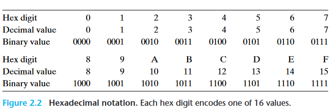

在 C语言 中，以 0x 或 0X 开头的数字常量被解释为十六进制，十六进制中的“A→F”既可以写成大写也可以写成小写。

使用机器级程序的一项常见任务是手动在位模式的十进制、二进制和十六进制表示形式之间进行转换

二进制与十六进制的相互转换：从二进制最低位起往高位发展，每4位二进制转换为一位十六进制（不足4位的二进制补前导零）。从十六进制最低位起往高位发展，每位十六进制可以转换为4位二进制

二进制与十进制之间的相互转换：以二进制小数点为分界线，小数点左边依次对应位值乘以2的对应位次幂(0、1、2、3……)结果相加；小数点右边依次对应位值乘以2的对应位次幂(-1、-2、-3……)结果相加。以十进制小数点为分界线，小数点左侧整数部分除2倒取余，小数点右侧乘2正取整。

> ✨当x是2的n次幂，n=4i+j，则x的十六进制为(j=0→1,j=1→2,j=2→4,j=3→8)然后加i个0

十进制与十六进制的相互转换：用二进制做媒介或者除16倒取余、乘16正取整。

## 2.1.2 Data Sizes

每台计算机都有一个字大小，指示指针数据的标称大小。指针数据的标称大小是指一个指针变量在内存中所占用的字节数，不与指针变量的类型有关，指针变量的类型只决定指针指向的数据占内存多少字节。

而由于虚拟地址正是以这样一个字编码的，所以字长决定的最重要的系统参数是虚拟地址空间的最大大小——假设字长w位，那么虚拟地址空间的范围是$0\dots2^{w}-1$，程序最多可以访问$2^w$个字节

大多数64位机器也可以运行为32位机器编译的程序，这是一种向后兼容。因此，举例来说，当程序prog.c用`gcc -m32 prog.c`伪指令编译后，该prog程序既可以在32位机器也可在64位机器上运行；而若使用`gcc -m64 prog.c`伪指令编译后，该prog程序只能在64位机器上运行——**因此区分32位程序和64位程序主要是看该程序是如何编译的而不是其运行在什么机器类型上**

计算机和编译器支持多种不同方式编码的数字格式，如不同长度的整数和浮点数。下面是C语言中支持的各种数据类型以及其字节长度：

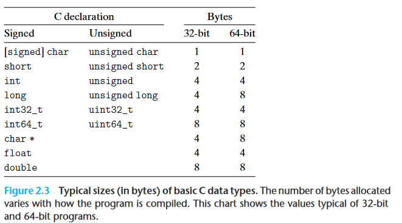

有些数据类型的确切字节数取决于该程序是如何被编译的——32位or64位

注意int32\_t、int64\_t

补充：C语言对类型声明的关键字顺序和省略可选int来说允许存在多种形式，比如

unsigned long、unsigned long int、long unsigned、long unsigned int均表示一个意思

> ✨使用固定大小的整数类型是程序员准确控制数据表示的最佳途径——为了避免由于依赖典型大小和不同编译器设置带来的数据类型大小的变化无常，ISO C99使用了一种大小固定，不随编译器和机器设置变化的数据类型，其中就有int32\_t,int64\_t

**大多数数据类型都采用有符号值进行编码**，除非以关键字 unsigned 为前缀或使用固定大小数据类型的特定无符号声明[^注释2]。但是**char是一个例外**，虽然大多数编译器和机器将char对待为有符号数据，但是标准C并不保证一定会这么对待。一般来说如上图中的标准C声明所示，**将char声明为signed char确保其按照一字节有符号数编码**——幸运的是一般程序对char有无符号并不敏感

> **C语言标准对不同数据类型的数字范围设置了下界，但是却没有上界**

## 2.1.3 *Addressing and Byte Ordering*

对于跨越多个字节的程序对象，我们必须建立两个约定：**对象的地址是什么，以及我们如何对内存中的字节进行排序。**

1.  多字节对象的地址是什么？

    实际上，在所有机器中，多字节对象都存储为连续的字节序列，**对象的地址由所使用字节的****最小地址****给出。**
    > *For example, suppose a variable x of type int has address 0x100; that is, the value of the address expression \&x is 0x100. Then (assuming data type int has a 32-bit representation) the 4 bytes of x would be stored in memory locations 0x100, 0x101, 0x102, and 0x103.*
2.  内存中字节数据是怎么放置的——大小端

    大端法：数据的高位放置在内存的低位，数据的低位放置在内存的高位

    小端法：数据的高位放置在内存的高位，数据的低位放置在内存的低位

    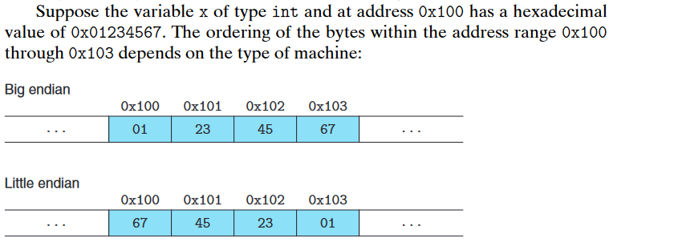
    > **大多数Intel兼容机均使用小端模式，大多数IBM、Oracle使用的是大端模式**
    > ✨目前许多比较新的微处理器是双端法(bi-endian)，可以把它们配置成大端或者小端的机器运行。但是实际情况是，一旦选择了操作系统那么字节的顺序也就固定了下来——比如ARM是采用双端法，但是其上最常见的两种操作系统Android、IOS均只支持小端
    > 大多数情况不需要考虑字节顺序均可以得到相同的结果，但是有时候字节顺序会成为问题：
    1.  不同机器之间通过网络传递二进制信息

        常见的问题是：大端发送的数据在小端接收、小端发送的数据在大端接收

        正确的做法是：发送端发送的数据先将内部的数据顺序转换为网络标准，接收端再将网络标准转换为内部的数据顺序
    2.  查看表示整数数据的字节序列

        当检查机器级程序代码时，可能会涉及到查看表示整数数据的字节序列，如下所示：

        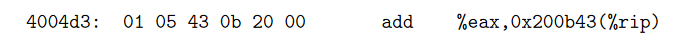

        在4004d3地址处的“01 05 43 0b 20 00 低到高”指令，经过反汇编工具得到该机器指令表示的意义是“x86指令 add %eax,0x200b43(%rip)”，指令的含义是采用相对寄存器寻址方式，将内存地址(%rip+0x200b43)上的值与%eax寄存器值相加写回%eax，而这里如果采用小端，那么是%rip+0x00200b43，如果采用大端那么是%rip+0x430b2000
    3.  程序规避正常系统的类型

        在C语言中，这种操作可以通过强制类型转换cast和联合union来实现

        **使用这种方法可以判断当前的机器是小端还是大端**
        ```c
        #include "stdio.h"
        union {
            char c;
            int b
        }example;
        int main(){
            int a=0x0128;//0x0 0 0 8
            printf("%x\n",*((char *)&a));
            example.b=0x1234;
            printf("%x",example.c);
        }
        ```

## 2.1.4 *Representing Strings*

**C 中的字符串由以空字符'\0'（ASCII值为 0）结尾的字符数组编码。** 也正因为采用ASCII编码的字符只占一个字节，不需要考虑字节顺序。所以任何只要使用ASCII作为其字符编码的系统对于同样一个采用ASCII编码的文本文件都可以得到同样的结果——T*ext data are more platform independent than binary data.*

## 2.1.5 *Representing Code*

以下面的sum C子程序为例，可以看到指令编码是不同的

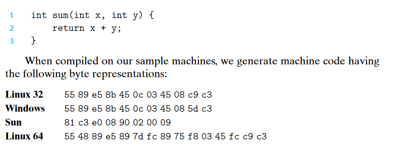

即使是同样的程序，运行在不同的机器类型/操作系统上也使用不同的且不兼容的指令和编码方式——二进制代码是不兼容的

> ✨计算机系统的一个基本概念是，**从机器的角度来看，程序只是一个字节序列**。机器没有关于原始源程序的信息，除了一些为了帮助调试而维护的辅助表之外。

## 2.1.6 *Introduction to Boolean Algebra*

> *Since binary values are at the core of how computers encode, store, and manipulate information, a rich body of mathematical knowledge has evolved around the study of the values 0 and 1*

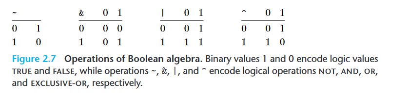

也可以将上述的按位运算拓展到位向量的运算，原理仍是向量对应位按位运算

位向量的一个很有用的应用是表示有限集合。我们可以用位向量 $ \left[a_{w-1}, \cdots, a_{1}, a_{0}\right]  $编码任何子集$A \subseteq\{0,1, \cdots, w-1\}, 其中 a_{i}=1 当且仅当 i \in A 。$此时|运算为两集合的并、&运算为两集合的交

## 2.1.7 *Bit-Level Operations in C*

之前提到的"|、&、\~、^"均可用到C语言的任何整数类型上，一般是将整数值转换为二进制来执行对应的布尔运算，最后再将二进制结果转变为十六进制，如下所示：

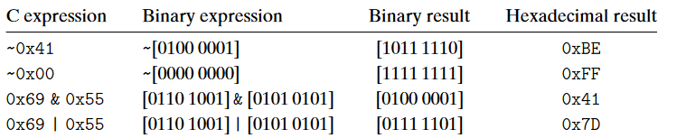

使用异或运算，我们可以实现一种更具有空间优势（不需要第三个中间变量来暂存值）的交换两个变量值的技术：

```c
void swap(int *x,int *y){
    *y=*x^*y;
    *x=*x^*y;
    *y=*x^*y;
}

```

其执行过程如下表所示（a^a=0,0^a=a)：

| Step    | \*x | \*y |
| ------- | --- | --- |
| Initial | a   | b   |
| Step1   | a   | a^b |
| Step2   | b   | a^b |
| Step3   | b   | b   |

位级操作的一个常见用途是实现掩码操作，其中掩码是指示字内选定的一组位的位模式。例如，掩码0xFF是选中一个字的最低8位。考虑到可移植性，一般使用\~0来生成位全1的字掩码，而不是使用32位的0xffffffff

## 2.1.8\* Logical Operations in C\*

C 还提供了一组逻辑运算符 ||、&& 和 !，分别对应于逻辑的 or、and 和 not 操作。逻辑运算的操作和位操作截然不同：1. 逻辑操作对待任何非0数据为True，对待0为False。下面是一些逻辑表达式的例子：

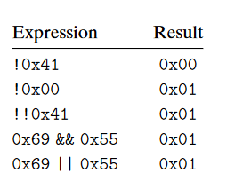

仅在运算数据为0或1时，位运算和逻辑运算结果等价

1.  逻辑运算的&&当第一个数据为0时，就不再计算第二个数据；||当第一个数据为1时，就不再计算第二个数据

> ✨x==y等价于!(x^y)

## 2.1.9 *Shift Operations in C*

C 还提供了一组移位操作，用于将位模式左移和右移

### 2.1.9.1 Left shift

对于位表示形式为$\left[x_{w-1}, x_{w-2}, \ldots, x_{0}\right]$的操作数x，x<\<k表示$\left[x_{w-k-1}, x_{w-k-2}, \ldots, x_{0},0,\dots,0]\right.$即x的二进制序列左移k位，低位补0，丢失k位高位有效值

移位操作是从左往右结合的，所以x<\<j<\<k等价于(x<\<j)<\<k

### 2.1.9.2 Right shift

右移操作较左移有微妙的差别，可以分为两种右移操作：

逻辑右移：同左移的处理不足位机制，x>>k表示将x的二进制序列右移k位，不足的高位补0，丢失k位低位

算术右移：不足的高位根据原来操作数的符号决定补0还是1

移位示例如下所示：

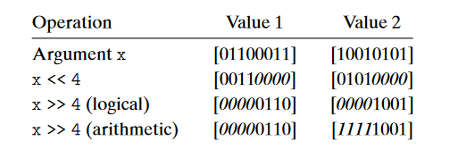

> ✨C 标准没有精确定义哪种类型的右移应与有符号数一起使用——可以使用算术移位或逻辑移位[^注释3]。然而，在实践中，几乎所有编译器/机器组合都对**有符号数据使用算术右移**，并且许多程序员认为情况就是如此。另一方面，对于**无符号数据，右移必须是逻辑的。**

> ✨若k很大时移动k位，C语言很小心的规避了这种情况，实际上的位移量是k%w(w为数据宽度)。但是这种移位法C语言并不保证，因此应该保证位移量小于数据位宽。但Java是特别要求按照k%w移位的
>
> 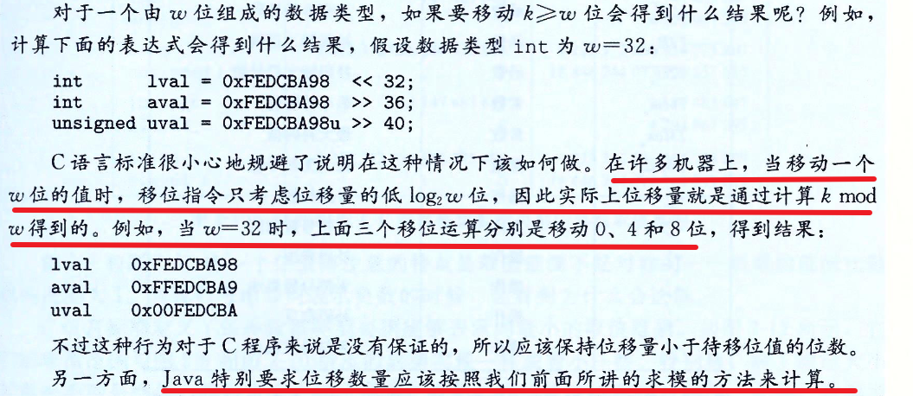

# 2.2 *Integer Representations*

下图列出了引入的数学术语，用于精确定义和描述计算机如何对整数数据进行编码和操作。

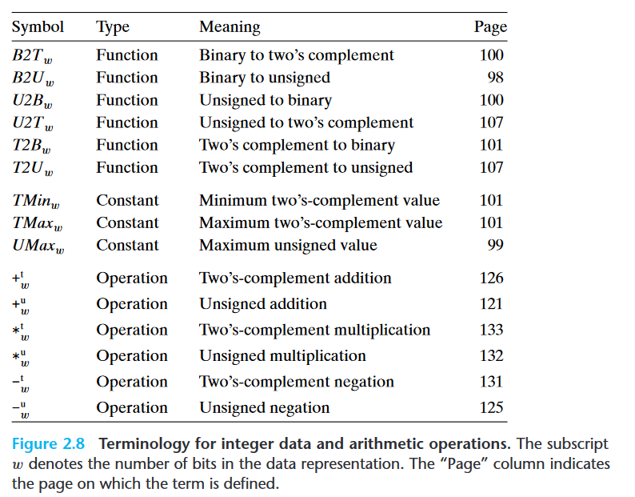

## 2.2.1 *Integral Data Types*

C提供了大量的整数类型[^注释4]来表示有限范围内的整数，下面Figure2.9和Figure2.10介绍了32位和64位程序中这些整数类型（除char外默认有符号）的取值范围：

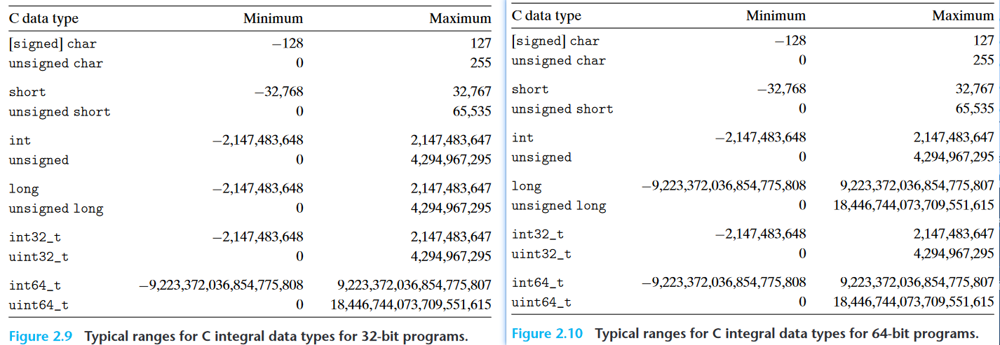

从上面两张图中可以得到：

1.  唯一和运行程序相关的取值范围的数据类型是long——64位程序采取8字节表示long，而32位程序采用4字节；
2.  表示范围不对称，对于无符号而言，最小值为0，最大值为$2^{位数}-1$；对于有符号而言，最小值是$-2^{位数-1}$，最大值是$2^{位数-1}-1$

> ✨C语言定义了每种数据类型所必须能表示的最小的数据范围。如下图Figure2.11所示
>
> 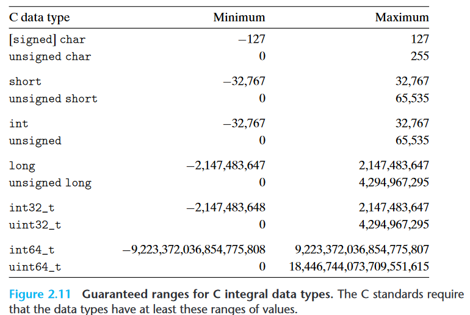
>
> 可以得到：
>
> 1.  除了固定范围的数据类型(int32\_t、int64\_t)外，其他的数据类型的有符号表示范围是对称的
> 2.  int只用两个字节，long是4字节

> ✨C和C++都支持有符号数(默认)和无符号数，但是Java只支持有符号数

## 2.2.2 *Unsigned Encodings*

> *Let us consider an integer data type of w bits. We write a bit vector as either *$\vec{x}$*,to denote the entire vector, or as*$\left[x_{w-1}, x_{w-2}, \ldots, x_{0}\right]$*to denote the individual bits within the vector. **Treating *$\vec{x}$* as a number written in binary notation, we obtain the unsigned interpretation of  x.** In this encoding, each bit*$x_i$\*has value 0 or 1, with the latter case \**indicating that value 2i should be included as part of the numeric value.*

那么可以得到$B2U_w$函数的定义[^注释5]：

$$
B2U_w(\vec{x})\doteq\sum _{i=0} ^{w-1} {x_i\times 2^i}
$$

则根据函数的定义可以得到w位二进制所能表示的无符号数的最小值是0，最大值是$\sum _{i=0} ^{w-1} 2^i=2^w-1$

> ✨无符号数表示的一个重要特性：对于0\~$2^w-1$范围内的任何一个数，均有唯一的一个w位二进制编码与之对应——$B2U_w$是一个双射bijection
>
> 证明：
>
> 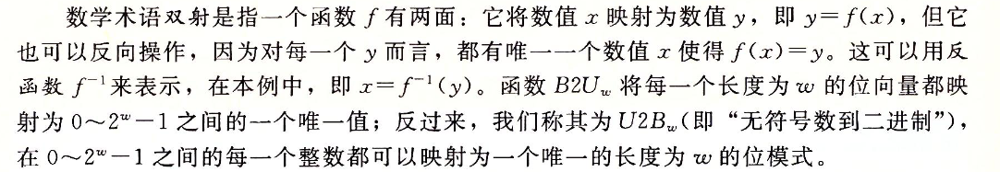

## 2.2.3 *Two’s-Complement Encodings*

二进制补码是将一个二进制序列的MSB作为符号位：1为负，0为正。我们可以得到$B2T_w$的定义如下：

$$
B 2 T_{w}(\vec{x}) \doteq-x_{w-1} 2^{w-1}+\sum_{i=0}^{w-2} x_{i} 2^{i}
$$

从而可以根据函数定义求出w位二进制补码所能表示的范围：

最大：符号位为0，数值位全1——$2^{w-1}-1$
最小：符号位为1，数值位全0——$-2^{w-1}$

> ✨同无符号编码的唯一性，二进制补码也具有唯一性：每一个二进制对应唯一的一个表示范围内的十进制数，而每一个表示范围内的十进制数都有唯一一个二进制对应
>
> 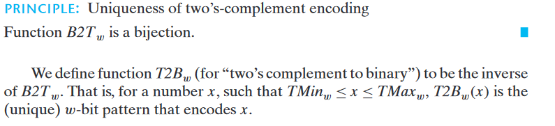

> 🍋  1.  造成二进制补码不对称的原因——一半的位模式(符号位为1的位模式)表示负数，而另一半用来表示非负数，包括了0，所以导致正数少了一个
>
> 1.  最大的无符号数值等于补码最大值的两倍+1

> 🍉C语言标准并未要求必须用二进制补码表示有符号数[^注释6]，但是几乎所有机器都是这么做的。程序员如果希望代码具有最大可移植性，能够在所有可能的机器上运行，那么除了图2-11[🖼️ 图片](image/image_DZUSF_Ow-Z.png "🖼️ 图片")所示的那些范围之外，我们不应该假设任何可表示的数值范围，也不应该假设有符号数会使用何种特殊的表示方式。另一方面，许多程序的书写都假设用补码来表示有符号数，并且具有图2-9和图2-10所示的“典型的”取值范围[🖼️ 图片](image/image_R0RWysq0a5.png "🖼️ 图片")，这些程序也能够在大量的机器和编译器上移植。
>
> C库中的文件\<lmits.h>定义了一组常量，来限定编译器运行的这台机器的不同整型数据类型的取值范围。比如，它定义了常量INT MAX、INT MIN和UINT MAX,它们描述了有符号和无符号整数的范围。

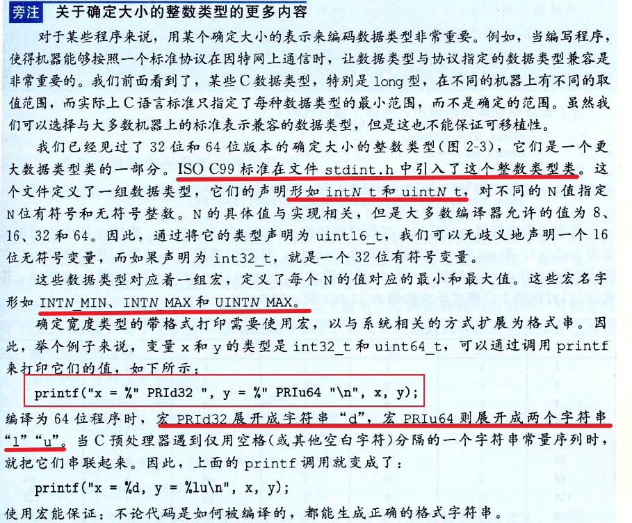

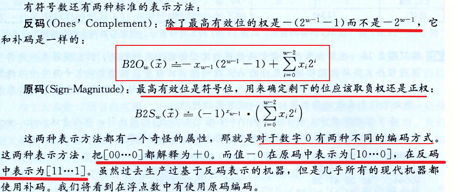

## 2.2.4 *Conversions between Signed and Unsigned*

**C语言允许不同数据类型之间的强制转换。大多数C语言的强制转换实现是基于位级的，而不是数级——即不改变位序列，而是改变位序列的解释方式**

对于同样一个w位序列，如果采用补码解析的十进制数为x是负数，采用无符号解析的十进制数为y，则有$|x|+y=2^w$。x是正数则$x=y$

定义$T2U_w$如下[^注释7]：

$$
对满足 \operatorname{TMin}_{w} \leqslant x \leqslant T \operatorname{Ta} x_{w} 的 x 有:\\\\T 2 U_{w}(x)=\left\{\begin{array}{ll}\\x+2^{w}, & x<0 \\\\x, & x \geqslant 0\\\end{array}\right.
$$

定义$ U2T_w
  $如下[^注释8]：

$$
对满足 0 \leqslant u \leqslant U M a x_{w} 的 u 有:\\\\U 2 T_{w}(u)=\left\{\begin{array}{ll}\\u, & u \leqslant \operatorname{TMax}_{w} \\\\u-2^{w}, & u>\operatorname{TMax}_{w}\\\end{array}\right.
$$

差不多可以理解成一个环形：

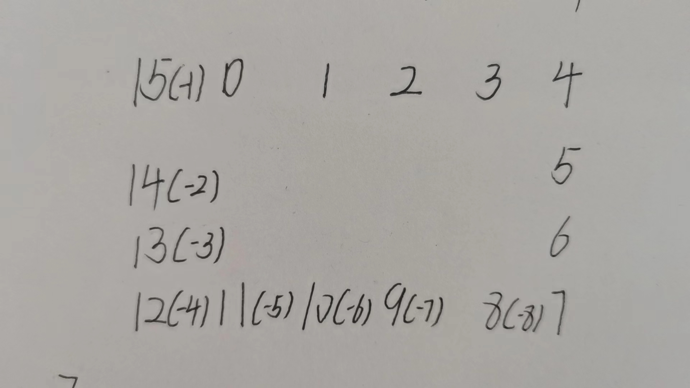

## 2.2.5 *Signed versus Unsigned in C*

**在C语言中，声明任何数字常量都默认是有符号的；通过在数字后加后缀“u”或者“U”来声明无符号数字常量**

C 允许无符号和有符号之间的转换。**尽管 C 标准没有准确指定如何进行这种转换，但大多数系统都遵循底层位表示不改变，而改变位解析方法的规则**

C语言中的类型转换发生在：

1.  显式强制转换 (type)
2.  隐式强制转换
3.  printf声明格式符，会按照指定的格式符来解析位序列

> 🍉C 标准对有符号数和无符号数组合的表达式的处理，可能会出现一些不直观的行为——比如当执行一个操作时，一个操作数有符号，另一个操作数无符号，C会默认将有符号数强制转为无符号数再执行该操作——**这种操作方式会使得对于>、<、=的判断出现问题**
>
> 下图是这种不直观行为的一些例子：
>
> 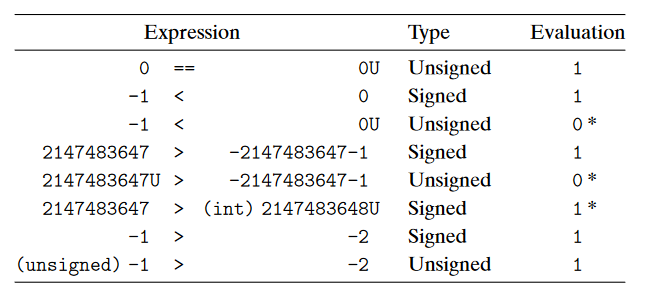
>
> > 为什么将$TMin_{32}$写为-2147483647-1
> >
> > 在C头文件\<limits.h>中就将INT\_MIN定义为-INT\_MAX - 1。原因是补码的不对称性以及C语言的转换规则之间的奇怪的交互迫使进行这样的表示
> >
> > 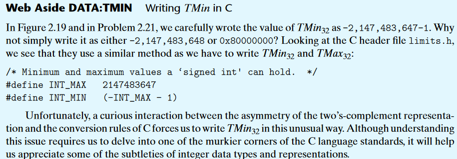

## 2.2.6\* Expanding the Bit Representation of a Number\*

扩展一个数字的位表示的方法主要有两种：零扩展和符号扩展

无符号数进行零扩展，规则如下：

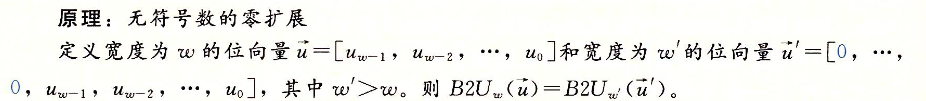

有符号数进行符号扩展，规则如下：

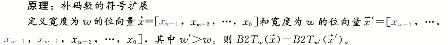

对于符号扩展保持了补码值的证明可以从证明原来的MSB表示的$-x_{w-1}2^{w-1}$等于扩展后的$-x_{w-1}2^{w-1+k}+\sum _{i=w-1} ^{w-1+k-1} x_i 2^i$

> 🍉一个比较重要的点是：先进行有无符号的转换还是先进行位扩展
>
> 如下面的程序允运行结果所示：
>
> 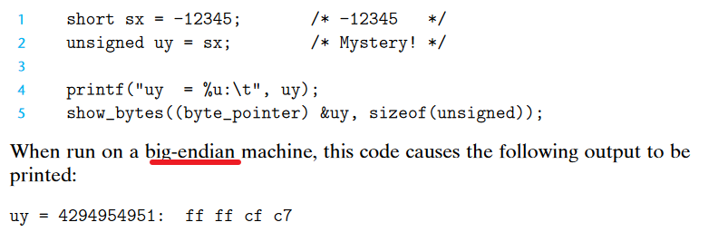
>
> **C语言标准要求先进行位扩展再进行符号转换**
>
> -12345位扩展为ff ff cf c7，再转符号就是：4294954951
> 若先进行符号转换-12345→53191，然后无符号数位扩展补0→53191

## 2.2.7 *Truncating Numbers*

位扩展是小的数据类型→大的数据类型，而截断是大的数据类型→小的数据类型

**无符号数的截断规则如下——直接舍去多余的高位**

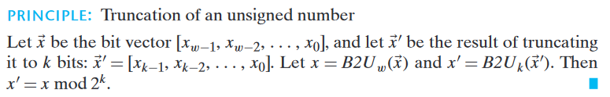

**补码的截断规则如下——舍去多余的高位，然后剩下的位序列转补码**

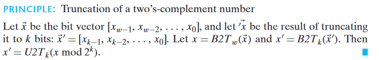

## 2.2.8 *Advice on Signed versus Unsigned*

C语言中对于有符号数和无符号数的建议主要是在之前提到的“C语言对同时含有无符号数有符号数的默认隐式转换”上，如下面的练习：

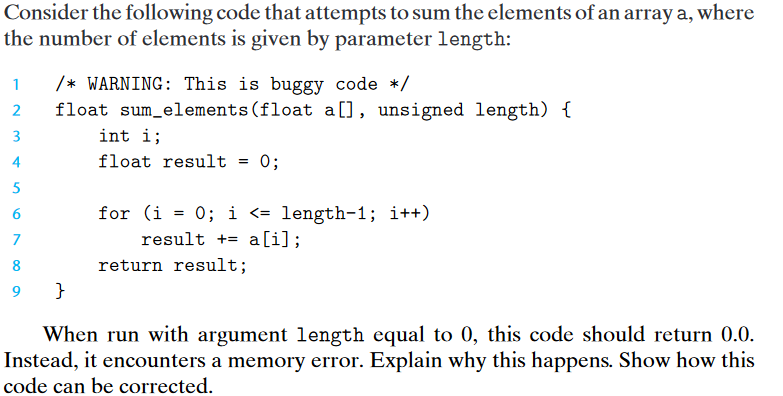

length采用的是无符号类型，因此length-1会默认的结果是无符号，当length≥1时结果正常，但是当length=0时，该结果是UINT\_MAX，造成了内存溢出。可以将length改为int或者判断i\<length

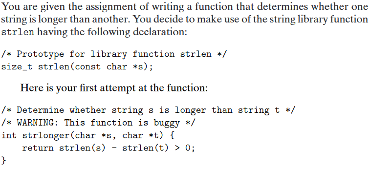

因为strlen的返回值size\_t类型为无符号类型，所以其相加的结果也默认为无符号类型，结果是一定≥0的。可以比较strlen(s)>strlen(t)

> 🍉为了杜绝上面两种情况，一个方法是从不使用无符号数
>
> 事实上很少有像C语言一样支持无符号数据类型，比如Java[^注释9]——认为无符号数带来的麻烦远超过能带来的价值[^注释10]

# 2.3 *Integer Arithmetic*

## 2.3.1 *Unsigned Addition*

两个w位的非负数x、y相加，其值结果应该是w+1位，即

$$
0 \leq x, y<2^{w}则0\leq x+y\leq2^{w+1}-2
$$

这样增加的"w+1"结果位形式称之为“**字长膨胀**”，意味着**要想完整的表示算术运算的结果，我们不能对字长做任何限制**——一些编程语言，例如 Lisp，实际上支持任意大小的算术，以允许任何大小的整数（当然，在计算机的内存限制内）。更常见的是，编程语言支持固定大小的算术，因此诸如“加法”之类的操作”和“乘法”与它们在整数上的对应运算不同[^注释11]。

那么可以定义二进制的无符号加法如下：

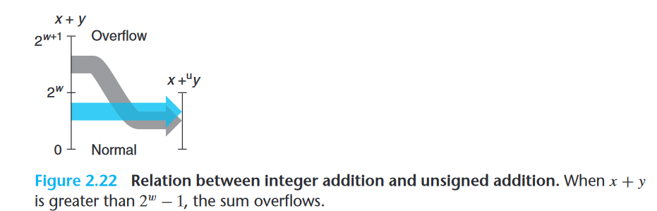

$$
x+{ }_{w}^{\mathrm{u}} y=\left\{\begin{array}{ll}x+y, & x+y<2^{w} \quad \text { Normal } \\x+y-2^{w}, & 2^{w} \leq x+y<2^{w+1} \quad \text { Overflow }\\\end{array}\right.
$$

这里**对溢出的定义是：当完整整数结果超出了数据类型所能表示的范围时**。在C语言中溢出并不被表示为Errors。但是有时我们需要检测是否发生了溢出：

检测规则：**对于任意x，y，x和y满足**$0 \leq x, y \leq U M a x_{w}$**，对x、y进行无符号加法求和，即**$s=x+{ }_{w}^{\mathrm{u}} y$**。那么发生溢出当且仅当s\<x或s\<y**

证明：从无符号加法的公式入手

无符号数求反的公式如下：

$$
-_{w}^{\mathrm{u}} x=\left\{\begin{array}{ll}x, & x=0 \\ 2^{w}-x, & x>0\end{array}\right.，0\leq x \leq 2^w
$$

## 2.3.2 *Two’s-Complement Addition*

给定二进制补码表示的w位二进制数x、y，x和y满足$-2^{w-1} \leq x, y \leq 2^{w-1}-1$，则x+y需要满足$-2^{w} \leq x+y \leq 2^{w}-2$，潜在也存在字长膨胀的现象。因此**截断后w位并按照二进制补码解析**。则二进制补码加法$x+{ }_{w}^{\mathrm{t}} y$[^注释12]可以定义为：

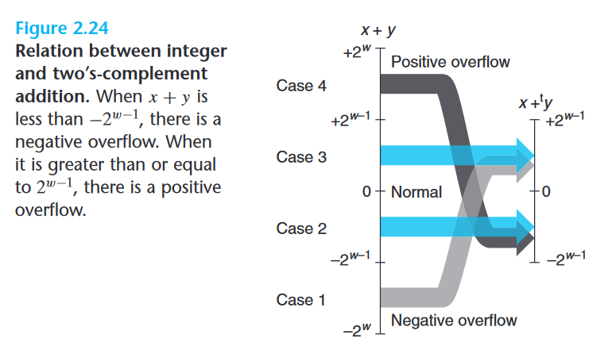

$$
x+_{w}^{\mathrm{t}} y=\left\{\begin{array}{ll}x+y-2^{w}, & 2^{w-1} \leq x+y \quad \text { Positive overflow } \\ x+y, & -2^{w-1} \leq x+y<2^{w-1} \quad \text { Normal } \\ x+y+2^{w}, & x+y<-2^{w-1} \quad \text { Negative overflow }\end{array}\right.
$$

> 🍉无符号加法和二进制加法有同样的位级表示
>
> > *The w-bit two’s-complement sum of two numbers has the exact same bit-level representation as the unsigned sum. In fact, most computers use the same machine instruction to perform either unsigned or signed addition.*
>
> 证明：
>
> 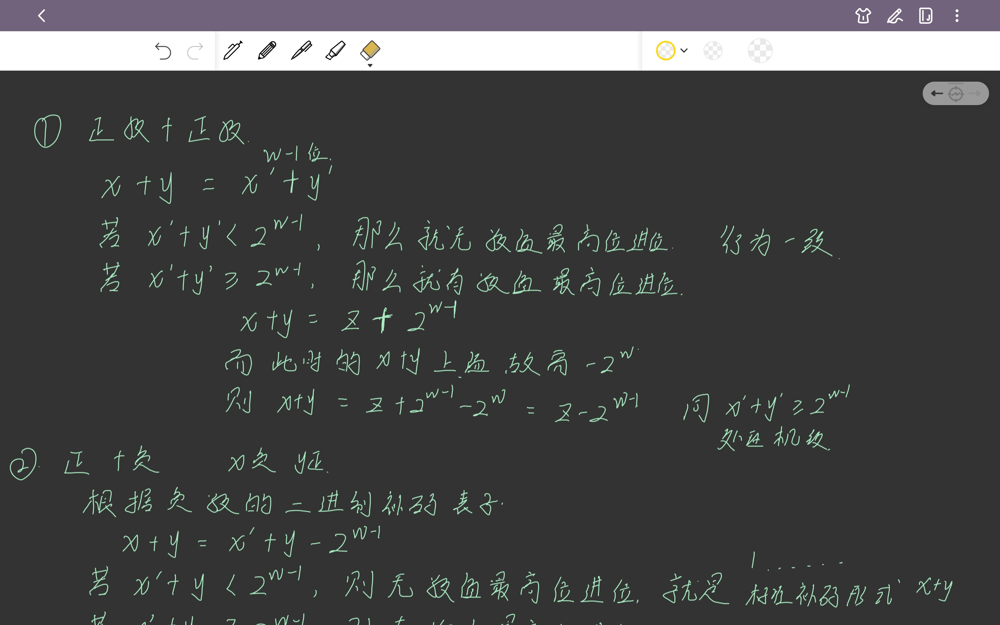
>
> 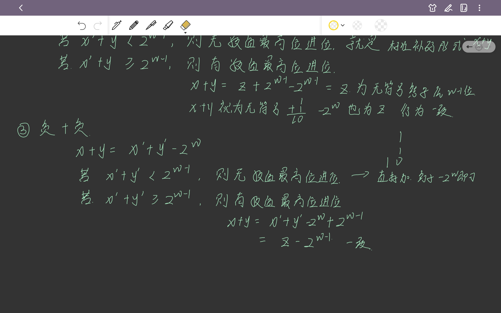
>
> **利用无符号数加法和二进制补码加法的位级表示一致的定律，大多数机器使用同样的机器指令来执行无符号数或者有符号数加法**

> 🍉检测补码加法中的溢出：**正数+正数=负数、负数+负数=正数**时出现溢出
>
> 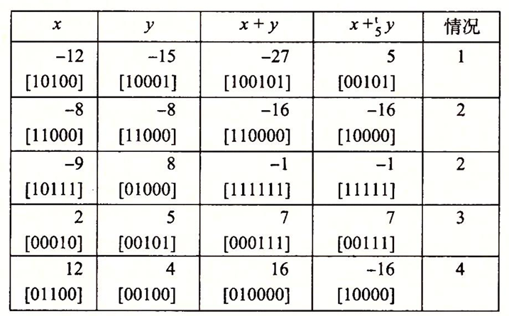

> 无符号数和有符号数补码的二进制表示是一个回环，有无溢出这个回环的加减结果都一样的
>
> 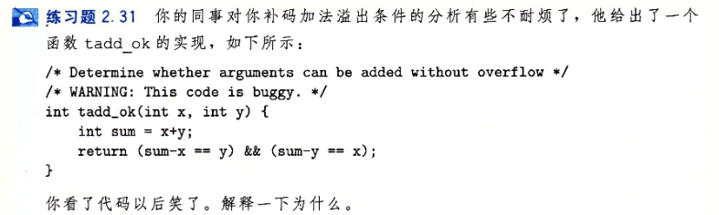
>
> 由于环形的原因：无论加法是否溢出，而(x+y)-y总是会求值得到x。

> **构建函数时一定要考虑边界值INT\_MIN对整个函数的影响**
>
> 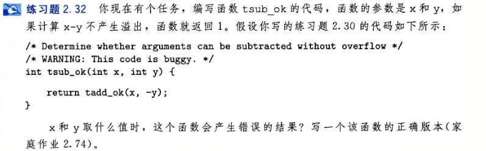
>
> 当y=INT\_MIN时，不考虑INT的限制，-y应该是正数，那么x为非负数，y为正数时发生溢出，x负数时不发生溢出。但是因为INT的限制→-y还是负数，则当x负数时才发生溢出

## 2.3.3 *Two’s-Complement Negation*

定义补码的非[^注释13]如下：对于任意在$\operatorname{TMin}_{w} \leq x \leq \operatorname{TMax}_{w}$的x，它的非$-_{w}^{\mathrm{t}} x$为：

$$
-{ }_{w}^{\mathrm{t}} x=\left\{\begin{array}{ll}\operatorname{TMin}_{w}, & x=\operatorname{TMin}_{w} \\ -x, & x>\operatorname{TMin}_{w}\end{array}\right.
$$

> 🐳二进制补码的非的位级表示
>
> 1.  对于同一个二进制序列，解释为无符号数求非的二进制序列和解释为补码求非的二进制序列是相同的
>     | x(h) | $-{ }_{4}^{u} x$ | $-{ }_{4}^{t} x$ |
>     | ---- | ---------------- | ---------------- |
>     | 0    | 0                | 0                |
>     | 5    | B                | B                |
>     | 8    | 8                | 8                |
>     | d    | 3                | 3                |
>     | f    | 1                | 1                |
> 2.  计算补码的非的方法1：对每一位求反，结果加1
> 3.  计算补码的非的方法2：将位序列分成两部分，划分的标准是从低位到高位的第一个“1”，“1”左侧的取反，右侧的不变——$\left[x_{w-1}, x_{w-2}, \cdots, x_{k+1}, 1,0, \cdots, 0\right](x\neq 0)$，然后它的非即$\left[\sim{x_{w-1}}, \sim{x_{w-2}}, \cdots\right.,\sim{x_{k+1}},1,0,\dots,0]$

## 2.3.4 *Unsigned Multiplication*

> \*Integers x and y in the range *$ 0 ≤ x, y ≤ 2^w − 1  $*can be represented as w-bit unsigned numbers, but their product x . y can range between 0 and*$ $$(2^w − 1)^2$$  = 2^{2w} − 2^{w+1} + 1 $*. \**This could require as many as 2w bits to represent.Instead, unsigned multiplication in C is defined to yield the w-bit value given by the low-order w bits of the 2w-bit integer product*

**在C语言中，w位的无符号数x、y相乘的结果定义为2w位积的低w位上的值**

$$
x *_{w}^{\mathrm{u}} y=(x \cdot y) \bmod 2^{w}
$$

## 2.3.5\* Two’s-Complement Multiplication\*

> \*Integers x and y in the range \*$ −2^w−1 ≤ x, y ≤ 2^{w−1} − 1  $\*can be represented as w-bit two’s-complement numbers, but their product x . y can range between *$−2^{w−1 }\times (2^{w−1} − 1) =−2^{2w−2} + 2^{w−1}$* and *$−2^{w−1} . −2^{w−1} = 2^{2w−2}$*. \**This could require as many as 2w bits to represent in two’s-complement form. Instead, signed multiplication in C generally is performed by truncating the 2w-bit product to w bits.*

则定义补码乘法如下：比无符号数乘法多了U2T

$$
x *_{w}^{\mathrm{t}} y=U 2 T_{w}\left((x \cdot y) \bmod 2^{w}\right)
$$

> 🐳**同加法一样，无符号数乘法的积和补码乘法的积的截断w位具有同样的位级表示**
>
> 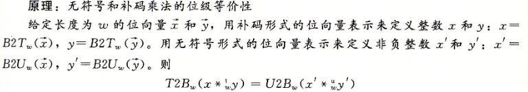
>
> 证明：
>
> 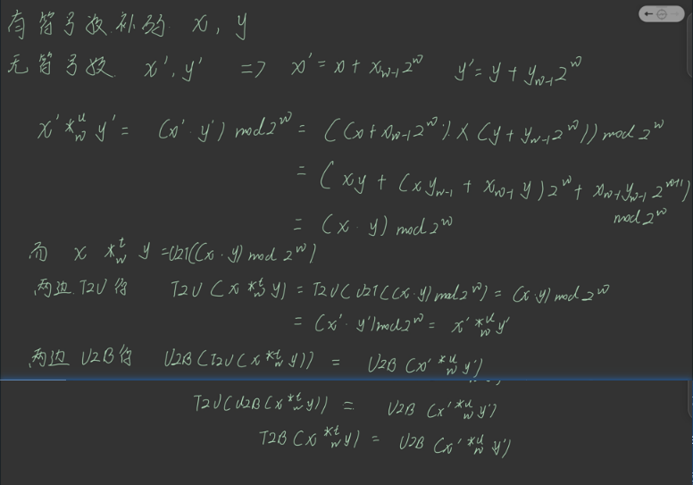

> 🐳判断乘法溢出：
>
> 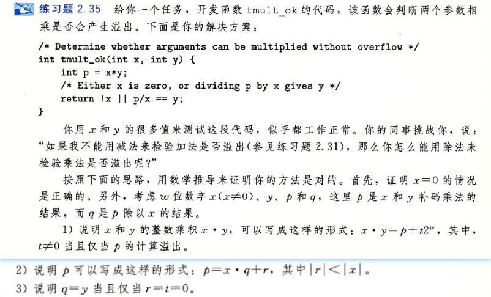
>
> 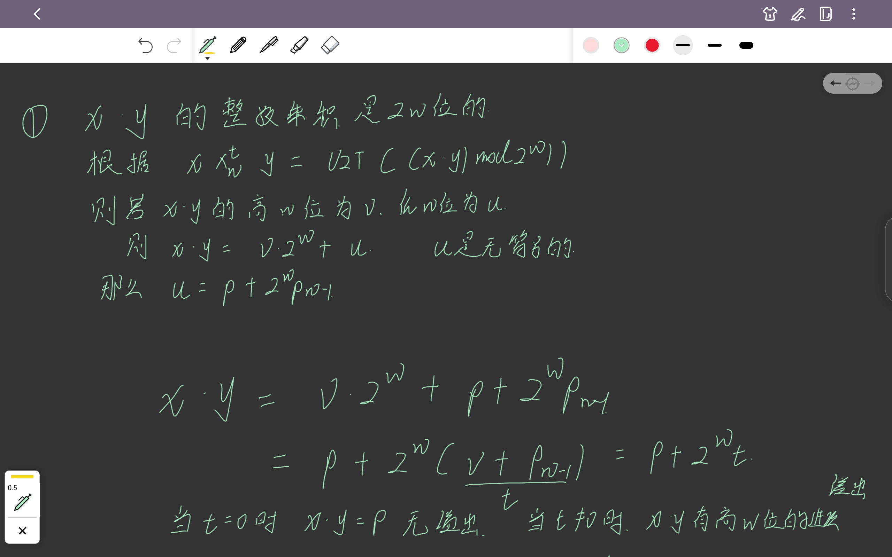
>
> 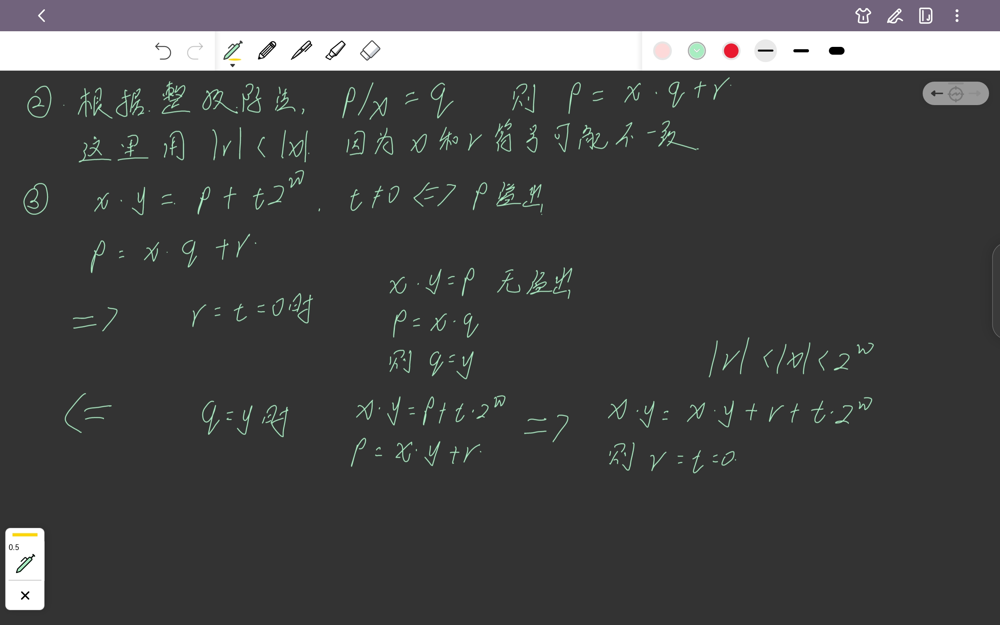
>
> 上述定义的函数是一种检测乘法溢出的方法

> 结合32位、64位判断乘法溢出
>
> 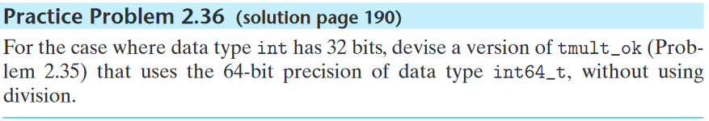
>
> ```c
> /Determine whether the arguments can be multiplied without overflow
> int tmult_ok(int x,int y){
>     //Compute product without overflow *
>     int64_t pll (int64_t)x*y;
>     /See if casting to int preserves value *
>     return pll=（int)pll;
> }
>
> ```
>
> malloc系统函数的参数是32位的，给定64位仍是按32位去使用，改进的方法是当超出范围后返回null
>
> 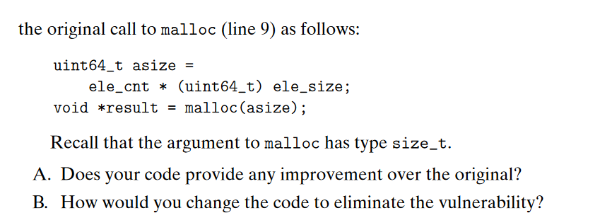

## 2.3.6 *Multiplying by Constants*

> 🐳因为乘数运算比较缓慢，需要的时钟周期数较多。所以对于编译开发人员一个重要的优化是——**尝试使用常数因子的加法和移位的组合来替代乘法**

1.  首先考虑乘以二的幂的情况

    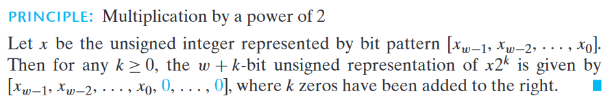

    x乘以2的k次方的整数运算，即将x左移k位

    而**无符号数及补码运算只是需要截取低w位，其中补码还需进行U2T转换**
2.  其他乘数

    对于一个常数表达式$x\times k$，编译器会将k的二进制按补码表示为一串0和1交替的序列
    $[(0 \cdots 0)(1 \cdots 1)(0 \cdots 0) \cdots(1 \cdots 1)]$，考虑一组从位位置n到位位值m（n>m）的1可以表示为下列两种形式：
    $$
    形式 A: (\mathrm{x}<<n)+(\mathrm{x}<<(n-1))+\cdots+(\mathrm{x}<<m)\\形式 B: (x<<(n+1))-(x<<m)，这里n不能是最高位，不然会移出使得结果为-(x<<m)
     
    $$
    而若**k是负数，则使用2的幂作差的形式凑k**。比如当k=-6=2-8，故x\*k=(x<<1)-(x<<3)

    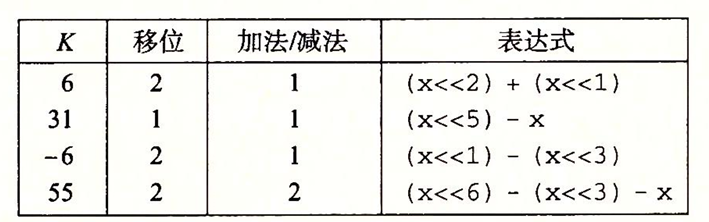
    > 🐳而对于编译器两种形式的选择问题，这里假设加法和减法具有同样的性能。那么：
    >
    > 1.  当n=m时，选A——因为B需要做两次移位，一次减法
    > 2.  当n=m+1时，选哪种都可以
    > 3.  当n>m+1时，选B

## 2.3.7 *Dividing by Powers of 2*

整数除法的耗时甚至大于乘法，我们同样也可以使用移位来处理一些整数除法，只不过从左移变为了右移——**无符号采用逻辑右移，有符号采用算术右移**

整数除法总是趋向于0的，可以定义于向上取整和向下取整：

向下取整：*For any real number a, define *$\lfloor a\rfloor$* to be the unique integer*\* a′ such that a′ ≤ a\<a′ + 1. \*\*As examples, *$\lfloor 3.14 \rfloor =3, \lfloor−3.14\rfloor=−4$*, and \*$\lfloor 3 \rfloor=3.$

向下取整：define $\lceil a\rceil$to be the unique integer a′ such that a′ − 1 \<a≤ a′. As examples, $\lceil 3.14 \rceil =4, \lceil −3.14 \rceil=−3$, and$\lceil 3 \rceil=3$

> 🐳对于x≥0且y≥0，整数除法应该采用向下取指，即$\lfloor x/y \rfloor$
> 对于x<0且y>0，整数除法应该采用向上取整，即$\lceil x/y \rceil$
>
> **向下取整正数，向上取整负数**

1.  无符号数除以2的幂——向0舍入

    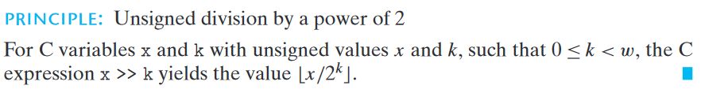
2.  有符号数除以2的幂
    1.  向下舍入：

        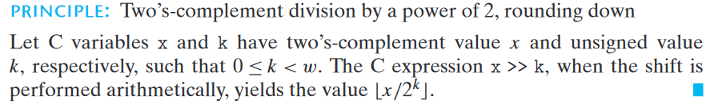
    2.  向上舍入：

        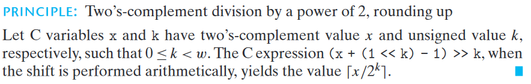
        $$
        （x+(1<<k)-1)>>k
        $$
        > 🐳$对于整数 x 和 y(y>0),\lceil x / y\rceil=\lfloor(x+y-1) / y\rfloor$
        > 综合得到有符号数除以2的幂的C表达式为：
    $$
    x/2^k=(x<0?x+(1<<k)-1:x)>>k
    $$
    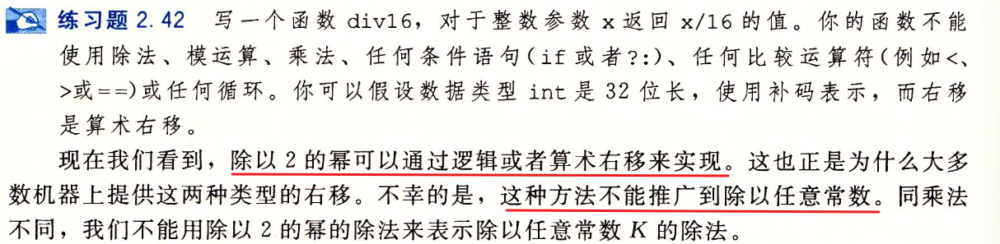
    ```c
    int div16(int x){
        int sign=x>>31;//得到符号位
        x=x+sign&(0xf);
        return x>>4;
    }
    ```

## 2.3.8 *Final Thoughts on Integer Arithmetic*

1.  无符号数和二进制补码的循环
2.  判断无符号数加法溢出，以及判断二进制补码加法的溢出
3.  无符号数和二进制补码的加法、乘法、除法、减法、非具有同样的位级表示
4.  对于所有的表达式以及函数一定要考虑无符号数的边界值、二进制补码边界值的影响

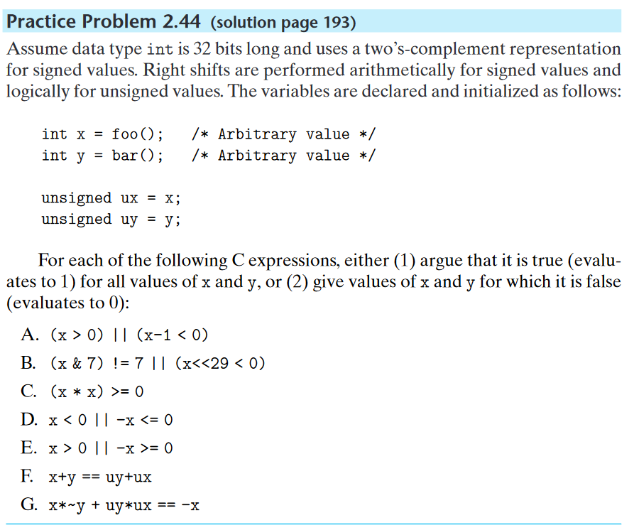

A：x属于INT，对于INT\_MIN是False
B：当x&7==7时，x低3位为111，则x<<29位，符号位为1小于0
C：x\*x会出现低w位最高位为1的情况
D：True
E：当x为INT\_MIN时，-x为INT\_MIN，False
F：无符号的乘法、加法、减法和除法与补码具有同样的位级表示，所以x+y==uy+ux True
G：\~y=-y-1，x\*(-y-1)=-xy-x+uy\*ux=-xy-x+xy=-x True

# 2.4 *Floating Point*

浮点数将数字V编码成为$x\times 2^y$的形式，浮点数的存在是非常有利于涉及到十分大的数字和非常小的数字的运算

## 2.4.1 *Fractional Binary Numbers*

**二进制形式：**$b_{m} b_{m-1} \cdots b_{1} b_{0} \cdot b_{-1} b_{-2} \cdots b_{-n+1} b_{-n}$**所代表的值是**$b=\sum_{i=-n}^{m} 2^{i} \times b_{i}$\*\*
小数点左侧是2的非负次幂，小数点的右侧是2的负数次幂\*\*​

小数点位置左移是除2，小数点位置右移是乘2

使用二进制0.11……1代表略小于1的数字。例如0.111111代表$\frac{63}{64}$，我们**将使用****1.0-ε****代表这样的值**。而且二进制小数只能精确表示可以表示成$x\times 2^y$的数值，对于其他数值只能通过增加二进制小数位数来近似——**可以精确表示整数，但是小数得近似**

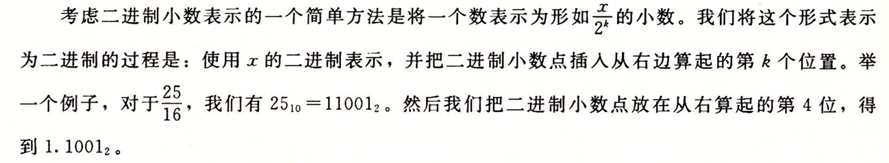

## 2.4.2 *IEEE Floating-Point Representation*

IEEE浮点数表示法是按照$x\times 2^y$的形式来进行存储的，即$V=(-1)^{s} \times M \times 2^E$

s表示符号位，s=1时表示负，s=时表示正

M表示尾数，范围在1\~2-ε（采用隐含记数表示）或者0\~1-ε

E表示阶码，即2的幂

也因为这种表示方式，将浮点数的数据存储划分为三个域：符号位、阶码位及尾数位[^注释14]

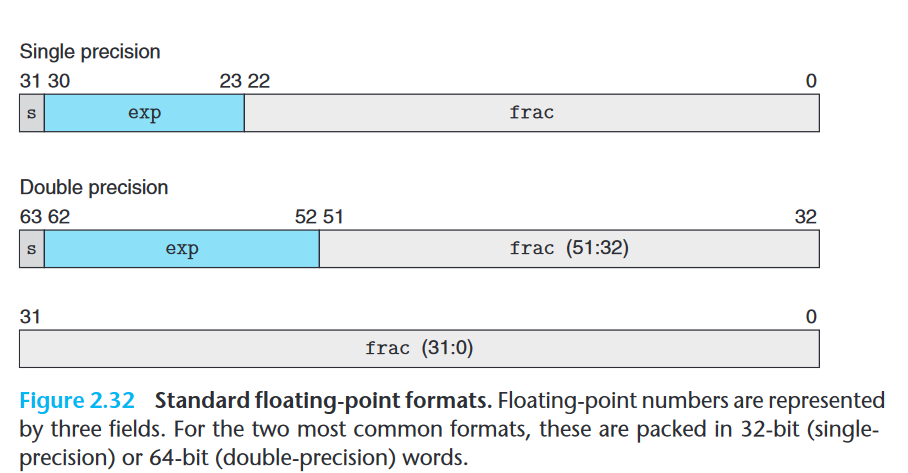

上图为IEEE 754标准规定的单精度浮点数和双精度浮点数

单精度：1位符号位、8位阶码位、23位尾数位
双精度：1位符号位、11位阶码位、52位尾数位

> 🐳根据**阶码位的值**可以将给定的符合IEEE 754标准的二进制序列分为三种不同的情况：
> **规格化值、非规格化值、特殊值**

### 2.4.2.1 *Normalized Values*——most common

> **规格化值的阶码值在1\~254/1\~2046之间——非全0也非全1**

1.  规格化数的阶码位采用**偏置码**形式表示：即$E=e-Bias$，其中E是实际的指数位，e为阶码位表示的无符号数，Bias为$2^{k-1}-1$(**float是127，double是1023**)。所以E的实际范围是 **-126~~127/-1022~~1023**
2.  规格化数的**尾数隐含一个1，即实际尾数为1.尾数位**——多了一个精度位

### 2.4.2.2 *Denormalized Values*

> **非规格化值的阶码值全0**

1.  **非规格化数的阶码值始终为1-Bias**[^注释15]**，Bias为127或1023**，即 **-126或者-1022**
2.  **非规格化数的尾数值并不含隐含1，即为尾数位代表的值**

> 🐳非规格化数提供了一种方法去表示0，也可以表示那些非常接近于0.0的数，这些数提供了一种属性——逐渐溢出

> 🐳+0.0的浮点数位模式为全0：符号位为0，阶码全0——非规格化数，尾数全0
> -0.0的浮点数只有符号位改变了

### 2.4.2.3 *Special Values*

> **特殊值的阶码值全1**

**当尾数位全0时，代表的值是****infinit****y**[^注释16]**，符号位为0时是+∞，符号位为1时是-∞**

**当尾数位非全0时，代表的值是****NaN(not a number)****，一些运算的结果**[^注释17]**不能是实数或无穷，就会返回这样的NaN值**

## 2.4.3 *Example Numbers*

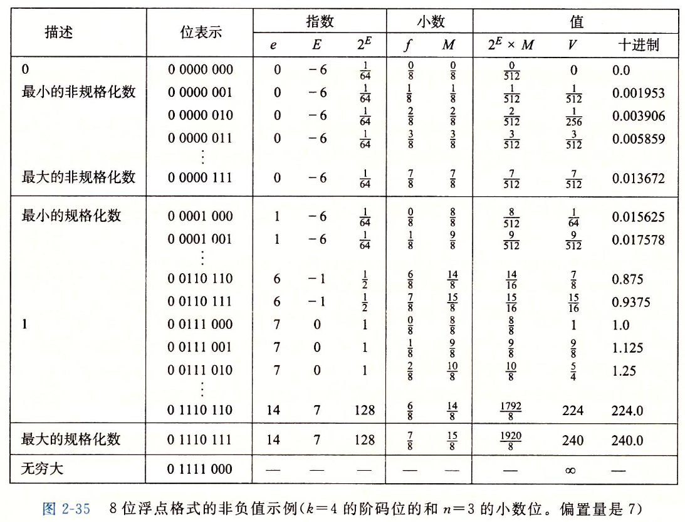

1.  非规格化数的阶码位固定为0，值为1-7=-6，小数部分为1/8\~7/8
2.  规格化数的阶码位是从1\~14，值为-6\~7，小数部分从1\~15/8
3.  无穷的阶码是全1
4.  最大的非规格化数到最小的规格化数是平滑过渡的——由于定义非规格化数阶码值为1-Bias
5.  从0\~无穷大的位表示解释为无符号整数，则是按照升序排列的（负数是降序）
    方便使用整数排序函数进行排序

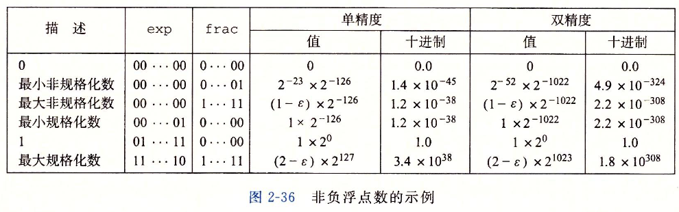

1.  +0.0是全0的二进制
2.  最小的正非规格化数是：阶码位全0，尾数位为1
3.  最大的正非规格化数是：阶码位全0，尾数位全1
4.  最小的正规格化数是：阶码为1，尾数全0
5.  最大的正规化数是：阶码全1-1，尾数全1

> 整数二进制转浮点数的方法
>
> 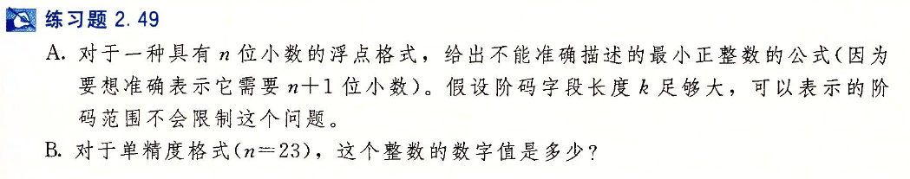
>
> 整数二进制转浮点数的方法是：**小数点在最后一位，通过左移小数点至1.xxxxx的形式，从而得到阶数和尾数**
>
> 那么无法表示即需要左移n+1次才能得到1.xxxxx的形式，故最小的形式是1……n个0……1（这里不取1……n+1个0的原因是，阶码不限范围，那么就还可以再移一次，因为尾数全0。所以为了不能再移，需要再有一个1使得尾数不全0）
>
> 即**最小正整数是**$2^{n+1}+1$

## 2.4.4 Rounding

> *Floating-point arithmetic can only approximate real arithmetic, since the representation has limited range and precision. Thus, for a value x, we generally want a systematic method of finding the “closest” matching value x′ that can be represented in the desired floating-point format. This is the task of the rounding operation.*

IEEE 定义了4种舍入的方法，默认的放啊是找最近的，其余的三种则是通过计算上界和下界

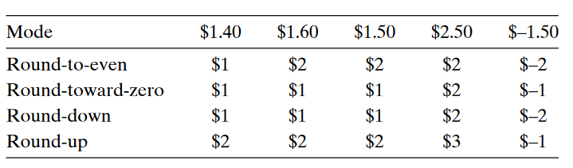

1.  round-to-even/round-to-nearest：默认的方法，取最近的匹配。而对于x.5这种中间值的舍入选择的是舍入到偶数
2.  round-toward-zero：向0舍入，将正数向下舍入，负数向上舍入。舍入后的值x'满足$|x'|\leq|x|$
3.  round-down：向下舍入，不管正数还是负数均向下舍入，舍入后的值x'≤x
4.  round-up：向上舍入，不管正数还是负数均向上舍入，舍入后的值x≤x'

> 为什么round-to-even选择向偶数舍入
>
> 如果我们采用向上舍入的方式，那么最后得到的数据的均值会略大于原始数据的均值；而如果使用向下舍入的方式，那么最后得到的数据的均值会略小于原始数据的均值。为了减小这种差异的影响，向偶数舍入可以将大概50%的向上舍入而50%的向下舍入，从而降低差异。
>
> 而且round-to-even可以应用于一些无法四舍五入至整数的情况——0偶1奇

## 2.4.5 *Floating-Point Operations*

IEEE 标准指定浮点运算行为$x\bigodot y=Round(x \bigodot y)$的方法的优点之一是它独立于任何特定的硬件或软件实现——对于一些特殊值比如0、-0、∞、NaN，IEEE也规定了带有它们的运算的特殊结果：**1/-0被定义为产生-∞，1/+0被定义为产生+∞**

### 2.4.5.1 $x + ^f y=Round(x+y)$

1.  **可交换**
    $$
    x+{ }^{\mathrm{f}} y=y+{ }^{\mathrm{f}} x
    $$
2.  **不可结合**

    因为加法采用舍入，可能会造成精度损失。此外再加上一些特殊值参与运算，导致浮点加法是不可结合的

    eg：(3.14+1e10)-1e10和3.14+(1e10-1e10)
3.  **逆元**

    大多数值在浮点加法下都有逆元，**但是除了无穷和NaN**

    NaN浮点加任何数均为NaN，而无穷的加法亦为NaN
4.  **单调性**

    若a≥b，则对于任何a，b以及x的值(除NaN)都有x+a≥x+b

### 2.4.5.2 $x * ^f y=Round(x*y)$

1.  可交换
    $$
    x*{ }^{\mathrm{f}} y=y*{ }^{\mathrm{f}} x
    $$
2.  不可结合

    同样由于乘法运算产生的溢出——特殊值，以及损失精度的原因，浮点乘法不可结合

    eg：(1e20*1e20)* 1e-20=+∞,1e20 *(1e20*1e-20)=1e20
3.  不可分配

    同样由于乘法运算产生的溢出——特殊值，以及损失精度的原因，浮点乘法不可分配

    eg：1e20 *(1e20-1e20)=0.0,1e20*1e20-1e20\*1e20=NaN
4.  单调性
    $$
    对于任何 a 、 b 和 c, 并且 a 、 b 和 c 都不等于 N a N, 浮点乘法满足下列单调性:\\\\\begin{array}{l}\\a \geqslant b \text { 且 } c \geqslant 0 \Rightarrow a *{ }^{\mathrm{f}} c \geqslant b *^{\mathrm{f}} c \\\\a \geqslant b \text { 且 } c \leqslant 0 \Rightarrow a *^{\mathrm{f}} c \leqslant b *^{\mathrm{f}} c\\\end{array}
    $$
    $$
    a*^fa\geq0,a\neq NaN
    $$

## 2.4.6 *Floating Point in C*

所有的C语言版本都提供了double、float两种浮点数类型，并且都采用round-to-even作为舍入方式。但是因为**C标准并不要求机器使用IEEE浮点，所以没有提供标准的方法去改变舍入方式和获取特殊值**——这种改变的方法**只能通过系统提供的头文件库进行**，但是不同系统的实现又很不一样

当在int、float、double之间强制类型转换时，程序改变数值和位模式的原则如下：

1.  从int→float：数字不会溢出，但可能会出现舍入
2.  从int/float→double：double表示范围更大，精度也更大，可以不溢出、不舍入的进行转换
3.  从double→float：表示范围变小——可能会溢出；精度也变小，可能会有舍入
4.  从float/double→int：值可能会溢出，不溢出时向0舍入

    C语言标准并没有定义溢出指定的结果

    但是与intel兼容的微处理器指定位模式\[100……0]即INT\_MIN为不确定值。当从浮点数转整数，如果为该浮点数找不到一个准确的整数近似值，则产生INT\_MIN

> 强制转换
>
> 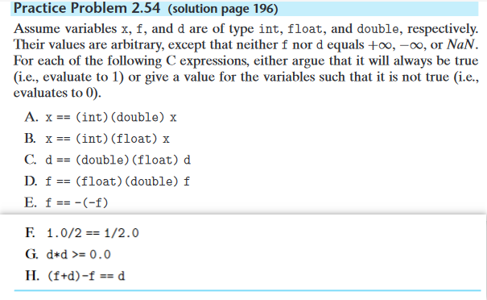
>
> A. x为int，可以不损失不溢出的转double，double再转int也能找到对应的值——True
>
> B. x为int，int转float不溢出但是会损失精度，所以再转int可能会不等——False
>
> C. d为double，double转float既可能溢出也可能损失精度，所以再转float可能会不等——False
>
> D. f为float，可以不损失不溢出的转double，double再转float也能找到对应的值——True
>
> E. 浮点数取反只用改变符号位sign——True
>
> F. 分子分母均会转换为1.0/2.0的形式——True
>
> G. d不为NaN，则该式成立——True
>
> H.由于舍入的存在计算过程中会有精度损失——False

# 2.5 *Summary*

1.  *Most machines encode signed numbers using a two’s-complement representation and encode floating-point numbers using IEEE Standard 754*
2.  *Because 64-bit machines can also run programs compiled for 32-bit machines, we have focused on the distinction between 32- and 64-bit programs, rather than machines.*
3.  *The advantage of 64-bit programs is that they can go beyond the 4 GB address limitation of 32-bit programs.*
4.  有符号和无符号之间的强转只改变位的解释方式，而不改变位序列*When casting between signed and unsigned integers of the same size, most C implementations follow the convention that the underlying bit pattern does not change.*
5.  使用位级运算和加减法表示二进制乘除法
6.  000000……111111的生成可以使用(1<\<k)-1，k个1
7.  注意int、float、double之间的转换

[^注释1]: 二进制表示法过于冗长，而使用十进制表示法时，与位模式之间的转换非常繁琐。

[^注释2]: 如uint32\_t,uint64\_t

[^注释3]: 与 C 不同，Java 对如何执行右移有精确的定义。表达式 x>>k 将 x 算术移位 k 个位置，而 x >>> k 对其进行逻辑移位。

[^注释4]: char、short、int、long、long long，以及unsigned，signed(默认)

[^注释5]: \doteq 符号表示左边的部分是被右边的部分所定义

[^注释6]: The Java standard is quite specific about integer data type ranges and representations. It requires a two’s-complement representation with the exact ranges shown for the 64-bit case (Figure 2.10). In Java, the single-byte data type is called byte instead of char. These detailed requirements are intended to enable Java programs to behave identically regardless of the machines or operating systems running them.

[^注释7]: 推导从B2T和B2U着手

[^注释8]: 推导同样根据B2U和B2T

[^注释9]: Java 仅支持有符号整数，并且要求它们使用补码算术来实现。正常的右移运算符 >> 保证执行算术移位。特殊运算符 >>> 被定义为执行逻辑右移。

[^注释10]: 比如位序列不代表任何数字意义的情况、比如地址、比如实现模运算等情况

[^注释11]: 无符号数只剩最后的w位，并按无符号解析这w位；二进制补码计算则也是只剩最后的w位，按照二进补码解析

[^注释12]: 必须决定结果太大——正溢出或者太小了——负溢出怎么办

[^注释13]: 加法逆元x+x的非=0

[^注释14]: 阶码位为0时会对尾数的表示方式有影响

[^注释15]: 定义为1-Bias可以弥补非规格化数缺失的1

[^注释16]: infinity可以表示溢出的结果

[^注释17]: 根号-1或者∞-∞
