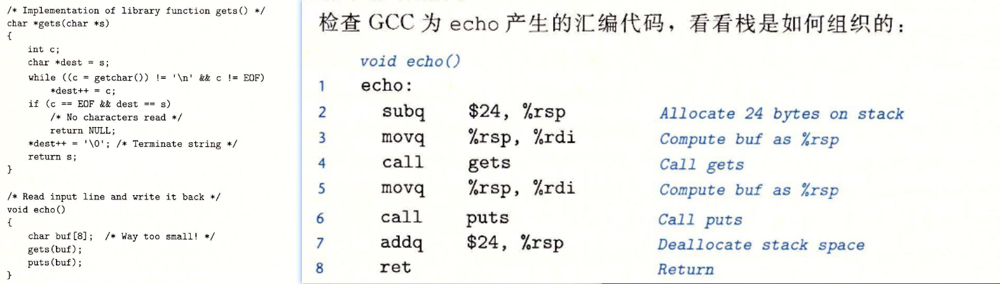

# 3 Machine-Level Representation of Programs

## 目录

-   [英语](#英语)
-   [3.1 A Historical Perspective](#31-A-Historical-Perspective)
-   [3.2 Program Encodings](#32-Program-Encodings)
    -   [3.2.1 Machine-Level Code](#321-Machine-Level-Code)
    -   [3.2.2 Code Examples](#322-Code-Examples)
        -   [反汇编器 disassembler](#反汇编器-disassembler)
        -   [链接main文件](#链接main文件)
        -   [链接后反汇编与编译后反汇编的对比](#链接后反汇编与编译后反汇编的对比)
    -   [3.2.3 Notes on Formatting](#323-Notes-on-Formatting)
-   [3.3 Data Formats](#33-Data-Formats)
-   [3.4 Accessing Information](#34-Accessing-Information)
    -   [3.4.1 Operand Specifiers](#341-Operand-Specifiers)
    -   [3.4.2 Data Movement Instructions](#342-Data-Movement-Instructions)
        -   [MOV类](#MOV类)
        -   [MOVZ、MOVS](#MOVZMOVS)
    -   [3.4.3 Data Movement Example](#343-Data-Movement-Example)
    -   [3.4.4 Pushing and Popping Stack Data %rsp](#344-Pushing-and-Popping-Stack-Data-rsp)
-   [3.5 Arithmetic and Logical Operations](#35-Arithmetic-and-Logical-Operations)
    -   [3.5.1 Load Effective Address](#351-Load-Effective-Address)
    -   [3.5.2 Unary and Binary Operations](#352-Unary-and-Binary-Operations)
        -   [3.5.2.1 Unary Operations](#3521-Unary-Operations)
        -   [3.5.2.2 Binary Operations](#3522-Binary-Operations)
    -   [3.5.3 Shift Operations](#353-Shift-Operations)
    -   [3.5.4 Special Arithmetic Operations](#354-Special-Arithmetic-Operations)
        -   [MUL](#MUL)
        -   [DIV](#DIV)
-   [3.6 Control](#36-Control)
    -   [3.6.1 Conditions Codes](#361-Conditions-Codes)
    -   [3.6.2 Accessing the Condition Codes](#362-Accessing-the-Condition-Codes)
    -   [3.6.3 Jump Instructions](#363-Jump-Instructions)
    -   [3.6.4 Jump Instruction Encodings](#364-Jump-Instruction-Encodings)
    -   [3.6.5 Implementing Conditional Branches with Conditional Control](#365-Implementing-Conditional-Branches-with-Conditional-Control)
    -   [3.6.6 Implementing Conditional Branches with Conditional Moves](#366-Implementing-Conditional-Branches-with-Conditional-Moves)
        -   [为什么要使用条件传送](#为什么要使用条件传送)
        -   [条件传送指令cmov类](#条件传送指令cmov类)
        -   [条件传送理解](#条件传送理解)
            -   [条件传送的缺点](#条件传送的缺点)
    -   [3.6.7 Loops](#367-Loops)
        -   [Do-While Loops](#Do-While-Loops)
        -   [While Loops](#While-Loops)
        -   [For Loops](#For-Loops)
    -   [3.6.8 Switch Statements](#368-Switch-Statements)
-   [3.7 Procedures](#37-Procedures)
    -   [3.7.1 The Run-Time Stack](#371-The-Run-Time-Stack)
        -   [栈基础](#栈基础)
        -   [栈结构](#栈结构)
    -   [3.7.2 Control Transfer](#372-Control-Transfer)
    -   [3.7.3 Data Transfer](#373-Data-Transfer)
    -   [3.7.4 Local Storage on the Stack](#374-Local-Storage-on-the-Stack)
    -   [3.7.5 Local Storage in Registers](#375-Local-Storage-in-Registers)
    -   [3.7.6 Recursive Procedures](#376-Recursive-Procedures)
-   [3.8 Array Allocation and Access](#38-Array-Allocation-and-Access)
    -   [3.8.1 Basic Principles](#381-Basic-Principles)
    -   [3.8.2 Pointer Arithmetic](#382-Pointer-Arithmetic)
    -   [3.8.3 Nested Arrays](#383-Nested-Arrays)
    -   [3.8.4 Fixed-Size Arrays](#384-Fixed-Size-Arrays)
    -   [3.8.5 Variable-Size Arrays](#385-Variable-Size-Arrays)
-   [3.9 Heterogeneous Data Structures](#39-Heterogeneous-Data-Structures)
    -   [3.9.1 Structures](#391-Structures)
    -   [3.9.2 Unions](#392-Unions)
        -   [联合的应用](#联合的应用)
    -   [3.9.3 Data Alignment](#393-Data-Alignment)
-   [3.10 Combining Control and Data in Machine-Level Programs](#310-Combining-Control-and-Data-in-Machine-Level-Programs)
    -   [3.10.1 Understanding Pointers](#3101-Understanding-Pointers)
    -   [3.10.2 Out-of-Bounds Memory References and Buffer Overflow](#3102-Out-of-Bounds-Memory-References-and-Buffer-Overflow)
    -   [3.10.3 Thwarting Buffer Overflow Attacks](#3103-Thwarting-Buffer-Overflow-Attacks)
        -   [堆栈随机化](#堆栈随机化)
        -   [堆栈损坏检测](#堆栈损坏检测)
        -   [限制可执行代码区域](#限制可执行代码区域)
    -   [3.10.4 Supporting Variable-Size Stack Frames](#3104-Supporting-Variable-Size-Stack-Frames)
-   [3.11 Floating-Point Code](#311-Floating-Point-Code)
    -   [3.11.1 Floating-Point Movement and Conversion Operations](#3111-Floating-Point-Movement-and-Conversion-Operations)
        -   [浮点数传送指令](#浮点数传送指令)
        -   [浮点数转整数指令](#浮点数转整数指令)
        -   [整数转浮点数指令](#整数转浮点数指令)
        -   [单精度与双精度浮点数之间的转换](#单精度与双精度浮点数之间的转换)
    -   [3.11.2 Floating-Point Code in Procedures](#3112-Floating-Point-Code-in-Procedures)
    -   [3.11.3 Floating-Point Arithmetic Operations](#3113-Floating-Point-Arithmetic-Operations)
    -   [3.11.4 Defining and Using Floating-Point Constants](#3114-Defining-and-Using-Floating-Point-Constants)
    -   [3.11.5 Using Bitwise Operations in Floating-Point Code](#3115-Using-Bitwise-Operations-in-Floating-Point-Code)
    -   [3.11.6 Floating-Point Comparison Operations](#3116-Floating-Point-Comparison-Operations)

# 英语

1.  shield屏蔽
2.  reference引用
3.  consistent一致的
4.  inefficiency低效率
5.  malware恶意软件
6.  involve涉及、调用
7.  thereby从而
8.  recursive循环的，iterative迭代的
9.  delude oneself自欺欺人
10. arcane神秘的
11. feasible可行的

    economically feasible and technically desirable经济可行、技术可实现
12. compromise妥协
13. safeguards保障措施】
14. elementary基本的
15. aggregate聚合的
16. guildeline指导方针
17. strip away剥去
18. annotated带解释的
19. ambiguity歧义
20. owing to由于
21. impose提出
22. excerpt摘录
23. successive连续的
24. concise简洁的
25. invocation调用
26. assure确保
27. circumvent规避
28. complexities复杂性

<!---->

1.  specify指定
2.  manipulate操作
3.  underlying潜在的
4.  get a sense of感觉到
5.  infest侵扰
6.  nuance细微差别
7.  eliminate消除
8.  prerequisite先决条件
9.  corporation公司
10. proceed继续前进
11. legacy遗产
12. colloquially通俗地讲
13. overall最初的
14. elaborate复杂的
15. dictated被……制定的
16. whereas虽然
17. ever-changing不断改变的
18. indented缩进的
19. explanatory解释性的
20. dedicated专门的
21. enthusiasts爱好者
22. compact最紧凑的
23. reminiscent令人怀念的
24. outperform优于
25. adjacentl邻近的
26. overhead开销
27. successive连续的
28. novice新手
29. pervasive普遍的

> 🐳*Best of all, a program written in a high-level language can be compiled and executed on a number of different machines, whereas assembly code is highly machine specific.*
>
> *When programming in a hign-level language such as C,and even more so in Java,we are shielded from the detailed machine-level implementation of our program*.*In contrast, when writing programs in assembly code (as was done in the early days of computing) a programmer must specify the low-level instructions the program uses to carry out a computation.*

# 3.1 *A Historical Perspective*

> 摩尔定律
>
> 预测芯片上的晶体管数量每一年半翻一番

# 3.2 *Program Encodings*

假设有两个C语言文件：p1.c和p2.c，然后使用gcc命令行进行编译生成可执行文件

`gcc -0g -o p p1.c p2.c`

命令gcc表示使用gcc这种C编译器进行编译，而且因为Linux上的默认C编译器就是gcc所以也可以简单地使用cc进行调用

-0g表示使用一种优化方式，产生一种遵守最初的原始C代码的机器代码。

为什么选择-0g是因为使用更高级别的优化将会生成经过大量转换的代码，以致于生成的机器代码和原始源代码之间的关系难以理解。因此，我们将使用`  -0g  `优化作为学习工具，然后看看当我们提高优化级别时会发生什么

但是在实践中，一般是使用更高级别的优化，比如-01，-02

和之前提到的编译系统一致，gcc命令经过“**预处理、编译、汇编、链接**”四步来产生最终的可执行程序

预处理：扩展源代码中的`#include`所引入的文件和`#define`所定义的宏，.c→.i

编译：将修改后的C文件.i使用编译器生成汇编文件p1.s和p2.s

汇编：使用汇编器将汇编文件转换为二进制可重定向文件

可重定向文件是机器代码的一致形式，它包含着所有指令的二进制形式，但是并没有填充全局变量的地址

链接：将多个可重定向文件p1.o和p2.o以及所调用的库函数功能重定向文件合并并生成最后的可执行文件p(-o p)

可执行文件是机器代码的第二种形式，是处理器执行的代码的确切形式。

## 3.2.1\* Machine-Level Code\*

和1.9.3所描述的类似，计算机系统采用几种不同形式的抽象[^注释1]，通过使用更简单的抽象模型来隐藏实现的细节

对于机器级编程而言，这些抽象层次中有两个是比较重要的

1.  指令集体系结构ISA：定义了处理器的状态，指令格式以及每条指令对状态的影响。大多数ISA定义了程序的指令序列是串行执行的
2.  虚拟存储：提供了一个非常大的字节数组的存储模型

    存储器系统的实际实现是将多个硬件存储器和操作系统软件组合起来

x86-64机器代码和C语言原始代码差别很大，一些对于C程序员来说不可见的处理器状态对于x86-64机器代码来说是可见的

1.  PC：程序计数器，**在x86-64中标识为****%rip** **，其中存储着下一条要执行的指令的地址**​
2.  **整数寄存器文件包含着存储着64位值的16个命名位置**[^注释2]
3.  **条件码寄存器保存着最近执行的算术或者逻辑指令的状态信息**
4.  一组向量寄存器可以存放一个或多个整数或浮点数值

虽然C语言提供了一种模型，可以在内存中声明和分配各种数据类型的对象，但是机器代码只是简单地将内存看成一个很大的、按字节寻址的数组。C语言中的聚合数据类型，例如数组和结构，在机器代码中用一组连续的字节来表示。即使是对标量数据类型，汇编代码也不区分有符号或无符号整数，不区分各种类型的指针，甚至于不区分指针和整数。

程序的内存包括：程序的可执行机器代码、操作系统需要的一些信息、管理过程调用和返回的运行时栈，以及用户分配的内存块(一般malloc分配)

在任何时候，只有有限的一部分虚拟地址被认为是合法的。例如x86-64虽然是64位的虚拟地址，但是在实践中高16位必须设置为0，从而实际能够访问的是$2^{48}$/256TB范围内的一个字节

## 3.2.2 Code Examples

> `gcc -0g -S mstore.c`中的"-S"是表示只执行到编译阶段生成汇编代码文件

> `gcc -0g -c mstore.c`中的"-c"是表示只执行到汇编阶段生成可重定位的目标文件

#### 反汇编器 disassembler

为了查看该机器代码文件的内容，需要使用一类称为反汇编器的程序

反汇编器将会从机器代码中生成一种和汇编代码格式类似的文件

在Linux/Windows系统中，使用命令objdump和-d命令参数来对机器代码文件进行解析。类似的解析结果如下：

`objdump -d mstore.o`


在左侧，有 14 个十六进制字节值，按前面显示的字节序列列出，分为 1 到 5 个字节的组。这些组中的每一个都是一条指令，其汇编语言等效项显示在右侧

可以从中总结到几个特征：

1.  x86-64的指令长度从1-15字节不等，采用**哈夫曼编码**，使用频度高/操作数少的指令字节数少；使用频度低/操作数多的指令字节长
2.  设计指令格式的方式是：**对于某种指令都给一个字节唯一用来标识此处开始为该指令**。例如上图中“push以53起始，mov以48起始，pop以5b起始，retq以c3起始，callq以e8起始”
3.  反汇编器只是基于程序的机器代码文件中的字节序列来确定，不需要访问程序的源文件和汇编文件
4.  反汇编器生成的汇编代码和编译器生成的汇编代码在指令的命名规则上有细微差别，例如指令后缀加不加“q”

#### 链接main文件

生成实际可执行的代码需要对一组目标代码文件[^注释3]运行链接器，而这一组目标代码文件中必须含有一个main函数

`gcc -0g -o prog main.c mstore.c`即预处理、编译、汇编、链接main和mstore两文件，最后生成prog可执行程序

#### 链接后反汇编与编译后反汇编的对比

链接之后的可执行文件的反汇编和编译之后的可重定向目标文件的反汇编示例如下：


不同的点主要有：

1.  链接后的反汇编代码还包括用于启动和终止程序以及与操作系统交互的代码
2.  链接后的反汇编代码已经给代码分配好了具体的地址范围，并直接指明了要跳转到的地址
3.  插入的nop只是为了将函数代码变为16字节[^注释4]，就存储器系统性能而言可以更好地放置下一个代码块

## 3.2.3 *Notes on Formatting*

经GCC编译器生成的汇编代码如下，并不容易阅读。有两方面的原因：

1.  该汇编代码中包含一些程序员不太需要关注的信息
2.  该汇编代码并未提供任何关于程序或是它怎么工作的描述


下面是带有注释的、省略掉"."指令的汇编代码


> 🐳对于一些应用程序，程序员必须用汇编代码来访问机器的低级特性。
>
> 一种方法是用汇编代码编写整个函数，在链接阶段把它们和C函数组合起来。
> 另一种方法是利用GCC的支持，利用asm伪指令直接在C程序中嵌入汇编代码。

# 3.3 *Data Formats*

由于x86-64起源为 16 位架构，后来扩展到 32 位架构，Intel 使用术语“字Word”来指代 16 位数据类型。基于此，将 32 位数据量称为“双字DW”，将 64 位数据量称为“四字QW”

下图是C语言基本数据类型对应的x86-64表示


int占4字节，指针8字节，long占8字节

**大多数GCC生成的汇编代码指令都有一个字符后缀“b/w/l/q”，表示操作数的大小**。例如，数据传送指令有4个变种：movb、movw、movl、movq。注意float、double后缀是s、l。这不会引起歧义，因为浮点数与整数使用不同的指令和寄存器文件

# 3.4\* Accessing Information\*

x86-64 中央处理单元 (CPU) 包含一组 16 个通用寄存器，用于存储 64 位值。这些寄存器用于存储整数数据和指针。如下图所示：


这16个寄存器名均以“%r”起始，但是对于32位、16位、8位的寄存器数据则有不同的命名规则。这是由于指令集的变革

1.  刚开始8086只有8个16位的寄存器，即`%ax~%sp`，根据它们的实际作用进行命名——高位h低位l
2.  之后扩展到IA32，寄存器命名为`%eax~%esp`表示扩展到32位
3.  再之后扩展到IA64，前8个寄存器命名为`%rax~%rsp`。并添加了剩下8个寄存器，命名r8\~r15，32位为双字加后缀d，16位为字加后缀w，8位为字节加后缀b

因为指令允许对这16个寄存器的不同数据量位[^注释5]进行操作，那么当将这些寄存器作为目的寄存器且操作数据大小少于8字节，就会遇到高位字节怎么办的情况：

1.  操作1字节和2字节（字）的指令保持高位字节数据不变
2.  操作4字节（双字）的指令，赋值高位4字节为0[^注释6]

Figure3.2右侧的注释表示不太的寄存器在程序中充当的不同的作用

除了%rsp专用表示运行时栈的结束位置，并且有专门的指令来读写这个寄存器。其他15个寄存器的使用都较为灵活

## 3.4.1 *Operand Specifiers*

大多数指令都有一个或多个**操作数指示符来指出执行一个操作所需要的源数据值以及结果要存放的目标位置**。x86-64支持如下图所示的操作数格式：


各种不同操作数的可能性可分为三种类型：

1.  立即数

    立即数表示常数值，书写格式为：\$+C语言标准所表示的整数 $$\$Imm \rightarrow Imm$$

    eg:\$12,\$0x12
2.  寄存器数

    寄存器数表示的是数据来源于x86-64的16个通用寄存器，且数据大小可以是字节、字、双字、四字。书写格式为：$r_a$ $r_a\rightarrow R[r_a]$
3.  存储器数

    根据存储器地址的表示方法可以分为：存储器立即寻址、寄存器间接寻址、寄存器相对寻址，变址寻址（带立即数和不带立即数），比例变址寻址(4种)

    计算出的存储器地址称之为有效地址

> 🐳在这些寻址方式中，最常用的形式是$Imm(r_b,r_i,s)\rightarrow Imm+R[r_b]+R[r_i]\cdot s$其中**s必须是1、2、4、8，**$r_b、r_i$**必须是64位的寄存器**。这个形式经常用来引用数组元素，其余寻址形式都可以省略这个形式的某部分来形成。

## 3.4.2 *Data Movement Instructions*

将许多不同的指令分为指令类，其中类中的指令执行相同的操作，但操作数大小不同

#### MOV类


MOV类指令可以不需要任何转变的将数据从源位置复制到目的位置

MOV类包括movb、movw、movl、movq四类指令，它们执行的效果是相同的唯一的区别在于操作的数据大小不同：1、2、4、8

> 🐳源位置可以是一个立即数、寄存器数或者存储器数；目的位置可以是寄存器数或者存储器数。但是不允许源位置、目的位置都是存储器数
>
> 因此从存储器某位置复制数据到另一个位置需要使用两条指令：先mov到某寄存器，再由该寄存器mov到主存

mov指令使用的寄存器操作数可以是16个通用寄存器中的任意一个，但是需要保证使用寄存器片段的大小和指令的最后一个字符指令的大小相同(b、w、l、q)。且**对b、w、q指令的情况，mov指令只会更新目标操作数指示的特定区域，除了movl指令**[^注释7]**会使得寄存器高4B为0**

下面是mov类指令的一些示例：

```nasm
movl $0x4050,%eax    %Immediate--Register,4 bytes
movw %bp,%sp         %Register--Register,2 bytes
movb (%rdi,%rcx),%al %Memory--Register,1 byte
movb $-17,(%esp)     %Immediate--Memory,1 byte
movq %rax,-12(%rbp)  %Register--Memory,8 bytes
```

> Figure3.4中的最后一条指令`movabsq`是用来处理64位立即数的[^注释8]。它可以直接使用任意的**64位立即数值**作为源操作数，但是**只能使用寄存器作为目的地址**

#### MOVZ、MOVS

> 🐳MOVZ和MOVS指令是用来将一个较小的数移动到一个较大的目的位置上。源位置可以是寄存器或者存储器，但是目的位置只能是寄存器。

1.  MOVZ指令是将目的位置上的剩余字节填充0
    MOVS指令是将目的位置上的剩余字节填充源操作数的MSB
2.  对于b、w、l、q四类数据大小，总共的指令类别有$C_4 ^2$种

    但是由于x86-64既有标准——对于任何产生32位结果的指令，若将结果放置在64位的目的处，则高位部分需设置为0。因此不存在movzlq

    

    

> cltq指令
>
> cltq指令没有显式指定操作数，它隐含源操作数%eax以及目的操作数%rax，执行的功能是$SignExtend(\%eax)\rightarrow \%rax$。等价于$movslq \space \%eax \space \%rax$
>
> 但是相较于movslq指令需要指明操作数，cltq并不需要因此指令字长更紧凑

> 根据源、目数据类型填充mov指令
>
> 
>
> 需要注意的是，**内存地址总是用64位的**
>
> 判断依据：**若目的位置是寄存器操作数，则需要根据寄存器所使用的大小决定mov的后缀；但如果使用的是存储器操作数，则需要根据源位置操作数大小来决定**

> 错误的指令示例：
>
> 
>
> 1.  内存引用需要使用64位
> 2.  movl是32位，但是%rax是64位
> 3.  mov指令不能用于内存和内存之间的数据移动
> 4.  没有%sl这个寄存器，应该是%sil
> 5.  不能将立即数作为目的寄存器
> 6.  movl是332位的，但是%rdx为64位
> 7.  %si寄存器为16位，但是使用的是movb指令

## 3.4.3 *Data Movement Example*

以Figure3.7中的交换值的代码示例为例进行分析


函数中的局部变量是被保存在寄存器中而不是内存中的。因为访问寄存器远快于访问主存

1.  返回值保存在%rax中；参数保存在%rdi、%rsi中

    %rdi中存储的是xp指针的值
    %rsi中存储的是y的值
2.  指针的解引用过程如下：
    1.  首先将内存中指针的值赋给某个寄存器
    2.  通过寄存器间接寻址的方式形成内存的有效地址，从而获得对应的值

> 使用MOV、MOVZ、MOVS类指令完成类型强制转换
>
> $*dp=(dest\_t)*sp$,sp存放在%rdi中，dp存放在%rsi中
>
> 中间变量使用%rax、%eax、%ax、%al
>
> 
>
> 1.  long→long：64位到64位
>
>     读数据：`movq (%rdi),%rax`
>
>     写数据：`movq %rax,(%rsi)`
> 2.  char→int：8位到32位
>
>     读数据：`movsbl (%rdi),%eax `因为写数据要求使用%eax则存数据也要使用%eax，所以需要进行符号扩展，使用movsbl指令&#x20;
>
>     写数据：`movl %eax,(%rsi) ` 这里必须要使用%eax因为数据大小由源来决定
> 3.  char→unsigned：8位到32位
>
>     对于既要进行位扩展也要符号转换的情形：**C语言规定先进行位扩展再进行符号转换**
>
>     因此实际的调用指令同2
> 4.  unsigned char→long：8位到64位
>
>     无符号数进行零扩展使用movzbl指令
>
>     读数据：`movzbl (%rdi),%eax`
>
>     写数据：`movq %rax,(%rsi)`
> 5.  int→char：32位到8位
>
>     读数据：`movl (%rdi),%eax`
>
>     写数据：`movb %al,(%rsi)`
> 6.  unsigned→unsigned char：32位到8位
>
>     同5
> 7.  char→short：8位到16位
>
>     读数据：`movsbw (%rdi),%ax `
>
>     写数据：`movw %ax,(%rsi) `&#x20;

## 3.4.4\* Pushing and Popping Stack Data\* %rsp


栈顶采用“高到低”**向下增长**的形式且**栈顶有数据**

入栈：先减栈顶指针8，然后入数据
出栈：先取数据，再加栈顶指针8


在x86-64中，栈存放在内存中的某个区域。采用**向下增长****的原则使得****栈顶元素的地址是所有栈中元素地址最低的**——但是根据惯例，画栈时栈顶在最下端，采用向上增长

**出栈后，只是栈顶%rsp的值发生了变化，但是原栈顶位置上的元素还在直到被重新push覆盖**

**因为栈也存放在内存中，所以可以直接使用寄存器间接寻址的方式访问栈元素**

比如`movq 8(%rsp),rdx`则是将栈顶的下一个四字元素复制到%rax中

# 3.5 *Arithmetic and Logical Operations*

算术逻辑运算指令根据操作类型分为：加载有效地址、一元操作、二元操作和移位


## 3.5.1 *Load Effective Address*

加载有效地址`leaq`指令实际上是`movq`的变形，它限制了源操作数必须是个内存引用，目的操作数必须是寄存器，但是并不从内存指定位置读取数据，而是将内存引用的有效地址写寄存器。leaq指令可以得到内存引用指针的值也可以进行一些利用缩放变址寻址方式实现一些简单的计算

eg：若%rdx值为x，则`leaq 7(%rdx,%rdx,4),%rax`即`%rax=5x+7`

因此编译器可以使用leaq指令来完成一些优化操作，如下：


则若*x in %rdi,y in %rsi,z in %rdx*，那么x+4yi即`leaq (%rdi,%rsi,4),%rax`
12z即3z\*4，`leaq (%rdx,%rdx,2)`,`%rdx,leaq(%rax,%rdx,4),%rax`

> 🐳一定要注意leaq指令能够执行加法和有限形式的乘法，在编译一些简单的表达式时是十分有用的

## 3.5.2\* Unary and Binary Operations\*

### 3.5.2.1 Unary Operations

一元操作只有一个操作数，这个操作数既是源操作数也是目的操作数，**操作数的类型只能是寄存器或者存储器**。例如C语言中的自增、自减运算符


### 3.5.2.2 Binary Operations

二元操作有两个操作数，其中**第二个操作数既是源操作数也是目的操作数**。例如`subq %rax,%rdx`执行的功能是$R[\%rdx]-R[\%rax]\rightarrow R[\%rdx]$

二元操作的第一个源操作数可以是立即数、寄存器或存储器；但是第二个操作数只能是寄存器/存储器[^注释9]


## 3.5.3 *Shift Operations*

移位操作是二元操作：第一个操作数是移位量，移位量的表示可以使用立即数也可以使用%cl；第二个操作数是要移位的值，类型是寄存器或者存储器


> 🐳原则上虽然使用%cl表示移位量，范围为0\~255。但是在x86-64中，对w位长的数据值进行移位操作时，移位量是由%cl寄存器的低m位决定的，$ 2^m=w
>   $**也就是移位量%w**
>
> 例如当%cl=0xff时，salb会移动111b位，salw会移动1111b位，sall会移动11111b位，而salq会移动111111b位

## 3.5.4 *Special Arithmetic Operations*

> **使用异或指令实现寄存器的赋0**
>
> 
>
> A.这条指令可以将%rdx置为0
>
> B.`movq $0,%rdx`
>
> C.使用XOR编码长度更少

正如我们在 2.3 节中看到的，两个 64 位有符号或无符号整数相乘可以产生需要 128 位来表示的乘积。 x86-64 指令集对涉及 128 位（16 字节）数字的操作提供有限的支持。继续采用字（2 字节w）、双字（4 字节l）和四字（8 字节q）的命名约定，**Intel 将 16 字节数量称为八进制字**o

下图描述了x86-64指令集中支持128位的整数乘法和除法


### MUL

imulq指令有两种形式：

1.  双操作数形式的IMUL：`imul S,D`是将S\*D→D
2.  单操作数形式的IMUL：`imulq S`隐含操作数%rax为源操作数，是将S\*R\[%rax]的高位结果写R\[%dx]，低位结果写R\[%rax]——**有符号计算**

和单操作数imul有符号乘法类似的还有无符号单操作数乘法mulq

`mulq S`同样隐含源操作数%rax，也同样是将R\[%rax]\*S的高位结果写R\[%rdx]，低位结果写R\[%rax]


上图是一个计算64位无符号数乘以64位无符号数得到128位结果的函数，其对应的汇编代码如右半图所示。根据汇编代码可以得到如果想保留该128位的结果，需要使用两个movq；且根据机器的字节顺序，来决定先放高位还是先放低位

### DIV

有符号数除法指令idivq是单操作数指令，`idivq S`是将R\[%rdx]:R\[%rax]组成的128位有符号数除以S计算得到的商放R\[%rax]，余数放R\[%rdx]

> cqto指令——读取R\[%rax]的符号位，并复制到R\[%rdx]所有位，实现128位的符号扩展

> 当被除数是64位值时，这个值应该存放在R\[%rax]中，R\[%rdx]的所有位应该设为全0(无符号运算)或者是R\[%rax]的符号位(有符号运算)——使用cqto指令实现
>
> 无符号数除法使用`divq`指令，寄存器`%rdx`需要事先清0


# 3.6 *Control*

> 🐳机器代码提供两种基本的低级机制来实现有条件的行为：测试数据值，然后根据测试的结果来改变控制流或者数据流

## 3.6.1 *Conditions Codes*

除了整数寄存器之外，CPU 还维护一组单个位的条件码寄存器，用于描述最近算术或逻辑运算的属性，通过检测这些条件码来进行条件分支。其中最常用的条件码如下：

1.  CF：进位标志。最近的操作使得最高位发生了进位，可以用于检测无符号数加法的溢出
2.  ZF：零标识。最近的操作使得结果为0
3.  SF：符号位。最近的操作使得结果为负
4.  OF：溢出位。最近的操作导致出现一个补码溢出——可能是正溢出也可能是负溢出

以t=a+b为例，表示上述的条件码如下：

1.  $CF=(unsigned)t<(unsigned)a$
2.  $ZF=(t==0)$
3.  $SF=(t<0)$
4.  $OF=(a<0\&b<0\&t>0)|(a>0\&b>0\&t<0)$

> 🐳虽然leaq指令可以用来做一些简单的加法和乘法，但是它并不改变条件码。除此之外Figure3.10[🖼️ 图片](image/image_4pqo0v1Q0g.png "🖼️ 图片")中的所有指令均会改变条件码
>
> 1.  对于逻辑指令OR、AND、XOR，会设置CF和OF为0
> 2.  对于移位指令，CF设置为最后一个被移出的位，而OF设置为0
> 3.  INC、DEC指令会设置OF和ZF，但是不改变CF

除此之外，还有两个指令类只改变条件码而不改变任何其他寄存器

1.  CMP指令类

    

    cmp类指令执行的行为同sub指令，但是并不将结果写回，而是只根据结果来设置条件码。且使用的是ATT汇编格式，操作数是倒序的 `cmp S1,S2→S2-S1`

    根据条件码的情况来判断S1和S2的大小关系：S2-S1

    有符号数小于：S2\<S1→SF^OF
    有符号数小于等于：S2≤S1→SF^OF|ZF
    有符号数大于：S2>S1→\~(SF^OF)^\~ZF
    有符号数大于等于：S2≥S1→\~(SF^OF)

    无符号数小于：S2\<S1→CF
    无符号数小于等于：S2≤S1→CF|ZF
    无符号数大于：S2>S1→\~CF^\~ZF
    无符号数大于等于：S2≥S1→\~CF
2.  TEST指令类

    

    test类指令执行的行为同and指令，但是并不将结果写回，而是只根据结果设置条件码

    test类指令的作用：
    1.  一般用来判断某个寄存器内的值是负数、整数还是0

        `test S1,S1`操作数重复，则根据结果设置的条件码，若ZF=1则S1为0；若SF=1则结果为负，否则为正
    2.  掩码与

        将其中一个操作数设置为掩码来进行计算

## 3.6.2 *Accessing the Condition Codes*

通常不能直接读取条件码，而是使用下面三种方式来使用条件码：

1.  可以通过指令根据条件码的某种组合来将一个字节设置为0或1

    指令的后缀表示的是所考虑的不同条件码的组合

    
    > 🐳SET指令只产生8位结果，指令中的D可以是内存某个字节位置也可以是寄存器的低8位。若要产生16/32/64的结果，则需要使用movz指令将高位0扩展
    >
    > 一般比较64位a、b大小的指令序列如下：
    >
    > ```nasm
    > //int comp(data_t a,data_t b)
    > //a in %rdi,b in %rsi
    > comp:
    >   cmpq %rsi,%rdi //R[%rdi]-R[%rsi]
    >   setl %al
    >   movzbl %al,%eax//不仅复位32位的前3个字节，也复位64位的前4个字节
    >   ret
    > ```
2.  可以条件跳转到程序的某个其他部分——条件控制
3.  可以有条件地传送数据——条件传送

## 3.6.3 *Jump Instructions*

> *A jump instruction can cause the execution to switch to a completely new position in the program. These jump destinations are generally indicated in assembly code by a label*


左图中列出了x86-64所支持的跳转指令。其中包括无条件跳转jmp指令以及结合条件码的某种组合的j型条件跳转指令

jmp指令可以分为直接跳转和间接跳转两种

直接跳转：jmp label
间接跳转：jmp \*Operand

j指令均是直接跳转

> 🐳在生成可重定位的目标代码文件时，汇编器会确定所有带标号指令的地址，并将该地址编码为跳转指令的一部分。而采用间接跳转的jmp指令则需要访问寄存器/存储器得到跳转目标地址

## 3.6.4 *Jump Instruction Encodings*

跳转目标的编码方式有两种：

1.  **PC相对编码**[^注释10]：使用跳转目标地址以及跳转指令后面那条指令的地址之间的差作为编码
2.  绝对地址：用4个字节直接指定跳转目标

以下图的汇编代码为例，从左至右依次是其源汇编代码、可重定向目标代码以及可执行文件


在左图汇编代码中有两条跳转指令，均采用直接跳转的方式。采用PC相对编码

第一个jmp指令要调到.L2即地址8处，而当前跳转指令的下一条地址是5，因此跳转目的编码为03；第二个jg指令要跳转到地址5处，跳转指令的下一条地址是d，因此跳转目的编码为-8，即11111000b

在链接后的可执行文件中，该程序已被装配到内存中的某个位置处。但是指令所编码的目标地址并没有改变

## 3.6.5 *Implementing Conditional Branches with Conditional Control*


以上述代码为例展示C语言和汇编语言中的控制分支转换

通过分析可以得到C中的`if-else`语句块的汇编表示的控制流的一般形式：

```c
if (test-expr)
  then-statement
else
  else-statement
```

```c
  t =test-expr;
  if (!t)
    goto false;
  then-statement
  goto done;
false:
  else-statement
done:

//这种结构对于没有else的情况会更好些
```

> &&以及||的机器代码
>
> 

## 3.6.6 *Implementing Conditional Branches with Conditional Moves*

> *The conventional way to implement conditional operations is through **a conditional transfer of control**, where the program follows one execution path when a condition holds and another when it does not. This mechanism is simple and general, but it can be very inefficient on modern processors. An alternate strategy is through*-   a conditional transfer of data.\* \*\****This approach computes both outcomes of a conditional operation and then selects one based on whether or not the condition holds***.This strategy makes sense only in restricted cases, but it can then be implemented by a simple conditional move instruction that is better matched to the performance characteristics of modern processors.

下图是一个可以用条件传送编译的示例代码：


这种数据流的风格和控制流的风格不同点在于：数据流风格同时计算了x-y和y-x；然后根据x和y的大小关系，选择是否更改其中%rax所存储的值

为了实现这种机制，采用了cmovge指令，即若上一条cmp指令结果是大于等于，那么就进行赋值

### 为什么要使用条件传送

至于基于条件数据传输的代码为什么是优于基于条件控制传输的代码的原因，必须理解现代处理器的工作原理——使用**流水**来实现高性能。对于流水遇到条件分支时采用分支预测技术。当分支预测成功时，会提高性能；但是当分支预测失败时，性能会严重降低。而如果使用条件传送编译，那么无论测试的数据是什么，所需的时间都约是8个时钟周期


$$
T=p\times T_{ok}+(1-p)\times (T_{ok}+T_{MP})=T_{ok}+(1-p)\times T_{MP}
$$


### 条件传送指令cmov类


每个条件传送指令都有两个操作数：S和R。其中S可以是寄存器或者存储器，R只能是寄存器

源和目的值可以是16、32、64位，但不能是单字节。和无条件传送数据大小以后缀的形式表明不同，条件传送的数据大小取决于目的寄存器。**同条件跳转不同，处理器无需预测测试的结果就可以执行条件传送；处理器只是读源值（可能是从内存中），检查条件码，然后要么更新目的寄存器，要么保持不变**

### 条件传送理解

以条件表达式`v=test-expr?then-expr:else-expr;`为例：

1.  转变为条件控制形式
    ```c
      t=test-expr;
      if(!t)
        goto false;
      v=then-expr;
      goto done
    false:
      v=else-expr;
    done:
      
    ```
2.  转变为条件传送形式
    ```c
    v=then-expr;
    vn=else-expr;
    t=test-expr;
    if (!t) v=vn;
    ```

#### 条件传送的缺点

不是所有的都可以转换为条件传送的形式。比如，前面求值的表达式出现错误条件或者非法引用的情况，从而导致非法行为。


如上图，当rdi为空时，在第2行已出现对空的解引用，是非法行为

而且条件传送并不是总会提高代码效率。比如如果计算then-expr和else-expr太过复杂，那么编译器就必须考虑浪费的计算和由于分支预测错误所造成的性能处罚之间的相对性能。

一般根据经验，**只有then-expr和else-expr都很容易计算时才采用条件传送；即使在分支错误预测的成本超过更复杂的计算的许多情况下，gcc 也使用条件控制传输。**

## 3.6.7 Loops

> *C provides several looping constructs—namely, do-while, while, and for.No corresponding instructions exist in machine code. **Instead, combinations of conditional tests and jumps are used to implement the effect of loops.** Gcc and other compilers generate loop code based on*-   the two basic loop patterns\*​

### Do-While Loops

Do-while格式循环的一般格式如下，它会重复执行body-statement直到test-expr为false。因此Do-While循环至少执行一次

```c
do
   body-statement 
while (test-expr);
```

将Do-While的C格式翻译为类汇编语言的格式如下：

```nasm
loop:
  body-statement
test:
  t=test-expr;
  if(t)
     goto loop

```

### While Loops

while循环的一般格式如下，与do-while不同的是它首先检测test-expr是否成立。GCC一般采用两种方式[^注释11]来将While循环转换为机器代码

```c
while(test-expr)
  body-statement

```

1.  跳转到中间[^注释12]

    跳转到中间的方法是通过执行无条件跳转到循环末尾的测试[^注释13]来执行初始测试。其一般结构如下：
    ```nasm
      goto test
    loop:
      body-statement
    test:  
      t=test-expr;
      if(t)
         goto loop
    ```
2.  受保护的do[^注释14]

    受保护的do的方法是通过在do-while前加一个条件分支来先判断是否满足循环条件，然后再do-while。其一般结构如下：
    ```nasm
      t=test-expr;
      if(!t)
        goto done;
    loop:
       body-statement
    test:  
      t=test-expr;
      if(t)
         goto loop;
    done:

    ```

> ✨-0g优化使用跳转到中间的方法，-1g采用受保护的do方法

### For Loops

for循环的通过C语言格式如下，且C语言标准规定for循环可以等价为其下的while循环(有一个例外)

```c
for(init-expr;test-expr;update-expr){
  body-statement;
}

init-expr;
while(test-expr){
  body-statement;
  update-expr;
}
```

GCC编译for循环根据所采用的优化规则遵循While循环的“跳转到中间”/“受保护的do”的方法之一，其对应的goto代码如下：

```nasm
//跳转到中间
  init-expr
  goto test
loop:
  body-statement
test:  
  t=test-expr;
  if(t)
     goto loop
     
//受保护的do
  init-expr
  t=test-expr;
  if(!t)
    goto done;
loop:
   body-statement
test:  
  t=test-expr;
  if(t)
     goto loop;
done:
```

## 3.6.8 Switch Statements

switch语句可以根据一个整数索引值进行多重分支。同时可以使用跳转表这种数据结果使得switch更加高效。

和使用一组很长的if-else语句相比，使用跳转表的优点是执行开关语句的时间与开关情况的数量无关[^注释15]。GCC根据开关情况的数量和开关情况值的稀疏程度来翻译开关语句。当开关情况数量比较多（例如4个以上），并且值的范围跨度比较小时，就会使用跳转表[^注释16]。


下图为switch的C语言示例，以及其对应的汇编程序(-0g优化)


可以看到，无论有多少个分支。都是根据`goto *jt[index]`来直接跳转。而不需要经过多次分支。因此“使用跳转表的优点是执行开关语句的时间与开关情况的数量无关[^注释15]。”

而汇编中goto \*jt\[index]的实现是使用jmp指令 `jmp *.L4(,%rsi,8)`即跳转表基址是.L4标号位置，每一个表项8B,%rsi为表索引

> 习题
>
> 
>
> +1以后在0\~8，那么减1就在-1\~7
>
> 和8比较后，大于8的跳转到.L2默认位置，而3和6也跳转到-2，说明没有对应项
>
> 则switch内的标号有“-1、0、1、2、4、5、7”

# 3.7 Procedures

> *Procedures are a key abstraction in software. They provide a way to package code that implements some functionality with a designated set of arguments and an optional return value.*

当为过程提供机器级别的支持时，需要处理很多不同的属性

假设过程P调用过程Q，过程Q执行完后返回过程P的执行，那么会涉及到下列的一个或多个机制：

1.  控制传递：程序计数器必须进入Q程序时时设置为 Q 代码的起始地址，然后在Q程序返回时设置为调用 Q 后的 P 中的指令
2.  数据传递：P 必须能够向 Q 提供一个或多个参数，并且 Q 必须能够将一个值返回给 P
3.  内存的分配和回收：Q 可能需要在开始时为局部变量分配空间，然后在返回之前释放该存储空间

> *Great effort has been made to minimize the overhead involved in invoking a procedure. As a consequence, it follows what can be seen as a minimalist strategy, implementing only as much of the above set of mechanisms as is required for each particular procedure*

P 必须能够向 Q 提供一个或多个参数，并且 Q 必须能够将一个值返回给 P。

## 3.7.1\* The Run-Time Stack\*

### 栈基础

程序可以使用堆栈来管理其程序所需的存储，其中堆栈和程序寄存器存储传递控制和数据以及分配内存所需的信息。随着P调用Q，控制和数据信息被添加到栈的末尾。当P返回时，这些信息得到了重新分配

在x86-64中，栈存放在内存中的某个区域。采用**向下增长****的原则使得****栈顶元素的地址是所有栈中元素地址最低的**——但是根据惯例，画栈时栈顶在最下端，采用向上增长

如3.4.4节所述，x86-64的栈是向低地址处增长，栈指针%rsp指向栈顶端——所有元素中地址最低。通过pushq和popq来存储数据和从栈中取出——减栈指针存储，加栈指针释放

### 栈结构

当x86 - 64程序需要的存储超出寄存器所能容纳的范围时，它会在堆栈上分配空间。这个区域被称为该过程的栈帧

下图即为过程P调用过程Q时，为过程P和过程Q分配的栈帧


最新过程的栈帧总是位于栈顶

当过程P调用过程Q时，需要压栈pushq保存返回地址。我们考虑将返回地址作为P栈帧的一部分，因为返回地址与P相关。

之后操作系统通过减小栈指针为过程Q分配固定大小的栈帧。这部分空间可以用来存储过程Q的受保护性的寄存器、局部变量和P传来的最多6个参数

如果参数大于6个，那么多余的参数存储在P栈帧中——倒入栈

但是出于时间和空间效率的考虑，x86-64为过程只分配其需要的栈帧的某部分。例如当参数少于6个时，调用者栈帧就不再需要保存多余的参数；当所有的参数、局部变量都可以用寄存器表示时，被调用栈帧也不需要保存局部变量了

<https://www.cnblogs.com/czw52460183/p/10320393.html>

## 3.7.2 *Control Transfer*

过程P和过程Q之间控制的转移主要是“设置PC，保存返回地址”以及“弹出返回地址并设置PC”，分别通过`call`指令和`ret`指令来实现

call指令和ret指令的通用形式如下：


> ✨call指令会将Label所表示的PC相对寻址以及操作数表示的值送PC，并保存PC+8入栈；
> ret指令会弹出call所保存的PC+8，并将该值送PC

## 3.7.3 *Data Transfer*

> In addition to passing control to a procedure when called, and then back again when the procedure returns, procedure calls may involve passing data as arguments, and returning from a procedure may also involve returning a value.

1.  在x86-64中过程调用时的数据传递大多都是通过寄存器进行的

    但是在x86-64中最多只能有6个整数/指针参数（数据大小可以是64、32、16、8位）可以通过寄存器传递，且这6个寄存器的使用须遵循一个特定的顺序，如下图所示：

    
2.  当传递的参数大于6个时，多余的参数必须使用栈来传递

    假设过程P调用过程Q并且需要传递n个参数(n>6)，那么P过程必须在它的栈帧上分配一个足够容纳参数7\~n的空间（参数构建区域），且参数7位于栈顶。因为所有参数的大小是以8B对齐的，所以可以计算栈帧中存储参数的大小为$(n-7+1)\times8 B$

## 3.7.4 *Local Storage on the Stack*

之前所有的函数实例并没有要求任何超出寄存器外的本地存储内存。但是，在下面这些情况发生时局部变量必须存储在内存中即[🖼️ 图片](image/image_wsWvVjURXe.png "🖼️ 图片")中的“Local Variables”：

1.  没有足够的寄存器来保存全部的局部变量
2.  要使用地址远算符“&”的局部变量
3.  一些是数组/结构体的局部变量必须用数组、结构体引用来访问

## 3.7.5\* Local Storage in Registers\*

> *The set of program registers acts as a single resource shared by all of the procedures. Although only one procedure can be active at a given time, we must make sure that when one procedure (the caller) calls another (the callee), the callee does not overwrite some register value that the caller planned to use later.*

基于以上的原因，x86-64采用了一套统一的寄存器使用约定，所有程序（包括程序库中的程序）都必须遵守这些约定。

1.  被调用者保护的寄存器

    按照约定，寄存器` %rbx`、`%rbp` 和 `%r12~%r15` 被分类为被调用者保存的寄存器

    被调用者对于这些寄存器，要么根本不更改寄存器值；要么将原始值压入堆栈，更改它，然后在返回之前从堆栈中弹出旧值来保留寄存器值——会在栈帧中创建“Saved Registers”区域[🖼️ 图片](image/image_3bB4gRHu_W.png "🖼️ 图片")
    > *With this convention, the code for P can safely store a value in a callee-saved register (**after saving the previous value on the stack, of course*[^注释17]*), call Q, and then use the value in the register without risk of it having been corrupted.*
2.  调用者保护的寄存器

    除了被调用者保护的寄存器[^注释18]以及%rsp，其他寄存器都称为“调用者保护寄存器”

    调用者保护的寄存器是指保护这些内容的责任取决于调用者——在call指令之前就需要入栈保存这些寄存器中的数据；而被调用者可以自由地使用这些寄存器，

## 3.7.6 *Recursive Procedures*

使用“被调用者保存的”的寄存器保存递归控制信息


# 3.8 *Array Allocation and Access*

> *Arrays in C are one means of aggregating scalar data into larger data types. C uses a particularly simple implementation of arrays, and hence the translation into machine code is fairly straightforward. One unusual feature of C is that we can generate pointers to elements within arrays and perform arithmetic with these pointers. These are translated into address computations in machine code. Optimizing compilers are particularly good at simplifying the address computations used by array indexing. This can make the correspondence between the C code and its translation into machine code somewhat difficult to decipher.*

## 3.8.1 *Basic Principles*

对于数据类型T和整数常量N，形如$T \space A[N]$会有两个作用：

1.  该声明使得在内存中分配了一块大小为$L\times N$字节的区域，其中L为类型T的大小
2.  该声明表示了一个可以被用作指明数组开始位置的指针的标识符A，其值等于数组在内存中的起始地址$x_A$。从而使得数组元素存储在$x_A+L\times i,(0\leq i \leq N-1)$位置上，也可以通过$A[i]$来访问

使用缩放变址索引来访问数组元素：

假设数据类型长度为L，起始位置为$x_A$存储在%rdx中，索引i存放在%rcx中，则可以得到

`movb/w/l/q (%rdx,%rcx,L),%al/%ax/%eax%rax`

## 3.8.2 *Pointer Arithmetic*

C 允许对指针进行算术，其中计算值根据指针引用的数据类型的大小进行缩放，即

假设p是指向数据类型T的一个指针，其值是$x_p$，则表达式`p+i`值为$x_p+L\times i$，L为T类型的长度

一元运算符`&`和`*`可以实现指针的生成和解引用

即对于表示某个对象的表达式Expr，`&Expr`是产生一个指向该Expr的指针，其值为`AExpr`——Expr的地址，而`*AExpr`给出这个地址上的值。因此`Expr==*&Expr`

数组下标操作既可以用于数组，也可以用于指针

`A[i]←→*(A+i)`

假设数组E，和整数索引i分别存储在%rdx、%rcx中；结果存放在%eax(data)和%rax(pointer)，可以得到：


从最后一个例子中可以得到：指向同一个数据对象的两个指针作差，其值是两个指针指向的地址差值除以数据类型大小

## 3.8.3 *Nested Arrays*

嵌套数组的声明也适用于之前提到的数组的分配和引用规则

例如：`int A[5][3];`等价于`typedef int row3_t[3];row3_t A[5];`

A定义了5个长度为3的数组，总大小为15\*4=60B

声明的A也被视为5行3列的二维数组，从A\[0]\[0]\~A\[4]\[2]


嵌套数组的数组元素在内存中是按行主序存储的，即所有0行的元素可以写作A\[0]，之后是所有1行元素A\[1]，如左图所示

访问多维数组元素同访问一维数组元素的机制类似：采用缩放变址寻址表示数组元素的地址，然后使用mov类指令进行访问

例如对于二维数组`T D[R][C];`任何数组元素D\[i]\[j]其地址为$\&D[i][j]=x_D+L(i*C+j)$

## 3.8.4 *Fixed-Size Arrays*

1.  用常数设置数组长度时的良好习惯

    使用`#define`定义数组长度
    ```c
    #define N 16
    typedef int fix_matrix [N][N];
    ```
2.  优化等级为-01时的优化

    

    去掉了间接索引j，使用指针运算判断是否到了边界

    

## 3.8.5 *Variable-Size Arrays*

> ✨自ISO C99之后，允许数组的维度是表达式，在数组被分配时才计算出来

GCC仍采用类似于定长数组计算索引的方法进行计算，唯一不同的是由于存在变长n，需要使用乘法来进行计算[^注释19]，而不能使用leaq指令（leaq的乘法，需保证1，2，4，8）


GCC通常使用访问模式的规律性来优化索引的计算


# 3.9 *Heterogeneous Data Structures*

> *C provides two mechanisms for creating data types by combining objects of different types:*-   structures, declared using the keyword struct, aggregate multiple objects into a single unit; unions, declared using the keyword union, allow an object to be referenced using several different types.\*​

## 3.9.1 *Structures*

C 结构体声明创建一种数据类型struct，将可能不同类型的对象组合成为单个对象。结构体中不同的组成部分可以通过名称引用。它的实现是类似于数组的——结构体的所有组成单元占据一块连续的存储区域，并且使用一个指针指向这块区域的第一个字节。

例如下面的结构体：

```c
struct rec{
 int i; 
 int j; 
 int a[2]; 
 int *p; 
};
```

其占据的内存空间大小为24B，如下图：


访问结构体的成员既可以通过“`.`”点运算符，也可以通过指针→

```c
//.运算符
//假设声明rec类型变量A，rec指针p指向A
rec.i==p->i==*p
rec.j==p->j==*(p+4)
rec.a[0]==p->a[0]==*(p+8+4*0)==8(p,0,4)
rec.a[1]==p->a[1]==*(p+8+4*1)==8(p,1,4)
rec.p==p->p==*(p+16)

```

## 3.9.2\* Unions\*

> *Unions provide a way to **circumvent the type system of C**, allowing a single object to be referenced according to multiple types. The syntax of a union declaration is identical to that for structures, but its semantics are very different. Rather than having the different fields reference different blocks of memory, they all reference the same block.*

> ✨Struct是一块连续的存储区域内有多个对象，可以使用结构体.域名来引用这些对象；
> Union是一个对象，可以使用Union内的各种数据类型来访问这个对象

例如：

```c
struct S3{
 char c;
 int i[2];
 double v; 
};
union U3{
 char c; 
 int i[2]; 
 double v; 
};

```

若不考虑对齐，那么S3占用（1+8+8）=17个字节。而Union只占用最大的数据类型大小double——8个字节

对于S3类型的指针p来说，p→c,p→i\[0],p→v均从不同的内存地址开始访问；但是对于U3类型的指针q来说，q→c、q→i\[0]、q→v均是从这块内存的起始区域访问[^注释20]

#### 联合的应用

1.  事先知道对一个数据结构中的两个不同字段的使用是互斥的，将其声明为联合可以减少分配的空间总量

    例如对于二叉树，每个叶子节点都有两个double值，每个内部节点都有左右子树指针。因此一个节点要么是两个指针要么是两个值
    ```c
    struct node_S{
      struct node_S *left;
      struct node_S *right;
      double value[2];
    };//共32B

    union node_U{
      struct{
        union node_U *left;
        union node_U *right;
      }internal;
      double value[2]; 
    };//共16B
    ```
    为了知晓某个节点是叶子节点还是内部节点，可以加入一个枚举类型表示当前节点的类型
    ```c
    typedef enum {N_LEAF,N_INTERNAL} nodetype_t;
    struct node_t{
      nodetype_t type;
      union{
        struct{
           struct node_t *left;
           struct node_t *right;
        }internal;
        double data[2];
      }info;
    };//4+4+16 union对齐前空4B
    ```
2.  访问不同数据类型的位模式
    > ✨强制转换会转换为对应值的对应类型，改变位模式；
    >
    > 而联合是位模式不变，更换位模式的解释方式

## 3.9.3 *Data Alignment*

许多计算机系统对基本数据类型的合法地址做出了一些限制——要求某种类型的对象地址必须是某个值K(1,2,4,8)的倍数，从而简化处理器和内存系统之间的接口的硬件设计

> ✨无论数据是否对齐，x86-64硬件都能正确工作。不过，Intel还是建议要对齐数据以
> 提高内存系统的性能。对齐原则是任何K字节的基本对象的地址必须是K的倍数
>
> 
>
> 且对于结构和联合，因为可能会存在结构数组、联合数组这种连续分配内存地址的情况，此时也需要对整个结构、联合进行对齐，以保证内部的对象的字节是对齐的，一般来说，**结构整体对齐要看第一个元素是什么；联合是4B对齐**

可以全局对齐“`.align 8`”对齐命令，指定任何数据类型的对齐字节数

> 例题：
>
> 
>
> 1.  i:0\~3,c:4,j:8\~11,char:12  下一个是int 4 16
> 2.  i:0\~3.c:4,d:5,j:8\~15  下一个是int 4 16
> 3.  w:0\~1,2\~3,4\~5 c是6,7,8 下一个是short 2 10
> 4.  w:0\~9, c:16\~24\~32 下一个是short 2 40
> 5.  P3是10B， P2要是4倍数，因此是40

> 结构内元素整合排列
>
> 
>
> 当所有对象的大小是2的幂时，一种行之有效的方法是降序排

> ✨强制对齐的情况：
>
> 因为set类指令最小的操作单元是字——16位，因此必须满足16偏移量对齐
>
> 

# 3.10 *Combining Control and Data in Machine-Level Programs*

## 3.10.1 *Understanding Pointers*

指针为生成不同数据类型的元素的引用提供了一个统一的方法。下面介绍一些指针的关键原则以及到机器代码的映射：

1.  每一个指针都有其相关的类型。这个类型是反映了指针所指向地址上存储的数据类型，与指针的大小无关，但与指针的解引用以及指针的运算有关

    `void *`指针指的是“通用指针”，它可以通过强制类型转换以及隐式的赋值来转换为某种特定类型的指针

    机器代码并不映射指针的类型
2.  每一个指针都有一个值

    每一个可以解引用的指针都有一个值，这个值在内存地址的范围内，是它所指向的内存对象的地址

    值为`NULL(0)`表示指针并不指向任何地方
3.  使用`“&”`取地址操作符创建指针

    取地址操作符可以应用于任何C中可被赋值的左表达式*lvalue*，即包括结构体元素、联合、数组等

    取地址&符号在机器代码中映射为leaq指令
4.  使用`“*”`解引用指针

    解引用指针等价于使用mov类指令的缩放相对变址$i(a,b,c)\rightarrow b\times c+a+i$寻址方式来访存数据
5.  数组和指针是紧密相关的

    数组名即可当作一个指针

    数组的索引即相当于指针的解引用

    $*(p+i)=p[i]=mem[p+i\times L],L是数据类型的大小$
6.  指针之间的强制转换只改变指针的类型，但是不改变指针的值

    改变指针的类型只会影响解引用指针时访问对应地址多少字节以及指针运算
7.  也可以声明对函数的指针引用
    ```c
    //函数声明
    int fun(int x,int *p);

    //对应函数的指针声明，需要保证参列类型一致，返回值一致
    int (*f)(int ,int *);
    f=fun;//赋值

    //使用
    int y=1;
    int res=f(2,&y);

    ```
    函数指针指向的是函数的机器代码的第一条指令

## 3.10.2\* Out-of-Bounds Memory References and Buffer Overflow\*

> *We have seen that*-   C does not perform any bounds checking for array references\* *, and that*\* local variables are stored on the stack along with state information such as saved register values and return addresses.\* \* （**调用者进程的返回地址+受保护的寄存器+局部变量+被调用进程的参数空间**）This combination can lead to serious program errors, where the state stored on the stack gets corrupted by a write to an out-of-bounds array element. When the program then tries to reload the register or execute a ret instruction with this corrupted state, things can go seriously wrong.\*

一种特别常见的状态破坏称为“缓冲区溢出”，通常在栈中的局部变量区域会分配某个字符数组来保存一个字符串，但是当字符串的长度超出了分配的数组的空间则会向上修改受保护的寄存器区域和调用者进程的返回地址区域，造成很严重的错误



如上函数以及其汇编代码实现，调用后在堆栈中腾出24B用来存储字符串。但函数只分配了8个，其对应的堆栈使用情况如下所示：


则当输入字符到达一定范围时的破坏情况如下：


缓冲区溢出的一个更有害的用途是让程序执行原本不愿意执行的功能。这是通过计算机网络攻击系统安全的最常见方法之一。通常，程序会收到一个字符串，其中包含一些可执行代码（称为漏洞利用代码）的字节编码，以及一些用指向漏洞利用代码的指针覆盖返回地址的额外字节。执行ret指令的作用就是跳转到漏洞利用代码。有两种攻击形式：

1.  漏洞利用代码使用系统调用启动shell程序，为攻击者提供一系列的操作系统功能
2.  漏洞利用代码执行一些未授权任务，修复堆栈损坏，然后再次执行ret，表面上看起来正确地返回给调用者

> 蠕虫和病毒
>
> 蠕虫和病毒都试图在计算机中传播它们自己的代码段
>
> 但是蠕虫可以自己运行，将自己的等效副本传播到其他机器；而病毒能将自己添加到包括操作系统在内的其他程序中，但不能独立运行

## 3.10.3 *Thwarting Buffer Overflow Attacks*

### 堆栈随机化

攻击者为了在系统中插入攻击代码并能够执行该代码，就需要了解该攻击字符串在栈中的存放位置——为了能够使用指针跳转到该攻击字符串并执行。

在过去，存在“安全单一化”现象，即许多系统都容易受到同一种病毒的攻击。这是因为对于所有运行同样程序和操作系统版本的系统来说，在不同机器间栈的位置是相当固定的，而且非常容易预测

栈随机化的思想是指“栈的位置在程序每次运行时都有变化”。实现的方式是：程序开始时，在栈中分配一段0\~n字节的随机大小的空间，程序并不适用这段空间，但是它会导致程序每次执行时后续的栈位置发生了变化。且需要保证n足够大，才能够获得足够多的栈地址变化；但又需要足够小，不至于浪费程序太多的空间

在Linux系统中，栈随机化已成为标准行为，它是更大的一类技术——**ASLR地址空间布局随机化**中的一种。**ASLR的采用会使得每次运行时程序的不同部分、包括程序代码、库代码、栈、全局变量和堆数据都会被加载到内存中的不同区域**

然而栈随机化也可以使用蛮力克服，可以反复地用不同的地址进行攻击

**一种方法是“****空操作雪橇nop sled****”，即在攻击代码中插入一长串nop指令，只要攻击者能够猜中这段nop指令序列中的某个nop的地址，则程序就会经过这个序列到达攻击代码**


采用“nop sled”方法，若nop sled有256个字节，则破解$n=2^{23}$的随机化，需要枚举$2^{23-8}=2^{15}$次

### 堆栈损坏检测

> 虽然在 C 语言中，没有可靠的方法来防止对数组的越界写。但是可以在发生了越界写后且造成任何有害结果之前，尝试进行检测

GCC中加入了“**栈保护机制**”。其思想是：在栈帧中任何局部缓冲区与栈状态之间存储一个特殊的**只读的**金丝雀值/哨兵值——每次运行时随机产生。在恢复寄存器状态和从函数返回之前，程序检查这个金丝雀值是否被该函数的某个操作或者该函数调用的某个函数的某个操作改变了。如果是的，那么程序异常中止。

> ✨默认gcc编译是使用栈保护检测的，当使用参数“*-fno-stack-protector*”时会阻止栈检测

> 采用堆栈损坏检测机制的例题
>
> 
>
> 1.  buf在栈顶偏差0，v在栈顶偏差24；buf在栈的偏差16，v在偏差8，金丝雀在40
> 2.  v比buf更靠近栈顶，即使buf溢出也不会修改v

### 限制可执行代码区域

> ✨限制可执行代码区域可以消除攻击者向系统中插入可执行代码的能力

许多系统支持控制三种访问形式：读（从内存中读数据）、写（存储数据到内存中）和执行（将内存的内存看作机器级代码）。在典型的程序中，只有保存编译器产生的那部分内存才需要是可执行的，其他部分可以被限制为只允许读/些。

以前，x86体系结构将读和执行访问控制合并成一个1位的标志——导致标记为可读的内容也可以执行。而栈是既可读又可写的，因此栈也可执行

而为了限制栈不可执行，AMD为它的64位处理器的内存保护引入了 **“NX”不执行位**，将读和执行的访问控制分开。Intel也跟进了这一特性，从而使得栈不可执行

## 3.10.4\* Supporting Variable-Size Stack Frames\*

> ✨alloc和malloc
>
> alloc分配的是栈区内存，malloc分配的是堆区

为了管理变长栈帧，x86-64使用寄存器`%rbp`作为帧指针/基指针。因为%rbp属于被调用者保护的寄存器，所以过程在使用前需要保存%rbp

> ✨`%rsp` 和 `%rbp` 是 x86 架构下的两个寄存器。它们的作用如下：
>
> -   `%rsp`：栈指针寄存器，用于存放栈顶的指针，每次进栈（push）或出栈（pop）操作都会更新 `%rsp` 的值，使其指向当前栈顶；
> -   `%rbp`：基址指针寄存器，用于存放当前函数栈帧的基地址，函数执行过程中会使用栈帧来保存函数局部变量、参数等信息，`%rbp` 的值指向当前栈帧的基地址。
>
> 因此，`%rsp` 和 `%rbp` 的区别在于它们分别指向栈的位置和当前函数的栈帧位置。`%rsp` 经常用于栈操作，`%rbp` 经常用于访问函数局部变量和参数。

> 说明
>
> 
>
> 2行代码保存%rbp
>
> 3行代码将当前返回地址、%rbp入栈以后的栈顶地址%rsp赋给%rbp，表示从该处开始填放数据
>
> 4行代码设置16个字节的栈，其中前8个字节存放i，后8个字节不用
>
> 因为**数组的空间需要对齐**，所以
>
> 5\~7行代码设置用来存储变长指针数组的空间，8n+22和-16相与从而得到**向下舍入**最接近16倍数的数字[^注释21]，然后从%rsp减去该值，得到变长指针数组的栈空间
>
> 8\~9行代码设置将%rsp处的地址修正为**向上舍入**最接近8的倍数**e2**，然后从这个倍数+8n即为数组的起始地址**e1**
>
> 
>
> **leave指令可以恢复%rsp，并弹出%rbp**
>
> ```nasm
> movq %rbp,%rsp
> popq %rbp
> ```

> 8n+22与-16得到(8n+22)向下输入最接近16倍数的数
>
> +7再算术右移3位得到向上舍入最接近8倍数的数
>
> 

# 3.11\* Floating-Point Code\*

处理器的浮点架构由不同方面组成，这些方面影响对浮点数据进行操作的程序如何映射到机器上，包括：怎么存储、怎么操作、函数怎么传递返回、被调用者保存还是调用者保存

1.  浮点数是怎么被存储和访问的——一般是通过浮点寄存器
2.  操作浮点数据的指令
3.  传递浮点数作为函数参数和返回值的规则
4.  在函数调用过程中，寄存器是怎么保存的——例如，一些寄存器被设计为调用者保存型，另一些被设计为被调用者保存型

本节的介绍是基于AVX2[^注释22]的，当gcc编译使用`-mavx2`参数时将生成AVX2代码


如左图所示，AVX2支持16个YMM寄存器，命名为`%ymm0~%ymm15`。每一个ymm寄存器都是256位的。当对标量数据进行操作时，这些寄存器仅保存浮点数据，并且仅使用低位 32 位（对于浮点型）或 64 位（对于双精度型）。汇编代码用寄存器的SSE XMM寄存器`%xmm0~%xmm15`来引用它们，每个XMM寄存器都是对应的YMM寄存器的低128位(16字节)——%xmm0存储函数返回的浮点数

## 3.11.1 *Floating-Point Movement and Conversion Operations*

### 浮点数传送指令


上图的指令实现的是“内存和xmm寄存器之间”以及“从一个xmm寄存器到另一个不做任何转换的传送”的浮点数指令

### 浮点数转整数指令


将浮点数转为整数时，会发生截断，**把值向0舍入**

### 整数转浮点数指令


这类指令是3操作数格式，第一个操作数指明要转换的整数源，第二个操作数一般可以忽略，因为它的值只影响结果的高位字节，而xmm的高64位并不用在意。因此在最常见的使用场景中，**第二个源操作数和目的操作数是一样的**

### 单精度与双精度浮点数之间的转换

1.  单精度→双精度  vcvtss2sd&#x20;
    ```nasm
    vunpcklps %xmm0,%xmm0,%xmm0
    vcvtps2pd %xmm0,%xmm0

    ```
    vunpcklps指令通常用来交叉存放两个xmm寄存器的值，将它们存储到第三个寄存器中

    例如第一个寄存器是\[s3,s2,s1,s0]，第二个是\[d3,d2,d1,d0]则结果是\[s1,d1,s0,d0]

    vcvtps2pd指令把源xmm寄存器中的两个低位单精度扩展成目的xmm寄存器中的两个双精度值，得到\[dx0,dx0]
2.  双精度→单精度 vcvtsd2ss
    ```nasm
    vmovddup %xmm0,%xmm0
    vcvtpd2psx %xmm0,%xmm0

    ```
    vmovddup指令将%xmm0中的\[x1,x0]变成\[x0,x0]，燃尽使用vcvtpd2psx将这两个x0转换成单精度，再存放到该寄存器的低64位的一半中\[0.0,0.0,x0,x0]

## 3.11.2 *Floating-Point Code in Procedures*

对于 x86-64，XMM 寄存器用于将浮点参数传递给函数并从函数返回浮点值。如Figure3.45[🖼️ 图片](image/image_x0EQ5ZBW5G.png "🖼️ 图片") 所示，遵循以下约定：

1.  函数最多可以使用XMM寄存器%xmm0\~%xmm7来传递8个参数，使用顺序即从0\~7；多余8个的参数可以使用stack传递
2.  函数返回值是被存储在%xmm0中
3.  所有的XMM寄存器都是“**调用者保存**”类型，被调用的程序可以不需要先入栈这些寄存器而直接使用它们

当函数包含指针、整数和浮点参数的组合时，指针和整数将在通用寄存器中传递，而浮点值将在 XMM 寄存器中传递。这意味着参数到寄存器的映射取决于它们的类型和顺序


## 3.11.3 *Floating-Point Arithmetic Operations*


上图描述了一组执行浮点运算的AVX2浮点指令

每条指令都有一个(S1)或两个(S1,S2)源操作数，一个目的操作数D。其中S1可以是xmm寄存器或者内存操作数，但S2和D必须都是xmm寄存器

考虑下面的浮点函数


它对应的汇编代码是：先转x为double然后计算乘法，再转i为double计算除法，最后作差


## 3.11.4 *Defining and Using Floating-Point Constants*

> ✨与整数算术运算不同，AVX 浮点运算不能将立即值作为操作数。因此**编译器必须为任何常量值分配和初始化存储，然后代码从内存中读取值**
>
> 存储时要存储double型的常量，使用IEEE754的表示标准存储二进制，然后按照大小端的原则，决定先存储低位还是先存储高位


## 3.11.5 *Using Bitwise Operations in Floating-Point Code*


左图是浮点数据的异或和与运算指令

这些指令的操作数是整个寄存器


## 3.11.6 *Floating-Point Comparison Operations*

AVX2提供了两条用于比较浮点数值的指令，参数S2必须是xmm寄存器数，而S1可以是xmm寄存器数也可以是内存操作数


浮点比较指令会设置三个条件码：零标志ZF、进位标志位CF和奇偶标志位PF

PF位对于整数和浮点数的计算中的表示意义不同

整数：若最近的一次计算结果的最后一个字节中有偶数个1则设置该位为1

浮点数：浮点比较时若两个操作数中有一个是NaN则设置该位，使用JP跳转处理这种情况

对条件码的设置值如下：


下面是一个示例——比较0.0和x


[^注释1]: 虚拟机、进程(ISA+虚拟内存)、虚拟内存、文件

[^注释2]: x86-64只有16个整数通用寄存器

[^注释3]: main文件、库函数文件

[^注释4]: 2的n次幂

[^注释5]: B、W、DW、QW

[^注释6]: x86-64的惯例：任何为寄存器生成 32 位值的指令也会将该寄存器的高位部分设置为 0

[^注释7]: x86-64规定任何产生32位结果的指令，若要将结果放置在64位寄存器中，均需要将寄存器的高位设置为0

[^注释8]: 因为movq只能处理32位立即数，这个立即数然后会被符号扩展为64位

[^注释9]: 因为第二个操作数也要做目的操作数

[^注释10]: 这些例子说明，当执行P℃C相对寻址时，程序计数器的值是跳转指令后面的那条指令的地址，而不是跳转指令本身的地址。这种惯例可以追溯到早期的实现，当时的处理器会将更新程序计数器作为执行一条指令的第一步。

[^注释11]: 两种方式都使用与 do-while 循环相同的循环结构，但在如何实现初始测试方面有所不同

[^注释12]: GCC使用-0g时使用这种策略

[^注释13]: 意思是dowhile的变体，dowhile的测试在循环的末尾

[^注释14]: Gcc 在使用更高级别的优化进行编译时遵循此策略，例如使用命令行选项 -01

[^注释15]: 其中case不同且对应代码执行不同的，使用不同的编号；case不同但对应代码执行相同的，使用相同的编号；case缺失的使用同一种编号

[^注释16]: 当分支较少或者分支很多但值跨度较大，汇编成if-else

[^注释17]: P可能也是被调用的

[^注释18]: %rbx、%rbp和%r12\~%r15

[^注释19]: 会招致严重的性能处罚

[^注释20]: q->i\[1]是从相对位置4开始访问

[^注释21]: 偶数——8n+16
    奇数——8n+8

[^注释22]: 从MMX到SSE到AVX，使用的寄存器的称呼从“MM”到“XMM”到“YMM”，64到128到256
