# 4 Processor Architecture

## 目录

-   [英语](#英语)
-   [4.1 The Y86-64 Instruction Set Architecture](#41-The-Y86-64-Instruction-Set-Architecture)
    -   [4.1.1 Programmer-Visible State](#411-Programmer-Visible-State)
    -   [4.1.2 Y86-64 Instructions](#412-Y86-64-Instructions)
    -   [4.1.3 Instruction Encoding](#413-Instruction-Encoding)
        -   [Instruction specifier](#Instruction-specifier)
        -   [Register specifier](#Register-specifier)
        -   [8B Constant](#8B-Constant)
        -   [示例](#示例)
        -   [RISC and CISC](#RISC-and-CISC)
    -   [4.1.4 Y86-64 Exception](#414-Y86-64-Exception)
    -   [4.1.5 Y86-64 Procedure](#415-Y86-64-Procedure)
    -   [4.1.5 Some Y86-64 Instruction Details](#415-Some-Y86-64-Instruction-Details)
-   [4.2 Logic Design and the Hardware Control Language HCL](#42-Logic-Design-and-the-Hardware-Control-Language-HCL)
    -   [4.2.1 Logic Gates](#421-Logic-Gates)
    -   [4.2.2 Combinational Circuits and HCL Boolean Expressions](#422-Combinational-Circuits-and-HCL-Boolean-Expressions)
    -   [4.2.3 Word-Level Combinational Circuits and HCL Integer Expressions](#423-Word-Level-Combinational-Circuits-and-HCL-Integer-Expressions)
    -   [4.2.4 Set Membership](#424-Set-Membership)
    -   [4.2.5 Memory and Clocking](#425-Memory-and-Clocking)
        -   [硬件寄存器](#硬件寄存器)
        -   [程序寄存器](#程序寄存器)
        -   [数据存储器](#数据存储器)
        -   [指令存储器](#指令存储器)
-   [4.3 Sequential Y86-64 Implementations](#43-Sequential-Y86-64-Implementations)
    -   [4.3.1 Organizing Processing into Stages](#431-Organizing-Processing-into-Stages)
        -   [指令执行阶段序列](#指令执行阶段序列)
        -   [设计原则](#设计原则)
        -   [Y86-64指令集通用框架](#Y86-64指令集通用框架)
            -   [OPq rA,rB](#OPq-rArB)
            -   [rrmovq rA,rB](#rrmovq-rArB)
            -   [irmovq V,rB](#irmovq-VrB)
            -   [rmmovq rA,D(rB)](#rmmovq-rADrB)
            -   [mrmovq D(rB),rA](#mrmovq-DrBrA)
            -   [pushq rA](#pushq-rA)
            -   [popq rA](#popq-rA)
            -   [jXX Dest](#jXX-Dest)
            -   [call Dest](#call-Dest)
            -   [ret](#ret)
            -   [cmovq](#cmovq)
    -   [4.3.2 SEQ Hardware Structure](#432-SEQ-Hardware-Structure)
        -   [各阶段对应的硬件单元](#各阶段对应的硬件单元)
        -   [硬件图的画图惯例](#硬件图的画图惯例)
        -   [SEQ详细硬件图](#SEQ详细硬件图)
    -   [4.3.3 SEQ Timing](#433-SEQ-Timing)
    -   [4.3.4 SEQ Stage Implementations](#434-SEQ-Stage-Implementations)
        -   [取指阶段](#取指阶段)
        -   [译码、写回阶段](#译码写回阶段)
        -   [执行阶段](#执行阶段)
        -   [访存阶段](#访存阶段)
        -   [更新PC阶段](#更新PC阶段)
-   [4.4 General Principles of Pipelining](#44-General-Principles-of-Pipelining)
    -   [4.4.1 Computational Pipelines](#441-Computational-Pipelines)
    -   [4.4.2 A Detailed Look at Pipeline Operation](#442-A-Detailed-Look-at-Pipeline-Operation)
    -   [4.4.3 Limitations of Pipelining](#443-Limitations-of-Pipelining)
        -   [Nonuniform Partitioning](#Nonuniform-Partitioning)
        -   [Diminishing Returns of Deep Pipelining](#Diminishing-Returns-of-Deep-Pipelining)
    -   [4.4.4 Pipelining a System with Feedback](#444-Pipelining-a-System-with-Feedback)
-   [4.5 Pipelined Y86-64 Implementations](#45-Pipelined-Y86-64-Implementations)
    -   [4.5.1 SEQ+: Rearranging the Computation Stages](#451-SEQ-Rearranging-the-Computation-Stages)
    -   [4.5.2 Inserting Pipeline Registers](#452-Inserting-Pipeline-Registers)
        -   [PIPE-硬件结构](#PIPE-硬件结构)
        -   [代码分析示例](#代码分析示例)
    -   [4.5.3 Rearranging and Relabeling Signals](#453-Rearranging-and-Relabeling-Signals)
    -   [4.5.4 Next PC Prediction](#454-Next-PC-Prediction)
    -   [4.5.5 Pipeline Hazards](#455-Pipeline-Hazards)
        -   [Avoiding Data Hazards by Stalling](#Avoiding-Data-Hazards-by-Stalling)
        -   [Avoiding Data Hazards by Forwarding](#Avoiding-Data-Hazards-by-Forwarding)
        -   [Load/Use Data Hazards](#LoadUse-Data-Hazards)
        -   [Avoiding Control Hazards](#Avoiding-Control-Hazards)
    -   [4.5.6 Exception Hanlling](#456-Exception-Hanlling)
        -   [Brief Introduction](#Brief-Introduction)
        -   [Exception in Y86-64](#Exception-in-Y86-64)
        -   [Exception handling in pipelined system](#Exception-handling-in-pipelined-system)
    -   [4.5.7 PIPE Stage Implementations](#457-PIPE-Stage-Implementations)
        -   [PC Selection and Fetch Stage](#PC-Selection-and-Fetch-Stage)
        -   [Decode and Write-Back Stages](#Decode-and-Write-Back-Stages)
        -   [Execute Stage](#Execute-Stage)
        -   [Memory Stage](#Memory-Stage)
        -   [Pipeline Control Logic](#Pipeline-Control-Logic)
            -   [Desired Handling for each of Special Control Cases](#Desired-Handling-for-each-of-Special-Control-Cases)
            -   [Detecting Special Control Conditions](#Detecting-Special-Control-Conditions)
        -   [Pipeline Control Mechanisms](#Pipeline-Control-Mechanisms)
        -   [Combinations of Control Conditions](#Combinations-of-Control-Conditions)
        -   [Control Logic Implementation](#Control-Logic-Implementation)
    -   [4.5.9 Performance Analysis](#459-Performance-Analysis)
    -   [4.5.10 Unfinished Business](#4510-Unfinished-Business)
        -   [多周期指令](#多周期指令)
        -   [与存储系统的接口](#与存储系统的接口)

# 英语

1.  dwarf使……相形见绌
2.  manufacturer制造商
3.  retrieval检索
4.  embody体现
5.  concise简洁的
6.  assemble装配
7.  mutually相互地
8.  criteria标准
9.  precede前面的
10. indefinitely无限期地
11. redundant多余的
12. preceding先前的
13. diminish减少
14. progression进展
15. erroneous错误的
16. pending悬而未决的；待处理的；直到……为止
17. subtle微妙的
18. defer推迟
19. penalty乘法
20. envision设想
21. while同时
22. intrinsic固有的
23. monolithic整体式的
24. contemporary当代的
25. acyclic无环的
26. exclusive专有的
27. periodic周期性的
28. diagramm图解
29. idiosyncrasy特质
30. spray喷涂
31. reciprocal倒数、互惠的
32. appreciate欣赏、感激、了解
33. justify证明
34. concern oneself with关注
35. hold back控制
36. glimpse瞥
37. mutually相互
38. fall short of the goal of达不到……目标

> \*The instructions supported by a particular processor and their byte-level encodings are known as its \*\*instruction set architecture \**(ISA)*
>
> *Each manufacturer produces processors of ever-growing performance and complexity, but*-   the different models remain compatible at the ISA level.\*​
>
> -   The ISA provides a conceptual layer of abstraction between compiler writers, who need only know what instructions are permitted and how they are encoded, and processor designers, who must build machines that execute those instructions.\*
>
> 指令集架构在编译器编写者和处理器设计者之间提供一层抽象概念层
>
> 编译器编写者只需要知道架构内存在哪些指令以及这些指令是怎么被编码的
>
> 处理器设计者则必须要设计执行这些指令的机器

# 4.1 *The Y86-64 Instruction Set Architecture*

> 可以将Y86-64视为X86-64的精简版，包括状态的不同组成部分，指令集以及指令集的编码格式、编程惯例和异常处理机制

## 4.1.1 *Programmer-Visible State*

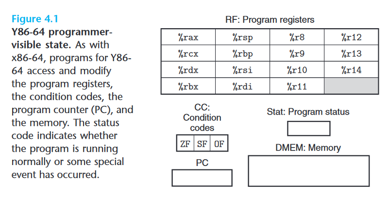

Y86-64中的每条指令都可以读或者修改处理器的一些状态，这些状态称为“程序员[^注释1]可见状态”

Y86-64的处理器状态包括：15个64位的寄存器、ZF、SF、OF三个状态码、PC、Stat、主存

15个寄存器包括%rax、%rcx、%rdx、%rbx、%rsp、%rbp、%rsi、%rdi、%r8\~%r14

ZF、OF、SF三个用于整数算术、逻辑运算效果的指令

PC存储着当前正在执行的指令的地址

Stat状态码表示程序执行的整体状态，可以表示当前程序是在正常操作执行还是发生某种异常

主存在概念上是存储程序和数据的大的字节数组，Y86-64使用虚拟存储，由操作系统和硬件合作将虚拟地址翻译为物理地址

## 4.1.2 *Y86-64 Instructions*


Y86-64所支持的指令集如上图所示，指令所操作的对象是8字节整数

1.  将movq指令按照源和目的操作数的形式划分为`irmovq`、`rmmovq`、`mrmovq`、`rrmovq`

    其中源操作数可以是i立即数、r寄存器、m存储器(指令助记符的第一个字符)，目的操作数可以是r寄存器、m存储器(指令助记符的第二个字符)

    存储器操作数的内存引用方式是简单的基址和偏移量形式，不支持变址和缩放的内存引用形式

    同x86-64，不支持内存和内存之间的数据直接传递，也不支持将立即数直接传送到内存
2.  OPq指令表示基于整数的四种运算指令：`addq`、`subq`、`andq`、`xorq`

    不像x86-64允许整数运算指令直接操作存储器数据，OPq指令仅仅在寄存器数据上操作

    OPq指令可以设置SF、ZF、OF条件码位
3.  jXX指令表示7种跳转指令：`jmp`、`jle`、`jl`、`je`、`jne`、`jge`、`jg`

    跳转指令执行跳转的条件同x86-64
4.  cmovXX表示6种条件传送指令：`cmovle`、`cmovl`、`cmove`、`cmovne`、`cmovge`、`cmovg`

    cmovXX指令的格式同rrmovq，是寄存器和寄存器之间的数据传送
5.  call和ret

    call指令将返回地址入栈，并将目的地址送PC

    ret指令则取返回地址送PC
6.  pushq和popq

    同x86-64的pushq、popq

    pushq先将%rsp减8然后入栈数据，popq先取%rsp内存引用上的数据，然后加%rsp 8
7.  halt指令暂停指令的执行

    x86-64中有类似的指令hlt，但是并不允许应用程序执行该条指令，因为它会暂停整个系统的操作

    在Y86-64中，halt指令的执行会使得处理器停止，设置状态码为HLT

## 4.1.3 *Instruction Encoding*

[🖼️ 图片](image/image_Fk_7K5nsTC.png "🖼️ 图片")Figure4.2也展示出了Y86-64指令集的位级编码：

1.  指令编码长度范围在1字节到10字节之间
2.  每条指令都以1字节的指令指示符开始，可能会有1字节的寄存器指示符、8字节的常量
3.  fn字段域表示了一个特定的整数运算或者是条件传送或者是分支指令

### *Instruction specifier*

每条指令都有一字节的指令指示符来表示当前指令类型。这一字节被分为两个4位部分：高4位表示代码，低4位表示功能

代码字段的值范围在0\~0xB之间

功能字段仅用于区分一组共享代码字段的指令集合的某个指令，如下


值得注意的是rrmovq与cmovXX具有同样的格式，可以被视为jmp类的cmov，它的功能字段值恰好为0

### *Register specifier*


寄存器指示符的编码是从0x0\~0xE。Y86-64和X86-64寄存器编号是匹配的(0xF为%r15)

**在Y86-64中的0xF表示不访问寄存器**，如`irmovq`、`popq`、`pushq`这些只需要一个寄存器操作数的指令，另一个寄存器操作数字段的值即为0xF

### 8B Constant

8B的常量字可以作为irmovq中的立即数、rmmovq和mrmovq中的内存引用的位移以及分支和调用的目的地。这里需要注意的是Y86-64中的分支和调用目的地址以绝对地址给出——X86-64中是采用PC相对寻址。且与X86-64一样，所有整数采用小端编码

### 示例

例如指令“`rmmovq %rsp,0x123456789abcd(%rdx)`”的机器编码为"0x4042cdab896745230100"

> ✨*One important property of any instruction set is that the byte encodings must have a unique interpretation. An arbitrary sequence of bytes either encodes a unique instruction sequence or is not a legal byte sequence.*
>
> Y86-64就是这样，只要知道指令指示符这一字节我们就能决定其他附加字节的长度和含义。但是如果不知道一段代码序列的起始位置，我们就不能准确地确定怎样将序列划分成单独的指令

### RISC and CISC

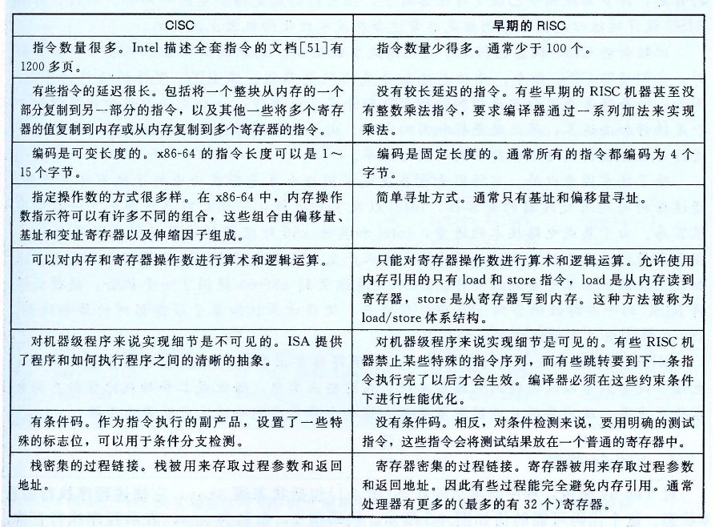

而Y86-64指令集既有CISC指令集的属性也有RISC指令集的属性。和CISC一样，它有条件码，长度可变的指令，并用栈来保存返回地址。和RISC一样的是，采用load-store机制和规则编码，通过寄存器来传参——Y86-64可以看作是采用了CISC x86-64指令集，但利用RISC的一些规则进行了简化

RISC和CISC的发展趋势是相结合的，而且各在不同的市场上表现得很出色

## 4.1.4 *Y86-64 Exception*

在4.1.1[🖼️ 图片](image/image_4SkZmBQ-pU.png "🖼️ 图片")中讲到，程序员的可见状态中包含一个Stat状态码位，其值如下：

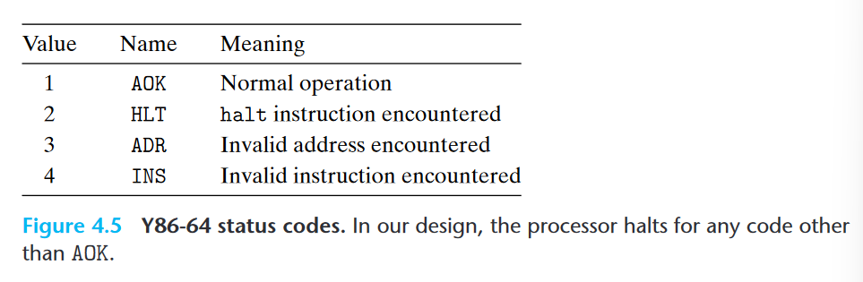

值为1时，表示AOK，即表示程序正常执行

值为2时，表示HLT，是由指令`halt`引起的，表示处理器暂停执行指令

值为3时，表示ADR，即处理器在获取指令或读取或写入数据时尝试读取或写入无效的内存地址

根据具体的实现细节限制最大的地址范围，超出此范围的地址的访问均会触发ADR异常

值为4时，表示INS，即无效的指令

## 4.1.5\* Y86-64 Procedure\*

对于下列C函数，观察它的x86-64汇编代码和Y86-64汇编代码：


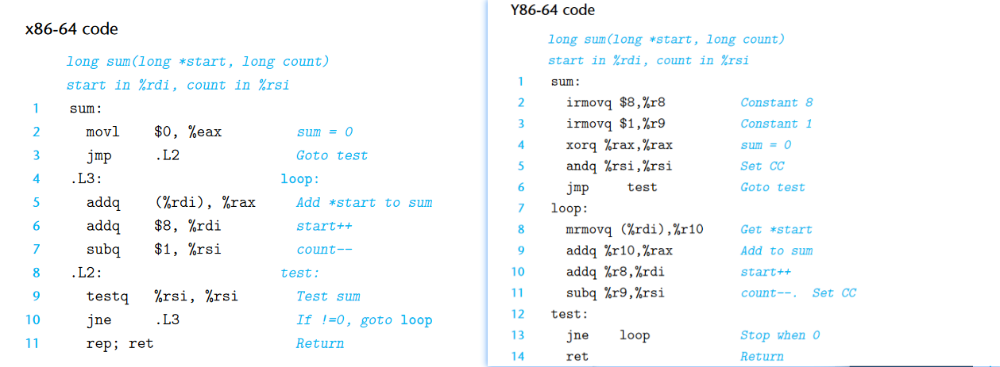

可以看到以下几点不同：

1.  Y86-64是load-store架构，所有的算术运算均是寄存器和寄存器之间的，不存在寄存器和立即数运算，因此需要2-3行的汇编代码`irmovq`；也不存在存储器操作数和寄存器之间的运算，因此需要第8行的`mrmovq`

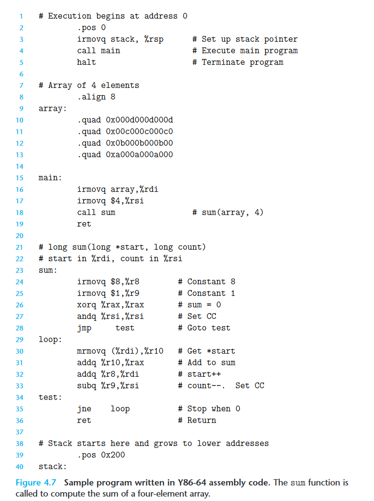

其中"`.`"开头的是汇编器伪指令，告诉汇编器调整生成代码的地址或插入一些数据字

`.pos 0`表示汇编器应该从地址0开始生成代码——所有Y86-64汇编程序均以该伪指令开始

`.align 8`表示汇编器插入数据的对齐偏移量为8B

在实验的过程中会用到yas和yis


## 4.1.5\* Some Y86-64 Instruction Details\*

需要注意两种特别的指令的组合

1.  pushq %rsp是存放原来的%rsp还是减8之后的%rsp

    

    总返回0说明，**push %rsp保存的是原来的%rsp即未减8的**
2.  popq %rsp是恢复栈中的值还是原来的%rsp+8

    

    返回的总是0xabcd，表明**popq %rsp得到的是栈中的值**

# 4.2 *Logic Design and the Hardware Control Language HCL*

大多数现代的逻辑设计电路将逻辑1设置为1.0v的高电平，将0设置为0.0v的低电平。实现数字系统需要三个主要组件：用于计算位功能的组合逻辑电路、用于存储位的存储元件以及用于调节存储元件更新的时钟信号。

HCL硬件控制语言是用来描述硬件设计的控制部分，只表示有限的操作集合。使用将HCL直接转换为Verilog的工具，将转换后的代码与基本的硬件单元的Verilog代码结合起来，就能产生HDL硬件描述语言，从而合成能够实际能够工作的微处理器

## 4.2.1 Logic Gates

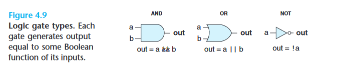

逻辑门是数字电路的基本计算元件，逻辑门的输出是其输入位值的布尔函数，如与AND、或OR、非NOT。上图即为逻辑门部件的示意图以及HCL描述。

注意这里使用&&、||、!代替C中的&、|、\~。因为逻辑门是对单个位，而不是整个字进行运算的。

> ✨逻辑门总是处于激活状态，当输入改变时，在很短的时间内，输出也会随之改变

## 4.2.2 *Combinational Circuits and HCL Boolean Expressions*

通过将多个逻辑门组装成一个网络，就可以构建称为组合电路的计算块。但是网络搭建的方式需要受到一定的限制：

1.  逻辑门的输入必须是“一个系统输入（称为主输入）”、“某个相连接的存储器单元的输出”、“某个逻辑门的输出”
2.  两个及其以上的逻辑门的输出不能连接在一起

    两个或以上的逻辑门可能将导线驱向不同的电压，从而导致无效电压或者电路故障
3.  网络必须是无环的

    如果网络中存在一条回路，那么会引起所表示的函数功能的歧义

下图的逻辑电路可以判断两个位是否相等，其对应的HCL为

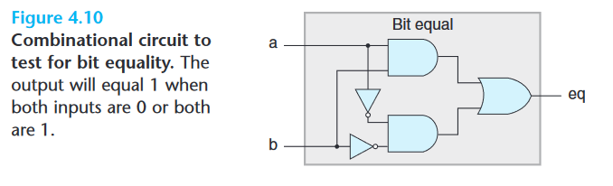

```c
bool eq=(a&&b)||(!a&&!b)
```

> ✨HCL使用C风格的语法，通过“=”将信号名称与表达式相关联。然而，与 C 不同的是，我们并不将其视为执行计算并将结果分配到某个内存位置。相反，它只是一种为表达式命名的方法

下图的逻辑电路可以实现一位多选器，其对应的HCL为

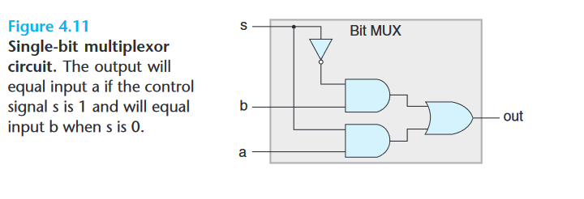

```c
bool out=(!s&&b)||(s&&a);
```

HCL表达式和C表达式有着很明显的相似之处

它们都使用布尔运算来计算其输入的函数

但是也有一些差异：

1.  组合逻辑电路HCL表达式当输入改变时，输出即改变
    C表达式只有当程序执行到该处时才进行计算输出
2.  C的逻辑表达式可以表示范围内的任意整数——将0视为False，非0视为True。而组合逻辑HCL只有0和1两个位值
3.  当C逻辑表达式中的第一部分可以被计算时，第二部分即不进行执行。而组合逻辑HCL只要输入改变，输出就会进行改变。

    例如$(a\&\&!a)\&\& func(b,c)$在C中并不会调用func函数，而在HCL中，只要a/b/c有改变就都会计算

## 4.2.3 *Word-Level Combinational Circuits and HCL Integer Expressions*

> *Combinational circuits that perform word-level computations are constructed using logic gates to compute the individual bits of the output word, based on the individual bits of the input words.*

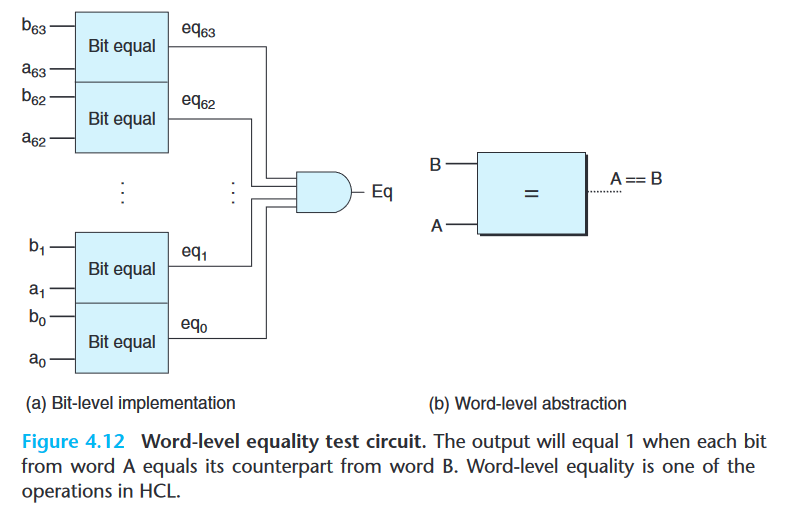

Figure4.12展示了一个用于判断两个64位字A、B是否相等的组合逻辑电路

是通过1位判断相等的逻辑电路来判断64位字的每个位是否相等，最后将每位的判断结果相与得到最终的判断结果——为1表示相等，为0表示不等

其HCL如下

```c
bool Eq=(A==B);
```

> ✨在 HCL 中，我们将任何字级信号声明为 int，而不指定字大小
>
> 在功能齐全的HDL中，每个字都可以声明为具有特定的位数

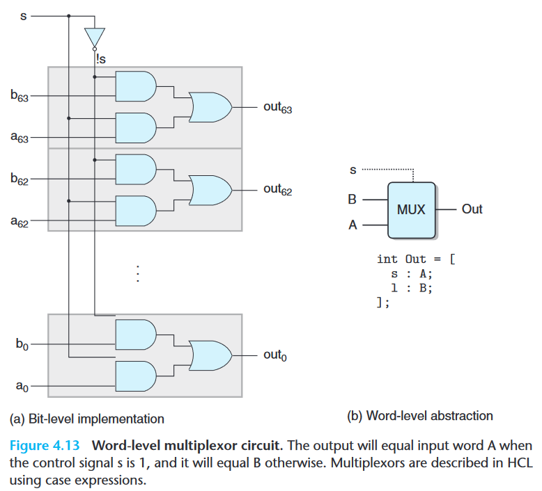

Figure4.13展示了字级的多路选择器，同字级的比较器一样，是对字的每一位运行一位多路选择器，然后最后输出等同字大小的数据

其HCL如下：

```c
int Out=[
  s:A;
  1:B;
]
```

> ✨多路选择器的HCL描述使用case表达式，其通用的格式为：
>
> 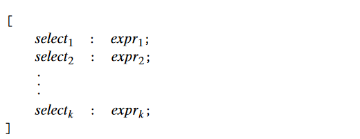
>
> 表达式包含着一系列的case语句，每一个case i包含着一个布尔表达式$select_i$和其对应的值$expr_i$
>
> 和C中的switch-case不同，不要求不同的选择表达式是互斥的。从逻辑上讲，选择表达式按顺序求值，并选择第一个产生 1 的情况[^注释2]。如Figure4.13的HCL
>
> $select_i$可以是任意的布尔表达式也可以是任意的整数
>
> 比如四路多路选择器的HCL为
>
> ```c
> word Out4=[
>   !s1&&!s0:A;#00
>        !s1:B;#01 !S1的另一种情况已在第一个判断，则不满足即进入第二个
>        !s0:C;#10
>          1:D;
> ];
> ```
>
> 比如三路最小的HCL为
>
> 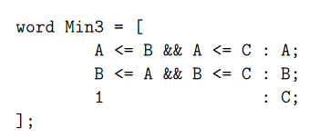

## 4.2.4 *Set Membership*

在处理器设计中，很多时候都需要将一个信号与许多可能匹配的信号作比较，以此来检测正在处理的某个指令代码是否属于某一类指令代码

例如，生成四路选择器的选择信号s1、s0：


```c
bool s1 = code == 2 || code == 3;
bool s0 = code == 1 || code == 3;
```

采用集合的通用表达形式：$iexpr \space in \left\{i \exp r_{1}, i \operatorname{expr}_{2}, \ldots, i e x p r_{k}\right\}$则对上式可简化为：

```c
bool s1 = code in { 2, 3 };
bool s0 = code in { 1, 3 };
```

## 4.2.5 *Memory and Clocking*

> *Combinational circuits, by their very nature, do not store any information. Instead, they simply react to the signals at their inputs, generating outputs equal to some function of the inputs.*\* To create **sequential circuits—that is, systems that have state and perform computations on that state**—we must introduce devices that store information represented as bits.\*\* Our storage devices are all controlled by a single clock, a periodic signal that determines when new values are to be loaded into the devices\*\*. We consider two classes of memory devices:\*

1.  时钟寄存器

    时钟寄存器（或简称寄存器）存储一个位或字，通过时钟信号控制寄存器的输入值的加载
2.  随机访问存储器

    随机存取存储器（或简称存储器）存储多个字，使用地址来选择应读取或写入哪个字

    随机存储器的示例包括：
    1.  处理器的虚拟存储系统
    2.  寄存器文件：使用寄存器标识符充当地址

> ✨正如我们所看到的，当谈到硬件和机器语言编程时，“寄存器”一词的含义略有不同
>
> 在硬件中：寄存器通过其输入和输出线直接连接到电路的其余部分
>
> 在机器语言编程中：寄存器表示CPU中可寻址字的一部分集合，地址是寄存器的ID
>
> 因此为了避免歧义，分别将这两种寄存器称为“硬件寄存器”和“程序寄存器”

### 硬件寄存器

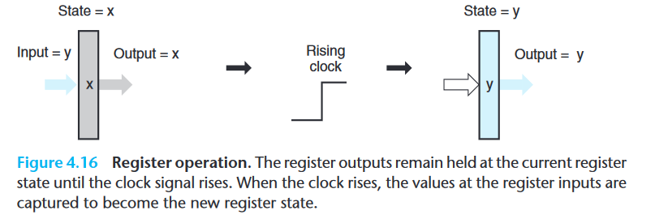

Figure4.16详细介绍了硬件寄存器以及它是怎么进行工作的

1.  在大多数情况下寄存器都保持在一个稳定状态（图中的x），产生的输出等于它当前状态
2.  只要时钟信号是低电平的，寄存器的输出就保持不变
3.  当时钟变成高电位时，通过组合逻辑传递的输入信号y就加载到寄存器中，成为寄存器的当前稳定状态y直到下一个时钟上升沿，此前的稳定态x成为寄存器的输出
4.  寄存器可以作为电路不同部分的组合逻辑之间的屏障——每当每个时钟到达上升沿时，值才会从寄存器的输入传送到输出

Y86-64处理器使用硬件寄存器去实现PC、CC、Stat

### 程序寄存器

下面的图展示了一个典型的寄存器文件：


该寄存器堆有两个读端口，名为 A 和 B，以及一个写端口，名为 W。这种多端口随机存取存储器允许同时进行多个读和写操作。

寄存器堆不是组合电路，因为它具有内部存储。然而，在之后的实现中，可以从寄存器文件中读取数据，就好像它是一个组合逻辑块，其地址作为输入，数据作为输出

寄存器的读端口并不需要受时钟信号的控制，时钟信号控制的是寄存器写——在每一次上升沿写端口的数据valW就会写入dstW地址所标识的寄存器

> ✨因为寄存器堆既可以进行读也可以进行写，那么“当同时尝试写或者读同一个寄存器时会出现什么呢？”答案是——如果寄存器堆中的某个寄存器同时被读和写，那么随着时钟上升，读出来的数据是被新写入的数据

### 数据存储器

为了存储程序数据，处理器内部存在一个随机访问的存储器，其电路结构如下：

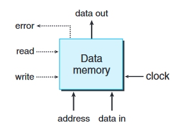

读：给定内存单元地址至address引脚，并设置write引脚为低电平，那么在几个延迟后，该存储单元的数据就会加载至data\_out引脚

写：给定将进行更改的内存单元的地址至address，以及新数据至data\_in，并设置write为高电平，那么在时钟上升沿，如果地址有效的话，就会对指定单元进行更新

如果给定的读/写地址超出了可寻址的范围，那么会设置error[^注释3]引脚为高电平，否则为低电平

### 指令存储器

为了存储程序指令，处理器内部存在一个只读的存储器

> ✨在大多数实际系统中，数据存储器和指令存储器被合并成具有两个端口的单个存储器：一个用于读取指令，另一个用于读取或写入数据

# 4.3 *Sequential Y86-64 Implementations*

Sequential Processor（SEQ）每个时钟周期都做完当前指令所需的全部操作——时钟周期长度为最复杂的指令完成所需要的时间

## 4.3.1 *Organizing Processing into Stages*

### 指令执行阶段序列

一般来说，处理一条指令涉及许多操作。我们按照特定的阶段顺序组织它们，试图使所有指令遵循统一的顺序：

1.  取指
    > ✨取指阶段会从内存中读取PC值为地址的内存单元处的指令；从指令说明符中提取的两部分icode、ifun分别表示指令的类型以及做什么样的运算。此外指令中可能会有寄存器操作数位rA、rB，也可能会有8字节的常量valC。取指阶段还需要计算下一条顺序执行指令的地址——当前地址+当前指令长度
    1.  取出icode、ifunc
    2.  取出可能有的寄存器指示符rA、rB
    3.  取出可能有的8字节立即数
    4.  计算顺序执行的下一条指令的地址
2.  译码
    > ✨根据指令的rA、rB字段，从寄存器文件中取得对应的valA、valB；此外还有些指令是读取%rsp的
3.  执行

    在执行阶段，算术/逻辑单元（ALU）要么执行指令指定的操作（根据ifun的值）[^注释4]，要么计算内存引用的有效地址，要么递增或递减堆栈指针，计算结果为valE，可能会根据结果位设置条件码

    对于条件传送指令，该阶段将评估条件代码和移动条件（由 ifun 给出）。类似地，对于跳转指令，它决定是否应该采取分支
4.  访存

    访存阶段可以将数据写入存储器，也可以从存储器读取数据。将读取的值称为 valM
5.  写回：最多可以写两个结果到寄存器文件——目的寄存器+%rsp
6.  更新PC：PC被设置为下一条指令的地址

### 设计原则

> \*The processor loops indefinitely, performing these stages. In our simplified implementation, the processor will stop when any exception occurs—that is, \*\*when it executes a halt or invalid instruction, or it attempts to read or write an invalid address. \**In a more complete design, the processor would enter an exception-handling mode and begin executing special code determined by the type of exception*

在进行硬件设计时，使用非常简单且统一的结构非常重要，因为我们希望最大限度地减少硬件总量，并且最终必须将其映射到集成电路芯片的二维表面上——一个降低硬件复杂度的方法是**让不同的指令尽可能多的复用硬件**[^注释5]

这个简单且统一的结构即是上述提出的6阶段的指令执行阶段序列，接下来要做的即是**将Y86-64指令集中的每条不同的指令所需要的计算放入这个通用框架**

### Y86-64指令集通用框架

#### OPq rA,rB

1.  取指：取icode、ifunc、可能有的寄存器指示符、8字节立即数并计算顺序执行的下一条PC地址
    $$
    icode:ifunc\leftarrow M_1[PC] \\
    rA:rB \leftarrow M1[PC+1] \\
    valP\leftarrow PC+2 
    $$
2.  译码：取寄存器操作数
    $$
    valA\leftarrow Reg[rA]\\
    valB\leftarrow Reg[rB] 
    $$
3.  执行：根据ifunc计算结果
    $$
    valE\leftarrow valB \space OP \space valA \\
    Set \space CC 
    $$
4.  访存

    OPq指令不需要访存
5.  写回
    $$
    Reg[rB]\leftarrow valE
    $$
6.  更新PC
    $$
    PC\leftarrow valP
    $$

#### rrmovq rA,rB

1.  取指：取icode、ifunc、可能有的寄存器指示符、8字节立即数并计算顺序执行的下一条PC地址
    $$
    icode:ifunc\leftarrow M_1[PC] \\
    rA:rB \leftarrow M1[PC+1] \\
    valP\leftarrow PC+2 
    $$
2.  译码：取寄存器操作数
    $$
    valA\leftarrow Reg[rA]
    $$
    只需要取操作数rA
3.  执行：根据ifunc计算结果
    $$
    valE\leftarrow 0+valA 
    $$
    这一步是多余的redudant，只是为了实现一个通用的处理方式
4.  访存

    OPq指令不需要访存
5.  写回
    $$
    Reg[rB]\leftarrow valE
    $$
6.  更新PC
    $$
    PC\leftarrow valP
    $$

#### irmovq V,rB

1.  取指：取icode、ifunc、可能有的寄存器指示符、8字节立即数并计算顺序执行的下一条PC地址
    $$
    icode:ifunc\leftarrow M_1[PC] \\
    rA:rB \leftarrow M1[PC+1] \space rA是F\\
    valC\leftarrow M_8[PC+2]\\

    valP\leftarrow PC+10 
    $$
2.  译码：取寄存器操作数

    irmovq指令不需要取寄存器操作数
3.  执行：根据ifunc计算结果
    $$
    valE\leftarrow 0+valC
    $$
4.  访存

    OPq指令不需要访存
5.  写回
    $$
    Reg[rB]\leftarrow valE
    $$
6.  更新PC
    $$
    PC\leftarrow valP
    $$

#### rmmovq rA,D(rB)

1.  取指
    $$
    icode,ifunc\leftarrow M_1[PC] \\
    rA,rB\leftarrow M_1[PC+1] \\
    valC\leftarrow M_8[PC+2] \\
    valP\leftarrow PC+10 
    $$
2.  译码
    $$
    valA\leftarrow Reg[rA]\\
    valB\leftarrow Reg[rB] 
    $$
3.  执行
    $$
    valE=valB+valC
    $$
4.  访存
    $$
    Mem_8[valE]\leftarrow valA
     
    $$
5.  写回

    无
6.  更新PC
    $$
    PC\leftarrow valP
    $$

#### mrmovq D(rB),rA

1.  取指
    $$
    icode,ifunc\leftarrow M_1[PC] \\
    rA,rB\leftarrow M_1[PC+1] \\
    valC\leftarrow M_8[PC+2] \\
    valP\leftarrow PC+10 
    $$
2.  译码
    $$
    valB\leftarrow Reg[rB] 
    $$
3.  执行
    $$
    valE=valB+valC
    $$
4.  访存
    $$
    valM\leftarrow Mem_8[valE]
     
    $$
5.  写回
    $$
    R[rA]\leftarrow valM
    $$
6.  更新PC
    $$
    PC\leftarrow valP
    $$

#### pushq rA

1.  取指
    $$
    icode:ifunc \leftarrow M_1[PC] \\
    rA:rB\leftarrow M_1[PC+1]\\
    valP\leftarrow PC+2
     
    $$
2.  译码
    $$
    valA\leftarrow Reg[rA]\\
    valB\leftarrow Reg[\%rsp] 
    $$
3.  执行
    $$
    valE=valB+(-8)
    $$
4.  访存
    $$
    Mem_8[valE]\leftarrow valA
    $$
5.  写回
    $$
    Reg[\%rsp] \leftarrow valE \\
     
    $$
6.  更新PC
    $$
    PC\leftarrow valP 
    $$

#### popq rA

1.  取指
    $$
    icode:ifunc \leftarrow M_1[PC] \\
    rA:rB\leftarrow M_1[PC+1]\\
    valP\leftarrow PC+2
     
    $$
2.  译码
    $$
    valA\leftarrow Reg[\%rsp]\\
    valB\leftarrow Reg[\%rsp] 
    $$
    这里取两次%rsp的值也是多余的，只是为了让popq后续的处理与之前指令的处理逻辑相类似
3.  执行
    $$
    valE=valB+8
    $$
4.  访存
    $$
    valM\leftarrow Mem_8[valA]
    $$
5.  写回
    $$
    Reg[\%rsp] \leftarrow valE \\

    Reg[rA]\leftarrow valM 
    $$
6.  更新PC
    $$
    PC\leftarrow valP 
    $$

> ✨pushq和popq的处理逻辑也表明了
>
> pushq %rsp是存%rsp的旧值入栈、popq %rsp是%rsp中的是栈中的值
>
> 4.1.5\* Some Y86-64 Instruction Details\*

#### jXX Dest

1.  取指
    $$
    icode:ifunc\leftarrow Mem_1[PC]\\
    valC\leftarrow Mem_8[PC+1]\\
    valP\leftarrow PC+9 
    $$
2.  译码

    `jXX Dest`指令不需要读寄存器，因此不需要译码
3.  执行

    有条件跳转指令执行阶段需要判断跳转条件是否满足

    无条件跳转的Cnd始终为1
    $$
    Cnd\leftarrow Cond(CC,ifunc)
    $$
4.  访存

    `JXX Dest`指令不需要访存
5.  写回

    `jXX Dest`指令不需要写寄存器
6.  更新PC
    $$
    PC\leftarrow Cnd?valC:valP
    $$

#### call Dest

> ✨call Dest指令相当于 push 下一条地址;j Dest

1.  取指
    $$
    icode:ifunc\leftarrow Mem_1[PC]\\
    valC\leftarrow Mem_8[PC+1]\\
    valP\leftarrow PC+9 
    $$
2.  译码

    call指令需要调用栈来保存返回地址，因此需要读取栈顶寄存器的值
    $$
    valB\leftarrow R[\%rsp]
    $$
3.  执行

    对栈顶寄存器的值进行减栈
    $$
    valE\leftarrow valB+(-8)
    $$
4.  访存

    写下一条指令地址入栈
    $$
    Mem_8[valE]\leftarrow valP
    $$
5.  写回

    更新%rsp
    $$
    Reg[\%rsp]\leftarrow valE
    $$
6.  更新PC
    $$
    PC\leftarrow valC
     
    $$

#### ret

> ✨ret指令相当于 popq rA ;j rA

1.  取指
    $$
    icode:ifunc\leftarrow M_1[PC]\\
    valP\leftarrow PC+1 
    $$
2.  译码

    ret指令需要popq，因此需要读取两次%rsp的值
    $$
    valA\leftarrow Reg[\%rsp]\\
    valB\leftarrow Reg[\%rsp] 
    $$
3.  执行

    对栈顶寄存器操作
    $$
    valE=valB+8
    $$
4.  访存
    $$
    valM\leftarrow Mem_8[valA]
    $$
5.  写回
    $$
    R[\%rsp]\leftarrow valE
    $$
6.  更新PC
    $$
    PC\leftarrow valM 
    $$

> ✨一般都是valB参与ALU运算，valA作赋值或者内存引用

#### cmovq

rrmovq rA,rB是cmovq的无条件版本，可以修改rrmovq的通用格式如下，即可实现cmovq的执行格式：

1.  取指：取icode、ifunc、可能有的寄存器指示符、8字节立即数并计算顺序执行的下一条PC地址
    $$
    icode:ifunc\leftarrow M_1[PC] \\
    rA:rB \leftarrow M1[PC+1] \\
    valP\leftarrow PC+2 
    $$
2.  译码：取寄存器操作数
    $$
    valA\leftarrow Reg[rA]\\
    valB\leftarrow Reg[rB] 
    $$
    只需要取操作数rA
3.  执行：根据ifunc计算结果
    $$
    valE\leftarrow 0+valA \\
    Cnd\leftarrow Cond(CC,ifunc) 
    $$
    这一步是多余的redudant，只是为了实现一个通用的处理方式
4.  访存

    OPq指令不需要访存
5.  写回
    $$
    Reg[rB]\leftarrow Cnd?valE:valB
    $$
6.  更新PC
    $$
    PC\leftarrow valP
    $$

## 4.3.2 SEQ Hardware Structure

4.3.1中已经介绍了Y86-64 SEQ的指令的通用处理结构，接下来的任务是创建硬件设计来实现结构中的6个阶段，并将它们连接起来

### 各阶段对应的硬件单元

各个阶段所涉及到的硬件单元为：

1.  取指：程序计数器PC、指令寄存器insMem和PC增量器
2.  译码：两个读端口、两个写端口的寄存器文件
3.  执行：算术逻辑单元ALU和条件码寄存器CC

    算术逻辑单元的作用：
    1.  对操作数执行算术逻辑运算
    2.  对栈指针%rsp进行增减
    3.  加0实现赋值mov
    4.  计算有效地址
        条件码寄存器只有3位
4.  访存：数据存储器dataMem
5.  写回：译码阶段的寄存器文件，E端口写valE、M端口写valM
6.  更新PC：根据valP、valC、valM更新

    valP是顺序执行或者条件转移不满足的情况

    valC是无条件跳转、以及条件转移满足的情况

    valM是返回地址

其对应的SEQ抽象视图如下：

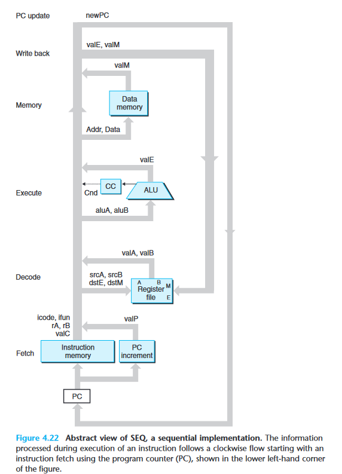

### 硬件图的画图惯例

1.  采用自下而上画处理器和流程的方法

    自下而上的画法是为了指令从下到上流动

    [🖼️ 图片](image/image_vBjlSNM_F2.png "🖼️ 图片")的第五周期的扩展图即符合这种自下而上的画法：取指在最底部，写回在顶部

    且由于正常的程序流程是从指令序列的顶部到底部，因此我们通过让流水线从底部到顶部来保留这种顺序
2.  硬件寄存器用白色方框表示——SEQ中唯一的硬件寄存器为PC
3.  硬件单元用浅蓝色方框表示——如存储器、ALU等

    这些硬件单元视为“黑盒”，不用关心内部实现细节
4.  控制逻辑块用灰色圆角矩形表示
5.  线路的名称在白色圆圈中说明，只是一个说明标识
6.  宽度为字长的数据连接用中等粗度的线表示
    宽度为字节或更窄的数据连接用细线表示
    宽度为位的数据连接用虚线表示

### SEQ详细硬件图

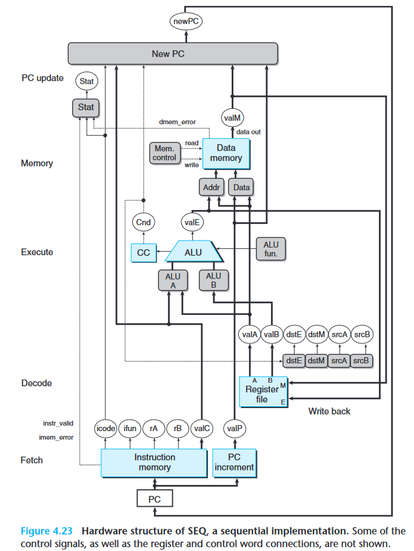

## 4.3.3 SEQ Timing

在4.3.1中对各类型指令的分析中，是将它们看成是用程序符号写的，赋值是从上到下顺序执行的。然后硬件结构的操作运行根本完全不同，一个时钟的变化会引发一个经过组合逻辑的流，来执行整个指令。

SEQ的实现包括组合逻辑和两种存储器设备（如PC、CC这样的时钟寄存器，如寄存器文件、insMem、dataMem这样的随机访问存储器）

组合逻辑以及随机访问存储器的读并不需要时钟信号的控制——只要输入变化了，值就会通过逻辑门网络传播

而PC、CC这样的时钟寄存器，以及随机访问存储器的写操作则需要通过一个时钟信号来控制

为了确保硬件结构的操作按照4.3.1中各类型指令的顺序执行，需要引入时钟控制机制以同步处理器内时钟寄存器和写内存的操作时序。这样，尽管所有状态的更新在时钟上升开始下一个周期时实际上是同时发生的，但我们仍然能够实现类似于4.3.1中指令顺序执行的效果。

> ✨之所以引入时钟控制机制使得硬件结构操作和指令逻辑操作效果一致的原因是：Y86-64本质上的`从不回读`原则，即处理器从来不需要为了完成一条指令的执行而去读由该条指令更新了的状态

> 也因为“从不回读”的原则，\*some instructions (the integer operations) set the condition codes, and some instructions (the conditional move and jump instructions) read these condition codes, but \**no instruction must both set and then read the condition codes*.

## 4.3.4 *SEQ Stage Implementations*

### 取指阶段


如上图所示，取指阶段包括指令存储器、分割以及对齐和PC增量器这三种组合逻辑组件、以及时钟寄存器PC寄存器和一些控制逻辑

在取指阶段会根据PC指定的指令存储器地址开始取出10个字节

其中第一个字节`Byte 0`被Split部件分割成两个4位的控制逻辑——icode和ifun。当指令地址无效时，即出现imem\_error[^注释6]信号时，当前指令的icode和ifun为nop指令的Byte 0；否则为内存中的Byte 0

剩余的9个字节会经过`Align`部件的处理，将其分割成寄存器指示符和常量字

如果need\_regids有效，则会设置Byte1为寄存器指示符，并将其分割成两个4位的rA、rB；如果need\_regids无效，则会设置rA、rB均为0xF

Align部件会根据need\_regids的有效与否，设置valC为Byte2\~Byte9或者Byte1\~Byte8

根据icode的值，可以计算出三个1位的控制逻辑instr\_valid、need\_valC、need\_regids

instr\_valid[^注释7]表示当前指令是一个有效的Y86-64指令集指令

need\_valC表示当前指令中包含一个常量字Byte1\~Byte9或者Byte2\~Byte9

```c++
//需要常数字的指令有irmovq、rmmovq、mrmovq
bool need_valC = icode in {IIRMOVQ,IRMMOVQ,IMRMOVQ,IJXX,ICALL};

```

need\_regids表示当前指令中包含寄存器指示符字节Byte1

```c++
//需要寄存器的指令有opq、rrmovq、irmovq、rmmovq、mrmovq、cmovXX、pushq、popq
bool need_regids = icode in { IRRMOVQ, IOPQ, IPUSHQ, IPOPQ, IIRMOVQ, IRMMOVQ, IMRMOVQ };

```

PC增量计算部件会根据PC值以及need\_regids、need\_valC信号来产生valP

$$
valP=PC+1+need\_regids+need\_valC\times 8
$$

### 译码、写回阶段

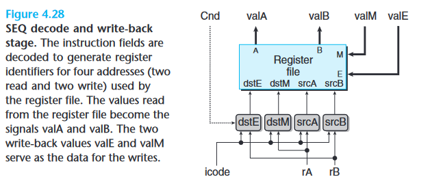

译码阶段和写回阶段均需要使用寄存器文件，因此一起讨论

寄存器文件共有8个引脚，可分为4种端口——两个同时读两个同时写。每种端口都会有数据连接引脚和地址连接引脚。其中地址连接引脚即为寄存器的ID、数据连接引脚为64位数据

两个读端口：A和B。地址引脚是srcA、srcB；输出数据引脚是valA、valB

两个写端口：E和M。E端口是用于ALU结果的写，dstE为地址引脚，valE为输入数据引脚；M端口是用于存储器结果的写，dstM为地址引脚，valM为输入数据引脚

> 0xF表示不需要访问寄存器

Figure4.28 [🖼️ 图片](image/image_sqBmZz67FM.png "🖼️ 图片")下方的4个控制逻辑块是用来根据rA、rB和icode生成4种端口的地址引脚的

```c++
//4位的数据量称为word
word srcA={
  icode in {IRRMOVQ,IRMMOVQ,IOPQ,IPUSHQ} : rA;
  icode in {IRET,IPOPQ} : 0x4;//0x4为%rsp的编号
  1 : 0xF;  
};//只是需要读rA寄存器的指令
word srcB={
  icode in {IRMMOVQ,IMRMOVQ,IOPQ} : rB;
  icode in {IPUSHQ,IPOPQ,ICALL,IRET} : 0x4;
  1 : 0xF;
};//只是需要读rB寄存器的指令
word dstE={
  icode in {IRRMOVQ} && Cnd : rB;
  icode in {IOPQ,IIRMOVQ,IRRMOVQ} : rB;
  icode in {IPUSHQ,IPOPQ,ICALL,IRET} : 0x4;
  1 : 0xF;
};//写ALU结果的指令
word dstM={
  icode in {IMRMOVQ,IPOPQ} : rA;
  1 : 0xF;
};//写MEM结果的指令
```

### 执行阶段

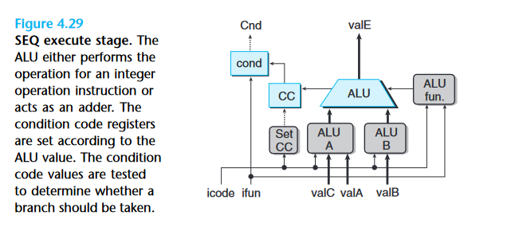

Figure4.19展示了执行阶段的控制逻辑。这一单元会基于alufun信号对输入的aluA和aluB做指定的运算

alu所做的操作都是将aluB作为第一操作数，aluA作第二操作数

```c++
word aluA={
  icode in {IOPQ,IRRMOVQ} : valA;
  icode in {IIRMOVQ,IRMMOVQ,IMRMOVQ} : valC;
  icode in {IPUSHQ,ICALL} : -8;
  icode in {IPOPQ,IRET} : 8;
};
word aluB={
  icode in {IOPQ,IRMMOVQ,IMRMOVQ,IPUSHQ,IPOPQ,ICALL,IRET} : valB;
  icode in {IRRMOVQ,IIRMOVQ} : 0;
};
```

ALU除了IOPQ对应的运算以外，其他基本执行的都是加法，因此可以编码alufun为

```c++
word alufun={
  icode==IOPQ : ifun;
  1 : ADD;
};
```

执行阶段还需要根据ALU的操作结果设置Cond，在Y86-64中只有opq指令需要设置Cond，因此可以得到

```c++
bool set_cc= icode==IOPQ;
```

cond这个硬件单元是使用条件码CC和功能码ifun一起决定是否采用条件分支或者数据转移。cond会根据CC、ifun的输入输出一个一位信号Cond，并根据这一信号设置条件转移的dstE和是否分支的nextPC

### 访存阶段

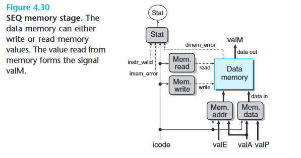

如Figure4.30所示，访存阶段需要完成读取程序数据以及写程序数据的任务。控制块memAddr生成访问的存储器地址，memData生成访问的存储器数据，memRead则生成读信号，memWrite生成写信号

```c++
word memAddr={
  icode in {IRMMOVQ,IMRMOVQ,IPUSHQ,ICALL} : valE;
  icode in {IPOPQ,IRET} : valA;
};

word memData={
  icode in {IRMMOVQ,IPUSHQ} : valA;
  icode == ICALL : valP;
};

bool memRead = icode in {IMRMOVQ,IPOPQ,IRET};
bool memWrite = icode in {IRMMOVQ,IPUSHQ,ICALL}

```

访存阶段还需要根据icode、imem\_error、instr\_valid和dmem\_error生成stat状态码

### 更新PC阶段


新PC的值可以是valC、valM或者valP。其对应的HCL描述如下：

```c++
word new_pc={
  icode == IJXX && Cnd : valC;
  icode == ICALL : valC;
  icode == IRET : valM;
  1:valP;
};
```

> ✨SEQ比较简单，但是它十分缓慢。时钟必须运行地足够慢，以便每一种指令的操作都可以在一个时钟周期内执行完毕
>
> SEQ的实现机制并未充分利用板载的硬件资源，因为每一个硬件单元在整个时钟周期内只有一定的比例处于活跃态

# 4.4 *General Principles of Pipelining*

> *Some general properties and principles of pipelined systems*
>
> 1.  *In a pipelined system, the task to be performed is divided into a series of discrete stages.*
> 2.  *Must move at the same rate*
> 3.  \*A key feature of pipelining is that it increases the throughput of the systembut it may also slightly increase the latency \*
>
>     *throughput:* ​*the number of customers served per unit time*
>
>     *latency:* ​*the time required to service an individual customer*

## 4.4.1 *Computational Pipelines*

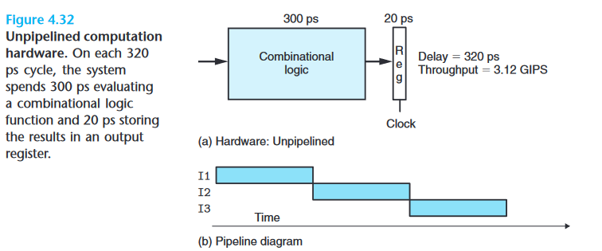

在目前的逻辑设计中，衡量电路延迟是使用ps数量级，即$10^{-12} s$

则在Figure4.32的示例中，假设组合逻辑计算块的延迟是300ps、时钟寄存器的加载延迟是20ps，则整个系统的latency是320ps，throughput是3.12GIPS


假设如Figure4.33所示，将Figure4.32中的组合逻辑分为三个阶段A、B和C，每个阶段耗时100ps。并在阶段之间插入时钟寄存器以实现流水。这样则当该系统处于稳定时，每个时钟周期有一条指令离开系统并有一条指令进入系统。可以计算出时钟周期是120ps，latency是360ps，throughput是8.33GIPS

> ✨吞吐量的增加使得硬件的开销和延迟增加[^注释8]

## 4.4.2 *A Detailed Look at Pipeline Operation*


在240ps的时钟上升之前，组合逻辑的输出并没有打入到寄存器中。因此组合逻辑B和Reg1是在计算I1的，组合逻辑A是I2，组合逻辑C是不活跃的
在240ps的时钟上升之后，之前的组合逻辑输出已经打入到了寄存器中但是还没有过20ps，仍没有传输到紧接着寄存器的组合逻辑块，因此组合逻辑A、B、C均空，Reg2是I1，Reg1是I2
在300ps时，上一阶段的组合逻辑输出已经传播出寄存器，因此Reg2和组合逻辑C是I1；Reg1和组合逻辑B是I2；组合逻辑A是I3
在359ps时，组合逻辑的计算已完毕，等待传播到寄存器

## 4.4.3 *Limitations of Pipelining*

### *Nonuniform Partitioning*

在实际应用中，可能会出现如下图这样存在着划分的组合逻辑段所需要的时间是不等长的系统，该系统的latency是510ps，throughput是5.88GIPS——因为**时钟周期会设置为瓶颈段所需要的时间**

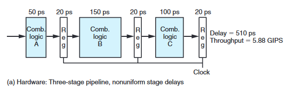

其流水线时空图如下：


> 例题
>
> 
>
> A. ABC 寄存器 DEF 时钟周期是190ps
> B. AB CD EF 时钟周期是130ps
> C.A BC D E 时钟周期是110ps
> D.A B C D EF 时钟周期是100ps

### *Diminishing Returns of Deep Pipelining*

因为在各个组合逻辑块之间需要插入寄存器来控制，所以如果划分的段太多，那么就会增加太多的额外硬件成本以及寄存器延迟，使得latency中的寄存器延迟的比例升高，且对吞吐量的增加的比例也下降

> *Modern processors employ very deep pipelines (15 or more stages) in an attempt to maximize the processor clock rate. The processor architects divide the instruction execution into a large number of very simple steps so that each stage can have a very small delay.*

> 例题
>
> 
>
> A.
>
> $$
> latency=\frac {300}{k} \times k +20 k=300+20k \\
> throughput=\frac{1000}{\frac{300}{k}+20}= \frac{1000k}{300+20k}
> $$
>
> B.k趋于无穷时，throughput上限是50GIPS

## 4.4.4 *Pipelining a System with Feedback*

这里的反馈回路即是带有冒险的流水线，包括数据冒险、控制冒险和结构冒险

# 4.5 *Pipelined Y86-64 Implementations*

## 4.5.1 SEQ+: Rearranging the Computation Stages

首先为了实现SEQ向流水线设计的过渡，需要重新安排SEQ中六个阶段的顺序——将PC的更新计算放在取指阶段前，使得更新PC在一个时钟周期开始时执行，而不是结束时才执行。这种修改后的设计叫做`SEQ+`

放在时钟周期结束时是计算下一条指令的PC，但放在时钟周期开始时是计算当前指令的PC

PC更新的公式是

```c++
word new_pc={
  icode == IJXX && Cnd : valC;
  icode == ICALL : valC;
  icode == IRET : valM;
  1:valP;
};
```

因此**放在时钟周期开始时计算当前指令的PC需要保存上一条指令的状态结果：`icode、Cnd、valC、valM、valP`**。其SEQ、SEQ+对应的逻辑图如下：

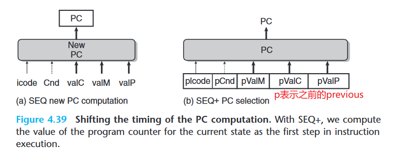

下图给出了SEQ+硬件的一个更为详细的说明，除更新PC外完全一样——PC逻辑从上面（在时钟周期结束时活动）移到了下面（在时钟周期开始时活动）

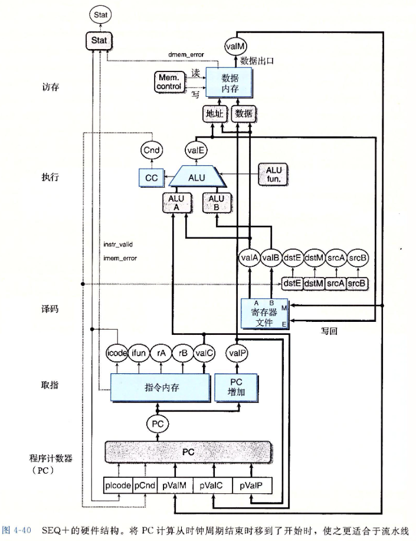

> SEQ+中的PC：
>
> *One curious feature of SEQ+ is that*-   there is no hardware register storing the program counter. Instead, the PC is computed dynamically based on some state information stored from the previous instruction.\* ​*This is a small illustration of the fact that **we can implement a processor in a way that differs from the conceptual model implied by the ISA, as long as the processor correctly executes arbitrary machinelanguage programs**. We need not encode the state in the form indicated by the programmer-visible state, as long as the processor can generate correct values for any part of the programmer-visible state (such as the program counter).*

## 4.5.2 Inserting Pipeline Registers

### PIPE-硬件结构

这一部分是在SEQ+的各阶段之间插入流水线寄存器并稍微重新排列信号，从而产生`PIPE-`[^注释9]

PIPE-的硬件结构如下图所示，图中的蓝色框为流水线寄存器，每个寄存器包含显示为白色框的不同字段。

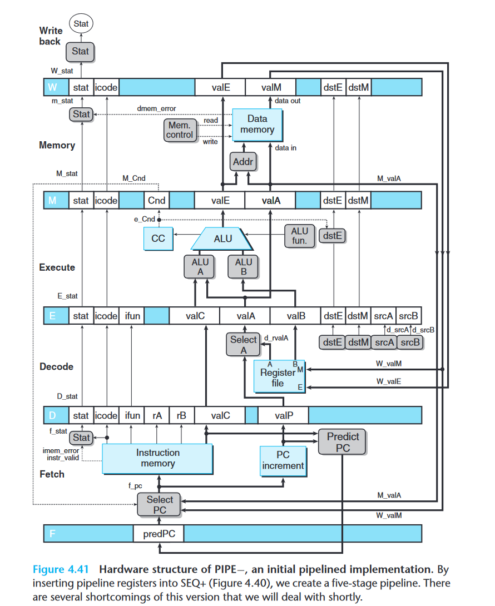

下面介绍一下所添加的流水线寄存器，除流水线寄存器外其余的硬件单元集合是几乎和SEQ、SEQ+相同的

F：有一个保存着PC的预测值的字段`predPC`

D：位于取指和译码阶段之间。保存有关最近获取的指令的信息`stat、icode、ifun、rA、rB、valC、valP`，以供解码阶段处理

E：位于译码和执行阶段之间。保存有关最近译码的指令的信息`dstE、dstM、srcA、srcB`以及从寄存器文件取出的值`valA、valB`以供执行阶段处理

M：位于执行和访存阶段之间。保存有关最近执行的指令的执行结果`valE`以供访存阶段处理，也保存关于分支条件和分支目标的信息`Cond`以供条件跳转处理

W：位于访存阶段和反馈路径之间，反馈路径将计算结果`valE`写入寄存器文件，并在完成ret指令时将返回地址`valM`提供给PC选择逻辑

### 代码分析示例

```webassembly
irmovq $1,%rax # I1 
irmovq $2,%rbx # I2 
irmovq $3,%rcx # I3 
irmovq $4,%rdx # I4 
halt # I5
```


## 4.5.3 Rearranging and Relabeling Signals

> *Our sequential implementations*-   SEQ and SEQ+ only process one instruction at a time, and so there are unique values for signals such as valC, srcA, and valE\* \*.In our pipelined design, there will be**multiple versions of these values associated with the different instructions flowing through the system**. For example, in the detailed structure of PIPE−, there are four white boxes labeled “Stat” that hold the status codes for four different instructions (see Figure 4.41). We need to take great care to make sure we use the proper version of a signal, or else we could have serious errors, such as storing the result computed for one instruction at the destination register specified by another instruction.\*

对流水线中的同类信号的不同版本的命名方法是：存储在某个流水线寄存器中的信号可以通过在这个信号名称前加上大写的流水线寄存器的前缀来唯一标识

此外也需要引用某些在一个阶段内刚刚被计算出来的信号，命名方法是在信号名前加上小写的阶段名的第一个字母作为前缀

> ✨区分这两种前缀命名法
>
> 

此外PIPE-和SEQ+虽然都在译码阶段生成了dstE、dstM。但是在SEQ+中dstE、dstM是直接送到寄存器文件的，因为周期内执行的指令是不变的；而PIPE-中若采取SEQ+同样的方法，则在写回阶段时，i指令的结果是写到i+3指令中的dstE、dstM。因此dstE、dstM需要通过流水线寄存器向WB阶段传递

PIPE-中还在译码阶段增加了“Select A”控制逻辑块[^注释10]，该块从D流水线寄存器中的valP和寄存器文件A端口读出的数据中选择一个送往E流水线寄存器中的valA

在所有的指令巾，只有cal1在访存阶段需要va1P的值[^注释11]。只有跳转指令在执行阶段（当不需要进行跳转时）需要va1P的值[^注释12]。而这些指令又都不需要从寄存器文件中读出的值。因此我们合并这两个信号，将它们作为信号valA携带穿过流水线，从而可以减少流水线寄存器的状态数量。这样做就消除了SEQ和SEQ+中标号为“Data”的块，这个块完成的是类似的功能。在硬件设计中，像这样仔细确认信号是如何使用的，然后通过合并信号来诚少寄存器状态和线路的数量，是很常见的

## 4.5.4 Next PC Prediction

这一节将介绍在PIPE-设计中解决控制依赖所采用的一些方法

流水的理想目标是实现throughput为每个周期一条指令。要实现这个目标必须在去除当前指令之后马上确定下一条指令的位置。但是由于分支、跳转的存在使得要到几个周期之后才能确定下一条指令地址

采取的解决方法是进行分支预测，猜测分支方向并根据猜测开始取指。但是无论是预测分支成功还是失败，都必须以某种方式处理我们的预测不正确的情况

对于Y86-64来说，除跳转和ret指令外，下一条指令地址均是valP；对于call和jmp来说下一条指令地址均是valC；对于ret来说是valM；对于分支指令来说，预测成功即为valC否则是valP

在本次设计中，仅使用预测分支成功这种策略，即遇到分支指令时预测下一条指令地址是valC。对于ret指令，因为返回地址需要在访存后才可以得到，所采取的措施是暂停取指，等到ret指令通过写回阶段

如Figure4.41[🖼️ 图片](image/image_cFal17EdHE.png "🖼️ 图片")所示，可以看到取指阶段有一个“Predict PC”控制逻辑，该控制逻辑在valP和valC中二选一产生预测得到的PC，存储在F寄存器的`predPC`字段。而“Select PC”控制逻辑则在`predPC`、没有采用分支的分支跳转指令的`valP即M_valA`、ret指令到写回阶段时的`W_valM`

## 4.5.5 Pipeline Hazards

所遇到的依赖包括两种形式：

1.  数据依赖：某条指令的计算结果被后续指令当作源数据使用
2.  控制依赖：某条指令确定下一条指令的地址，例如call、jump、ret指令

> **依赖可能会导致冒险，但冒险一定是**依赖
>
> *When such dependencies have the potential to cause an erroneous computation by the pipeline, they are called hazards.*

和依赖一样，阻塞也可以分为数据冒险和控制冒险

因为ID阶段取寄存器数，但是对寄存器结果的更新是在WB阶段完成之后，因此当指令的操作数之一被前面的三个指令中的任何一个更新时，该指令可能会出现数据冒险

### Avoiding Data Hazards by Stalling

避免数据冒险的一个非常通用的技巧是阻塞——处理器抑制在流水线中的一条或多条指令直到冒险的状况不再成立。更为易懂的说法是处理器可以在译码阶段抑制这条指令直到生成其源操作数的指令已通过写回阶段将结果写回到寄存器文件中来避免数据冒险

> *Our processor can avoid data hazards by holding back an instruction in the decode stage until the instructions generating its source operands have passed through the write-back stage.*

当某条指令经过ID阶段，由流水线控制单元检测到至少有一条在EX、MEM、WB阶段的指令要更新该条指令的源操作数，那么流水线控制单元就会阻塞该条指令在ID段1\~3个周期直到EX、MEM、WB阶段的指令已经将结果写回到寄存器文件中

要阻塞ID阶段指令，那么也必须阻塞IF阶段的取指——可以通过保持PC寄存器为当前要取指的指令地址来重复取指直到阻塞解除

Stalling技术是允许一组指令阻塞在它们在流水线的当前阶段（`IF/ID`），然后让`EX、MEM、WB`阶段的指令正常执行。使用Stalling技术最后的时空图是和插入对应阻塞周期数的`nop指令`的时空图是一样的，如下图

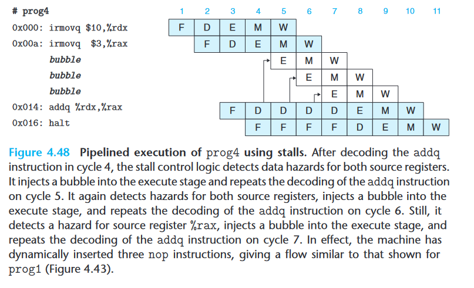

> ✨Stalling技术比较容易实现，但是它的性能并不是很好。在许多情况下，一条指令更新寄存器，而紧随其后的指令使用同一寄存器。这将导致流水线停顿最多三个周期，从而显着降低总体吞吐量

### Avoiding Data Hazards by Forwarding

当发生数据依赖时，除了使用`Stalling`技术暂停流水以外，也可以使用`Forwarding`前递技术来将要写到某条寄存器中的结果直接送到需要该寄存器的指令的取操作数ID阶段，如下图：

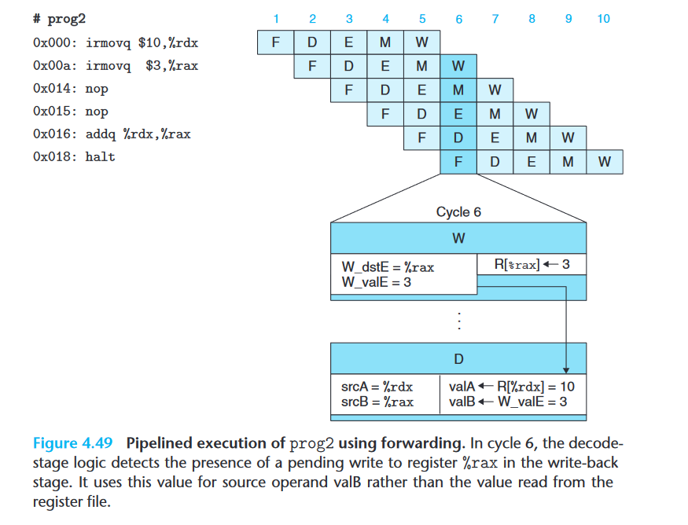

使用前递技术可以直接将EX阶段产生的`e_valE`[^注释13]、MEM流水线寄存器中的`M_valE`、MEM阶段产生的`m_valM`和WB流水线寄存器中的`W_valE`和`W_valM`传递给E流水线寄存器的valA或valB

至于ID阶段是如何确定valA、valB是选择寄存器文件中的值还是Forward的值，采用的方法是比较srcA、srcB和各个流水线寄存器中的dstE、dstM

具体使用Forward技术解决数据冒险的处理器`PIPE`[^注释14]硬件结构图如下：

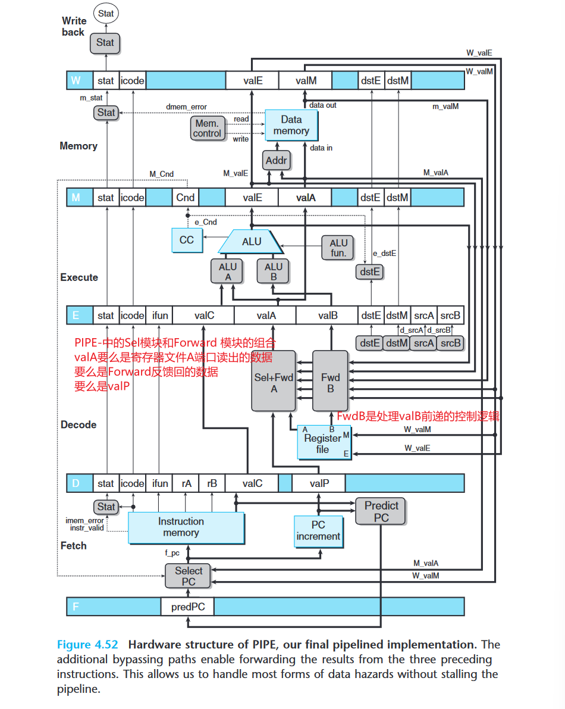

### Load/Use Data Hazards

但是需要注意一个特殊情况：**从内存中读出的数据是需要在MEM阶段才产生的m\_valM**。因此如果是两条紧邻的指令i和j且i是一个load指令，j指令需要用到i指令读出的结果，那么就必须使用`stalling+forward`结合的技术来最大化吞吐率，即暂停ID阶段指令j一个时钟周期，至指令i已在MEM阶段时才将m\_valM传递到valA或valB，如下图所示。相邻2、3个指令的load就并不存在这个问题

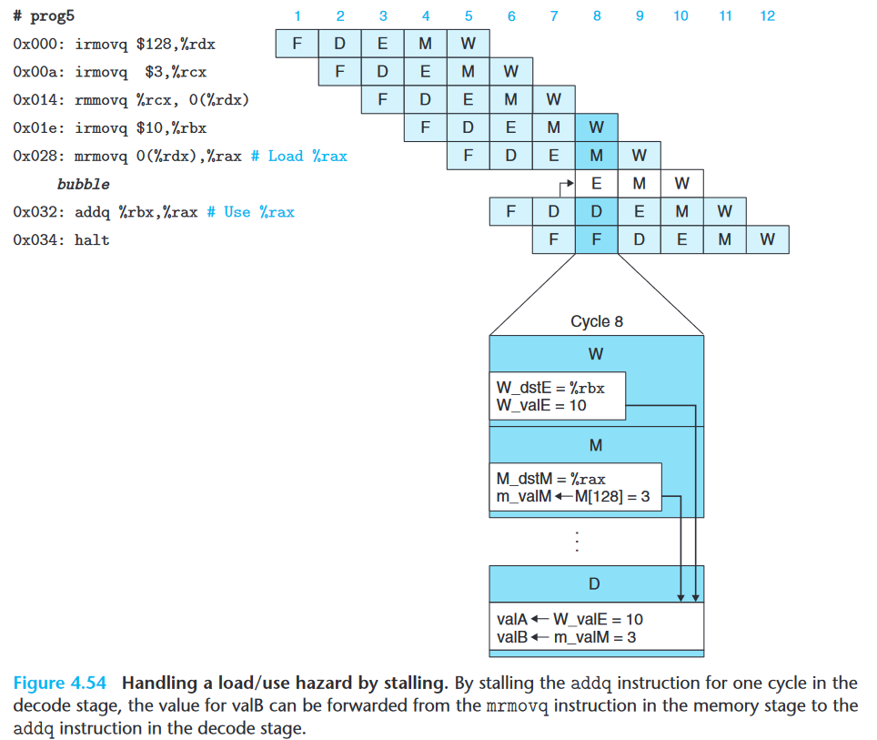

这种`stalling+forward`结合的技术称为“`load interlock`”

### Avoiding Control Hazards

> *Control hazards arise when the processor cannot reliably determine the address of the next instruction based on the current instruction in the fetch stage*

正如4.5.4 Next PC Prediction讨论的，在PIPE的设计中只有ret指令和预测失败的jump指令才会导致控制冒险

1.  ret指令

    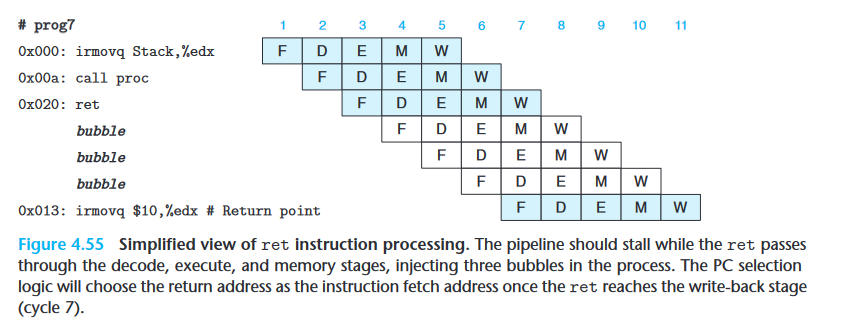

    当ID阶段检测到当前指令是一条ret指令时，即阻塞IF取指阶段。一旦ret指令到达WB阶段，即已经通过MEM段得到了返回地址，即可以通过PC选择器来从返回地址处取PC重新开始执行
2.  预测失败的jump指令

    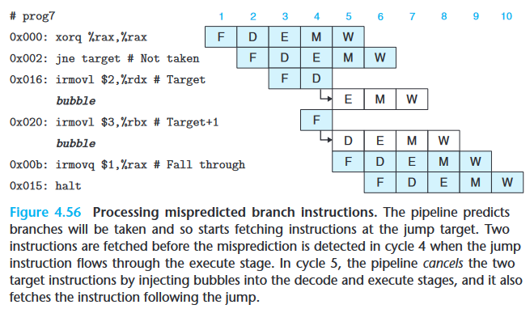

    虽然是按照预测分支成功是取分支目标处的指令，但是在实际分支结果在EXE阶段得到时，只取出了两条分支目标处的指令且并未对处理器状态（CSR、MEM、REG）进行修改[^注释15]，因此只需要取消[^注释16]所取出的两条分支目标处指令，重新从分支指令之后开始取指

## 4.5.6 Exception Hanlling

#### Brief Introduction

处理器中的许多活动都可以导致异常的控制流，从而破坏正常的程序执行链

异常可以是内部的——由正在执行的程序所引起，也可以是外部的——由一些额外的信号引起

一般内部的称之为异常，外部的称之为中断

将造成异常的指令称为**异常指令**`Excepting instruction`

#### Exception in Y86-64

Y86-64指令集架构只实现了3种内部异常：`halt指令`；不合法的指令[^注释17]；无效的地址[^注释18]

在Y86-64中，当遇到异常时，处理器所采用的做法是暂停处理器正在执行的指令，并按照[🖼️ 图片](image/image_dJUDcQvruB.png "🖼️ 图片")设置恰当的状态码。但是在更完整的处理器设计中，当遇到异常时采取的措施是执行驻留在操作系统内核中的异常处理程序，异常处理程序完成以后再回到异常指令的下一条指令继续执行

#### Exception handling in pipelined system

1.  可能同时有多个指令引起异常，必须决定处理器优先响应哪条指令引起的异常

    由于是采用流水线技术，待流水线稳定后，同一时钟周期可能会有多条指令正在运行，因此可能会有多条指令引起异常。eg：取指阶段取出halt指令，但访存阶段的指令的访存地址是越界的

    因此必须决定哪一个异常优先得到处理器向操作系统提出异常处理请求

    基本规则是：**优先处理流水线深度最深的指令引起的异常**。例如上面的例子，先处理invalid address异常
2.  采用分支预测技术且总预测分支成功，则会有如果分支目的处指令引起异常，但是若分支预测失败，需要继续执行分支指令的下一条指令，那么分支目标地址处所执行的指令应该取消，所造成的异常也需要避免出现

    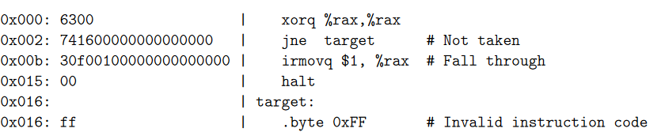

    target处是一个invalid instruction，但是实际上jne并不跳转，因此target处指令并不会执行，因此需要避免异常的出现
3.  由于流水线处理器在不同阶段更新系统状态的不同部分，所以异常指令后面的指令有可能在异常指令完成之前改变部分状态

    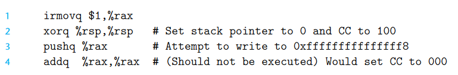

    假设不允许程序访问大于64位地址范围的高位地址部分即$2^{32}-1\dots2^{64}-1$

    %rsp会置为0，pushq保存是尝试去写-8即0xfffffffffffffff8的内存地址，该地址是不允许访问的会引起invalid address异常；异常时的CC是100，但是由于访存时是在MEM段，addq已达EXE段，会更改CC为000，导致程序状态发生改变

> ✨一般来说，通过将异常处理逻辑合并到流水线结构中就可以正确地在多个异常中做出选择[^注释19]，也能够避免出现由于分支预测错误取出的指令造成的异常。这也是为什么PIPE-和PIPE结构中的流水线寄存器包含状态码stat字段
>
> 如果一条指令在其执行的过程于某个阶段产生了异常，那么当前指令所要传递的下一个流水线寄存器的stat就被设置为指示异常的种类
>
> stat和该指令的其他信息一起沿着流水线传播，直到它到达写回阶段，此时执行完毕，转去暂停或者执行异常处理程序
>
> 而为了避免异常指令之后的指令更新程序员可见状态，当MEM或WB阶段中的指令引起异常时，流水线控制逻辑必须禁用条件代码寄存器或数据存储器的任何更新

> ✨当流水线中有一个或多个阶段出现异常时，存储异常Stat到流水线寄存器中。直到有异常指令到达WB阶段时，除了会禁止异常指令之后的指令对程序员可见状态的更新外并不会再对流水线中的指令有任何影响。因此指令到达写回阶段的顺序与它们在非流水线化的处理器中执行的顺序相同，也因此第一条遇到异常的指令会第一个到达写回阶段[^注释20]，此时程序执行会停止，流水线寄存器W中的状态码会被记录为程序的Stat状态。如果取出了某条指令，过后又取消了，那么所有关于这条指令的异常状态信息也都会被取消[^注释21]。所有导致异常的指令后面的指令都不能改变程序员可见的状态[^注释22]

## 4.5.7 PIPE Stage Implementations

PIPE中的许多逻辑块的设计是等同于SEQ和SEQ+的，除了**在信号上面需要加上前缀**，表示信号是来自流水线寄存器“大写F、D、E、M、W”还是流水线阶段“小写f、d、e、m、w”中产生的

### PC Selection and Fetch Stage

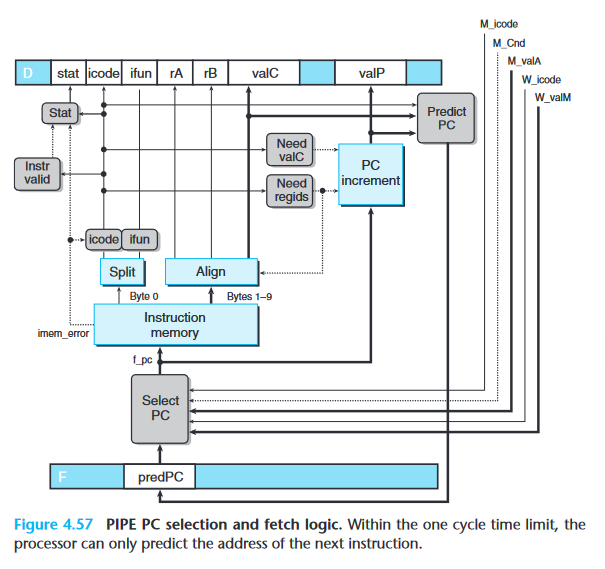

上图的Figure4.57展示了PIPE取指阶段的详细逻辑

**PIPE的取指阶段需要在**\*\*`predPC`****、****`分支预测失败的M_valA`****和****`ret的W_valM`****中选择产生当前的PC值，并在****`valP`****和****`valC`\*\***中预测产生下一个PC**

```c
word f_pc = [
  M_icode==IJXX &&!M_Cnd:M_valA; #分支预测失败
  W_icode==IRET:W_valM; #ret指令
  1:F_preadPC
];
word f_predPc= [
  f_icode in {IJXX,ICALL}:f_valC; #当前指令是分支指令或Call指令
  1:f_valP;
];

```

此外PIPE也需要像SEQ一样完成对Need valC、Need regids和Instr valid以及Stat控制逻辑的生成

need\_valC和need\_regids的逻辑同SEQ、只需要改变信号名即可

Stat的计算必须分成两部：对halt、无效指令以及指令取指的异常检测在IF阶段即可完成；但是对读写数据地址的异常必须在EXE阶段才可完成

```c
//need_valC表示有8字节常数
bool f_need_valC = f_icode in {IIRMOVQ,IRMMOVQ,IMRMOVQ,IJXX,ICALL};

//need_regids表示有寄存器指示符字节
bool f_need_regids = f_icode in { IRRMOVQ, IOPQ, IPUSHQ, IPOPQ, IIRMOVQ, IRMMOVQ, IMRMOVQ };

//f_instr_valid表示ficode有效
bool f_instr_valid = f_icode in {IOPQ,IRRMOVQ,IIRMOVQ,IRMMOVQ,IMRMOVQ,IJXX,ICALL,IRET,IPUSHQ,IPOPQ,IHALT};

//f_stat分为两阶段计算
bool f_imem_error=f_pc>值;
word f_stat= [
  f_icode==IHALT:HLT;
  f_imem_error:ADR;
  !f_instr_valid:INS;
  1:AOK;
];//还无法判断访数据地址是否错误

//PC_increment
word f_valP= f_pc+1+f_need_regids+f_need_valC*8;
word f_valC= f_instr[f_pc+1+f_need_regids:f_pc+1+f_need_regids+8];
```

### Decode and Write-Back Stages

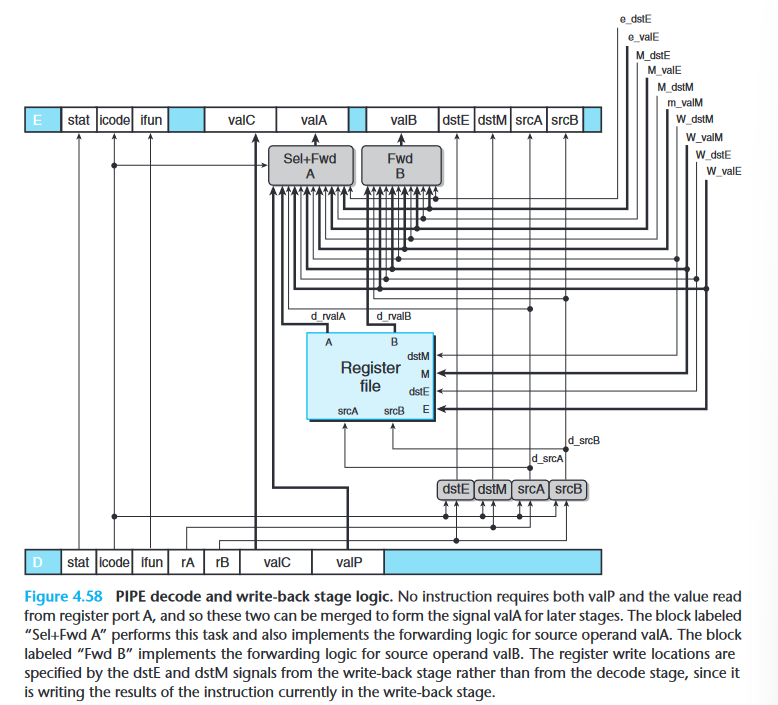

上图Figure4.58展示了ID和WB阶段的详细逻辑图

dstE、dstM、srcA、srcB的产生逻辑和SEQ是非常相似的，只需要信号前缀即可

```c
//4位的数据量称为word
word d_srcA={
  D_icode in {IRRMOVQ,IRMMOVQ,IOPQ,IPUSHQ} : D_rA;
  D_icode in {IRET,IPOPQ} : 0x4;//0x4为%rsp的编号
  1 : 0xF;  
};//只是需要读rA寄存器的指令
word d_srcB={
  D_icode in {IRMMOVQ,IMRMOVQ,IOPQ} : D_rB;
  D_icode in {IPUSHQ,IPOPQ,ICALL,IRET} : 0x4;
  1 : 0xF;
};//只是需要读rB寄存器的指令
word d_dstE={
  D_icode in {IOPQ,IIRMOVQ,IRRMOVQ} : D_rB;
  D_icode in {IPUSHQ,IPOPQ,ICALL,IRET} : 0x4;
  1 : 0xF;
};//写ALU结果的指令
word d_dstM={
  D_icode in {IMRMOVQ,IPOPQ} : D_rA;
  1 : 0xF;
};//写MEM结果的指令
```

"Sel+Fwd A"控制逻辑充当两个作用：

1.  在寄存器读出的valA和PC增量valP中选择一个

    只有call指令和jump指令需要使用valP，其余的都是使用操作数
2.  前递产生的操作数

    反馈得到的值包括：e\_valE,M\_valE,m\_valM,W\_valE和W\_valM

    需要比较d\_srcA和d\_srcB和e\_dstE[^注释23]、M\_dstE、M\_dstM、W\_dstE、W\_dstM

    前递的优先级是：E>M>W，同一阶段内的访存和执行的结果顺序是根据`popq %rsp`的结果，它的最后结果是访存的结果。因此是访存优于执行；

```c
word d_valA = [
  D_icode in [ICALL,IJXX]:D_valP;
  d_srcA==e_dstE:e_valE;
  d_srcA==M_dstM:m_valM;
  d_srcA==M_dstE:M_valE;
  d_srcA==W_dstM:W_valM;
  d_srcA==W_dstE:W_valE;
  1:d_rvalA;
];
word d_valB = [
  d_srcB==e_dstE:e_valE;
  d_srcB==M_dstM:m_valM;
  d_srcB==M_dstE:M_valE;
  d_srcB==W_dstM:W_valM;
  d_srcB==W_dstE:W_valE;
  1:d_rvalB;
];
```

此外之前在4.5.6中提到写回阶段需要将W流水线寄存器中的Stat更新到程序的Stat寄存器中。因为WB阶段的冒泡也是正常操作的一种，因此其HCL如下：

```c
word Stat=[
  W_stat==BUB:AOK;
  1:W_stat;
];
```

最后需要实例化寄存器文件

```c
regfile regfile_init(
  .clk(clk),
  .srcA(d_srcA),
  .srcB(d_srcB),
  .A(d_rvalA),
  .B(d_rvalB),
  .dstE(W_dstE),
  .dstM(W_dstM),
  .E(W_valE),
  .M(W_valM)
);
```

### Execute Stage

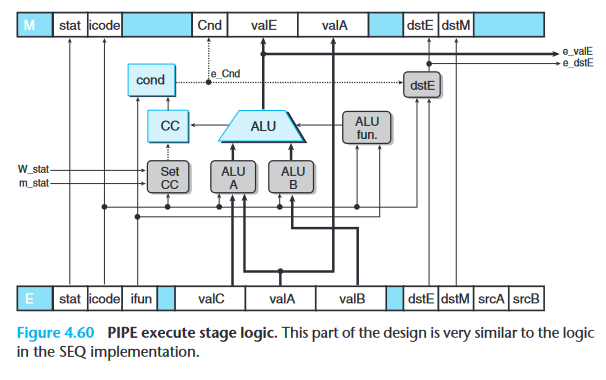

上图Figure4.60展示了PIPE执行阶段的具体流程

PIPE执行阶段的控制逻辑和SEQ几乎一样，不同点在于：

1.  e\_valE和e\_dstE需要前递到ID阶段
2.  setCC组合逻辑需要结合MEM、WB段是否有异常发生来决定是否对CC进行更新

    CC只会在EXE阶段进行更新，而EXE阶段执行的指令（ID检测到的异常指令并不会更新CC）并不会引发新的异常，因此只需要判断MEM[^注释24]、WB阶段是否有异常指令，从而停止掉异常指令之后的指令对CC的更新

```c
e_aluA = [
  E_icode in {IOPQ,IRRMOVQ}:E_valA;
  E_icode in {IIRMOVQ,IRMMOVQ,IMRMOVQ}:E_valC;
  E_icode in {IPUSHQ,ICALL}:-8;
  E_icode in {IPOPQ,IRET}:8;
];

e_aluB = [
  E_icode in {IOPQ,IRMMOVQ,IMRMOVQ,IPUSHQ,ICALL,IPOPQ,IRET}:E_valB;
  E_icode in {IRRMOVQ,IIRMOVQ}:0;
];

e_alufun = [
  E_icode==IOPQ:E_ifunc;
  1:ADD;
];

e_dstE = [
  E_icode==IRRMOVQ&&~e_cnd:0xF;
  1:E_dstE;//irrmovq的Cnd一定为1，而ccmov的Cnd需要根据条件判断
];

bool e_setCC= E_icode==IOPQ && !m_stat in {ADR,INS,HLT} && !W_stat in {ADR,INS,HLT};

//zf of sf
e_cc_enable = [
  e_setCC:根据e_aluE设置e_cc;
  1:不更新CC;
];

e_cnd = [
  E_ifunc==0:1;
  E_ifunc==1&&((e_cc[2]^e_cc[1])||e_cc[0]);//<=
  E_ifunc==2&&e_cc[2]^e_cc[1];//<
  E_ifunc==3&&e_cc[2];//==
  E_ifunc==4&&!e_cc[2];//!=
  E_ifunc==5&&!(e_cc[2]^e_cc[1]); //>=
  E_ifunc==6&&!((e_cc[2]^e_cc[1])||e_cc[0]); //>
  1:0;
];

```

实例化ALU

```c
alu alu_init(
  .alua(e_aluA),
  .alub(e_aluB),
  .alufunc(e_alufunc),
  .cc(e_cc),
  .alures(e_valE)
);
```

### Memory Stage

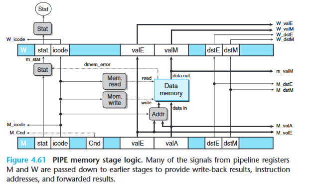

上图Figure4.61展示了PIPE中的访存阶段

和SEQ的MEM段比较，可以看到正如之前所述的为什么要在ID段selA的原因，这里不再需要传递更多的信号也不需要使用SEQ中的MEM.data控制逻辑[^注释25]

在MEM阶段，需要根据icode判断read还是write；也需要对访问内存的地址进行判断从而对Stat进行更新

```c
m_read = M_icode in {IMRMOVQ,IPOPQ,IRET};

m_write = M_icode in {IRMMOVQ,IPUSHQ,ICALL}

m_stat = [
   dmem_error:ADR;
   1:M_stat;
];

```

### Pipeline Control Logic

**流水线控制逻辑必须处理接下来****四种控制情况****，这四种情况是流水线机制（比如前递、分支预测）不能处理的**

1.  Load/use hazards

    当ID阶段检测到当前指令与其上一条指令存在数据依赖[^注释26]，且上一条指令是Load指令，那么流水线必须暂停一个时钟周期
2.  Processing ret

    当ID阶段检测到当前指令是ret指令，则必须阻塞流水线到ret达到WB阶段
3.  Mispredicted branches

    当分支逻辑检测到不应进行跳转时，必须取消分支目标处所取出的两条指令，并且应当从跳转指令之后的指令开始取指
4.  Exception

    当一条指令导致异常时，禁止异常指令后续的指令对程序员可见状态的更新，并在异常指令到达WB阶段后停止流水线的执行

#### Desired Handling for each of Special Control Cases

1.  Load/use hazards

    只有mrmovq和popq指令需要从MEM中加载数据送到寄存器中

    因此当ID阶段检测到d\_srcA、d\_srcB中有和E\_dstM相等的情况且E\_icode是IMRMOVQ或者IPOPQ，那么取操作数的指令就需要暂停在ID阶段，执行阶段执行bubble

    暂停流水线的方法是：保持F寄存器值和D寄存器值固定，从而使得流水线阻塞
    > *In summary, implementing this pipeline flow requires detecting the hazard condition, keeping pipeline registers F and D fixed, and injecting a bubble into the execute stage.*
2.  Processing ret

    当ID阶段检测到当前指令是ret指令时，流水线会阻塞直到ret指令已完成访存到达WB阶段

    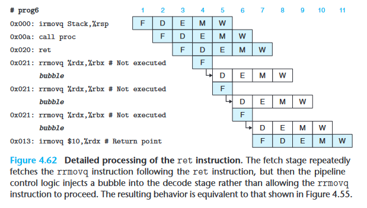

    上图Figure4.62是流水线控制逻辑处理ret指令的详细过程。可以看到没有方法去在取指阶段插入bubble。而ret指令所预测得到的pred\_PC是valP，因此会在ret指令后续指令连续取指同一条指令，但是为了不执行它们，会在这些指令的ID阶段插入bubble
3.  Mispredicted branches

    当跳转指令到达执行阶段时，将检测到错误预测。然后，控制逻辑在下一个周期将bubble注入到解码和执行阶段，导致两条错误获取的指令被取消。在同一周期，流水线将正确的指令读入取指阶段
4.  Exception

    Y86-64架构中对异常指令的处理需与ISA期望的行为保持一致——异常指令之前的指令都可完成执行，但是异常指令之后的指令不能修改程序状态

    但是由于Y86-64异常的修改是在取指和访存阶段，以及程序的状态在执行阶段、访存阶段和写回阶段均会更新，因此要与ISA保持一致是比较难的

    和之前的描述相一致，当异常发生时，记录异常指令的信息并继续执行异常指令，将stat按照流水线传递。当异常指令到达MEM阶段时，禁止EXE阶段中的指令更改CC；向内存阶段中插人气泡，以禁止向数据内存中写入；当写回阶段中有异常指令时，暂停写回阶段，因而暂停了流水线——即Stall WB+Bubble MEM

    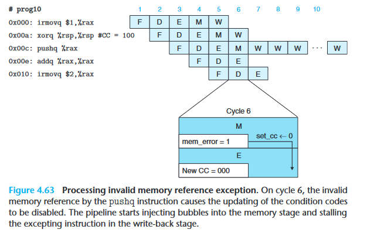

#### Detecting Special Control Conditions

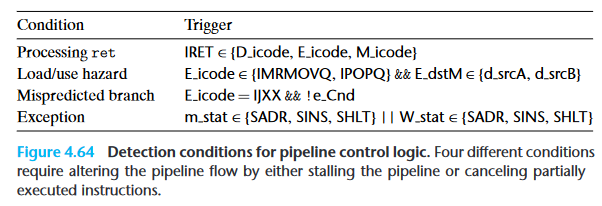

上图Figure4.64总结了需要进行特殊流水线控制的情况

Load/use hazard

```c
bool isload_hazard=E_code in {IMRMOVQ,IPOPQ} && (d_srcA==E_dstM||d_srcB==E_dstM);

```

Processign ret

```c
bool isRet=IRET in {D_icode,E_icode,M_icode};
```

Mispredicted branch

```c
bool isMisp=E_icode==IJXX&&!e_cnd;
```

Exception

```c
m_stat in {ADR,HLT,INS}||W_stat in {ADR,HLT,INS};
```

这些检测的控制块必须在时钟周期结束之前生成其结果，以便在时钟上升时控制流水线寄存器的操作以开始下一个周期

### Pipeline Control Mechanisms

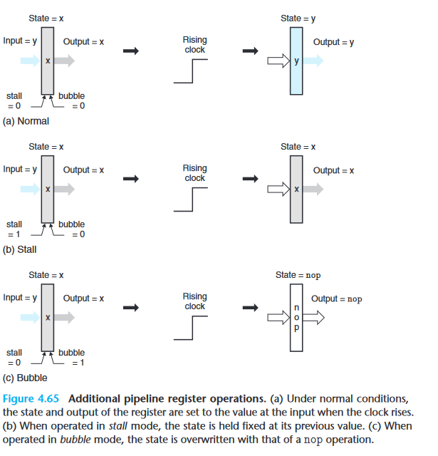

上图Figure4.65展示了实现流水线控制逻辑去抑制一个流水线寄存器中的指令或者是在流水线中插入bubble的机制

**流水线寄存器有两个控制引脚stall和bubble，当时钟上升沿出现时，stall高有效时寄存器的输出保持不变；** ​**bubble高有效时寄存器输出是某种复位配置，等同于nop**[^注释27]

那么可以总结四种特殊情况下的流水线寄存器是normal、stall还是bubble的情况如下——下一个时钟周期的情况

| Condition           | Pipeline register |        |        |        |        |
| ------------------- | ----------------- | ------ | ------ | ------ | ------ |
|                     | F                 | D      | E      | M      | W      |
| Load/use hazard     | Stall             | Stall  | Bubble | Normal | Normal |
| Processing ret      | Stall             | Bubble | Normal | Normal | Normal |
| Mispredicted branch | Normal            | Bubble | Bubble | Normal | Normal |

> *In terms of timing, the stall and bubble control signals for the pipeline registers are generated by blocks of combinational logic. These values must be valid as the clock rises, causing each of the pipeline registers to either load, stall, or bubble as the next clock cycle begins.*

### Combinations of Control Conditions

到目前为止，关于特殊流水线控制条件的讨论都是假设任何一个时钟周期内至多只发生一个特殊情况。但是在实际系统中也会存在多个特殊条件同时出现的状况

下面来对多个条件同时出现的状况进行分析

1.  单独讨论Exception

    因为Y86-64对异常的处理设计已经认真的考虑了流水线中的其他指令[^注释28]，因此不必担心涉及到Exception的组合
2.  其他三种条件的组合分析

    load/use hazard必须满足EXE阶段是load，而ID阶段是use
    mispredicted branch必须满足EXE阶段是jump
    ret指令可以在ID、EXE、MEM，只不过在EXE、MEM的话，前面需要是bubble

    因此这三种情况的满足条件分析图如下：

    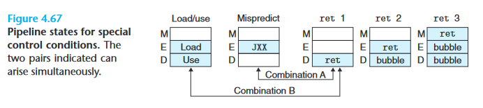

    就组合来说，只存在load/use和ret在ID阶段的组合B，以及Mispredicted和ret在ID阶段的组合A这两种情况
    1.  组合A

        组合A的实现即EXE段是一个预测失败的jump，ID阶段是分支目标处的ret指令，因为分支预测失败所以该ret指令应该被取消

        组合期待的行为是：

        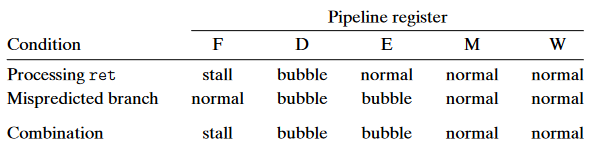

        即按照Mispredicted的逻辑来处理组合A，只不过阻塞F阶段的取指；而下一个时钟周期的PC并不会选择F寄存器中的pred\_PC而是选择M\_valP，因此并不会有什么错误的影响
    2.  组合B

        组合B的实现即load修改了%rsp寄存器，而ret指令需要%rsp寄存器读取栈中的返回地址，因此需要抑制ret指令

        组合的期待行为是：用stall>bubble>normal

        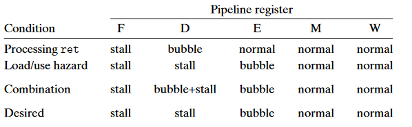

        之前的PIPE设计并不能正确处理这种组合，它会将D寄存器的stall和bubble均设置为1，因此需要修改PIPE这方面的设计实现组合B的处理

### Control Logic Implementation

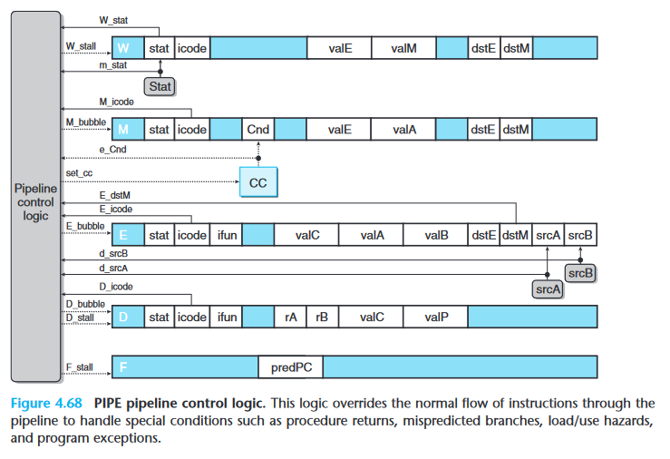

上图Figure4.68展示了流水线控制逻辑的整体结构。基于来自流水线寄存器和流水段的信号，流水线控制逻辑可以产生各个流水线寄存器的stall和bubble信号，也可以决定是否CC应该被更新

可以结合特殊情况的检测条件[🖼️ 图片](image/image_YYV--IbCqX.png "🖼️ 图片")以及执行的行为简单表格来产生流水线控制逻辑的HCL描述

F寄存器只需要Stall

当出现Load/use hazard、ret以及Misprediction和ID阶段的ret组合的情况需要stall F寄存器

```c
bool F_stall= 
  E_icode in {IMRMOVQ,IPOPQ} && E_dstM in {d_srcA,d_srcB}||IRET in {D_icode,E_icode,M_icode};
 //Mispredited和ID阶段的RET组合起来，是等价于IRET==D_icode的

```

D寄存器既需要Stall也需要Bubble

D寄存器需要Stall是在Load/use hazard以及Load/use hazard和ret组合的情况，即是Load/use hazard的情况；需要Bubble的情况是ret和mispredicted以及ret和mispredicted的组合，注意iret是不和load结合的

```c
bool D_stall=  E_icode in {IMRMOVQ,IPOPQ} && E_dstM in {d_srcA,d_srcB};

bool D_bubble = IRET in {D_icode,E_icode,M_code} && !(E_icode in {IMRMOVQ,IPOPQ} && E_dstM in {d_srcA,d_srcB}) || (E_icode==IJXX&&!e_cnd);
```

E寄存器需要Bubble

E寄存器需要Bubble是在Load/use hazard、Mispredicted以及load和ret的组合以及mispredicted和ret的组合，因此最后就是load和mispredicted两种情况

```c
bool E_bubble = E_icode in {IMRMOVQ,IPOPQ} && E_dstM in {d_srcA,d_srcB}|| (E_icode==IJXX&&!e_cnd);
```

M寄存器需要Bubble

在下一个周期向访存阶段插入气泡，需要检查当前周期中访存或者写回阶段是否有异常

```c
bool M_bubble = W_stat in {ADR,INS,HLT} || m_stat in {ADR,INS,HLT};
```

W寄存器需要Stall

W寄存器需要Stall是在异常到达WB阶段下

```c
bool W_stall = W_stat in {ADR,INS,HLT};
```

> 测试所完成的设计
>
> 一些设计上的挑战是对不常见的指令(popq %rsp)或者不常见的指令组合(mispredicted branch+ret)
>
> 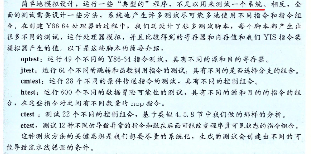

## 4.5.9 Performance Analysis

需要流水线控制逻辑采取特殊操作的条件都会导致流水线达不到每个时钟周期发出新指令的目标。可以通过确定bubble插入流水线的频率来衡量这种低效率，因为bubble是会导致流水线空闲——ret指令需要三个bubble、Mispredicted需要两个bubble、Load/use hazard需要一个bubble。

至于衡量这种低效率对整体性能的影响可以通过计算PIPE执行的每条指令所需的平均时钟周期的估计值——CPI，CPI是流水线平均吞吐量IPC的倒数

如果我们忽略异常带来的性能损失（异常的定义表明它是很少出现的），另一种思考CPI的方法是，假设我们在处理器上运行某个基准程序，并观察执行阶段的运行。每个周期，执行阶段要么会处理一条指令，然后这条指令继续通过剩下的阶段，直到完成；要么会处理一个由于三种特殊情况之一而插入的气泡。如果这个阶段一共处理了$C_i$条指令和$ C_b  $个气泡，那么处理器总共需要大约$C_i+C_b$个时钟周期来执行C条指令。我们说“大约”是因为忽路了启动指令通过流水线的周期。于是，可以用如下方法来计算这个基准程序的CPI：

$$
\mathrm{CPI}=\frac{C_{i}+C_{b}}{C_{i}}=1.0+\frac{C_{b}}{C_{i}}
$$

处罚项$C_b/C_i$表示一条指令平均要插入多少个气泡，因为剩下的三种特殊情况均只能由三种指令类型引起，从而导致气泡的插入，因此可以将处罚项分解成三个部分

$$
\mathrm{CPI}=1.0+l p+m p+r p
$$

lp表示由于Load/use hazard造成插入气泡的平均数$lp=\frac{load/use hazard的指令数}{指令总数}$
mp表示由于mispredicted造成插入气泡的平均数$\frac{Mispredicted指令数}{总指令数}$
ret表示由于ret指令造成插入气泡的平均数$ \frac{ret指令数}{总指令数}  $

为了估计每种处罚，我们需要知道相关指令（加载、条件转移和返回）的出现频率，以及对每种指令特殊情况出现的频率。对CPI的计算，我们使用下面这组频率：

-   load指令(mrmovq和popq)占所有执行指令的25%，其中20%会导致Load/use hazard
-   条件分支指令占所有执行指令的20%，其中60%会分支跳转，而40%不会分支跳转
-   返回指令占所有执行指令的2%。

因此可以估算当前CPI：

$$
CPI=1.0+0.25\times0.20\times1+0.20\times0.40\times2+0.02\times3=1.27
$$

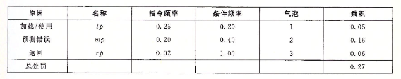

因为由于Mispredicted branch导致的处罚所占的比例0.16/0.27较大，因此可以增加对预测分支的处理，提高预测的准确率，降低这一项的处罚

## 4.5.10 Unfinished Business

目前设计的PIPE已实现指令流水线以及特殊情况的控制，但是要达到一个现代实用的处理器，还缺乏一些特征，比如下面所叙述的多周期指令和与存储系统的接口

#### 多周期指令

#### 与存储系统的接口

[^注释1]: 使用汇编语言或者机器语言编写程序的程序员

[^注释2]: 允许非独占选择表达式使 HCL 代码更具可读性。实际的硬件多路复用器必须具有互斥的信号来控制哪个输入字应传递到输出，如图 4.13 中的信号 s 和 !s。要将 HCL 案例表达式转换为硬件，逻辑综合程序需要分析选择表达式集，并通过确保仅选择第一个匹配案例来解决任何可能的冲突

[^注释3]: 组合逻辑生成error

[^注释4]: mov类指令的一个操作数是0

[^注释5]: 比如ALU的复用

[^注释6]: 当PC的值超出内存寻址范围

[^注释7]: instr和imem\_error可以用来生成存储器中的Stat状态字

[^注释8]: 因为在分割的组合逻辑块之间插入了时钟寄存器

[^注释9]: "-"反映了这一实现的处理器性能略低于最终实现的处理器性能

[^注释10]: 增加的目的是为了减少E和M流水线寄存器之间的传递字段数量

[^注释11]: 入栈

[^注释12]: 向后传递到写回阶段valP+0->valE

[^注释13]: The decode stage only needs to generate signals valA and valB by the end of the clock cycle so that pipeline register E can be loaded with the results from the decode stage as the clock rises to start the next cycle. The ALU output will be valid before this point.

[^注释14]: 在PIPE-上增加了使用Forward解决数据冒险

[^注释15]: 并未进入EXE阶段

[^注释16]: 有时也叫做instruction squashing

[^注释17]: icode和ifunc的组合是无效的

[^注释18]: 取指或者读写数据的地址是越界的

[^注释19]: 选流水线最深的异常指令引起的异常

[^注释20]: 解决subtlety1

[^注释21]: subtlety2

[^注释22]: subtlety3

[^注释23]: 因为执行阶段要判断cmov是否成立，需要再次产生dstE信号

[^注释24]: MEM段需要根据访数据内存地址重新计算Stat因此是m\_stat

[^注释25]: 在valA和valP中二选一

[^注释26]: d\_srcA和d\_srcB与E\_dstM有相等，且E\_icode是IMRMOVQ，IPOPQ

[^注释27]: For example, to inject a bubble into pipeline register D, we want the icode field to be set to the constant value INOP (Figure 4.26). To inject a bubble into pipeline register E, we want the icode field to be set to INOP and the dstE, dstM, srcA, and srcB fields to be set to the constant RNONE.

[^注释28]: 异常指令之前的正常执行，异常指令之后的不能修改程序状态
