5 Optimizing Program
Performance
===========

## 目录

-   [英语](#英语)

-   [5.1 Capabilities and Limitations of Optimizing Compilers](#51-Capabilities-and-Limitations-of-Optimizing-Compilers)
    -   [5.1.1 编译器优化级别的选择](#511-编译器优化级别的选择)

    -   [5.1.2 限制编译器只执行安全的优化](#512-限制编译器只执行安全的优化)

-   [5.2 Expressing Program Performance](#52-Expressing-Program-Performance)

-   [5.3 Program Example](#53-Program-Example)

-   [5.4 Eliminating Loop Inefficiencies——Code Motion](#54-Eliminating-Loop-InefficienciesCode-Motion)

-   [5.5 Reducing Procedure Calls](#55-Reducing-Procedure-Calls)

-   [5.6 Eliminating Unneeded Memory References](#56-Eliminating-Unneeded-Memory-References)

-   [5.7 Understanding Modern Processors](#57-Understanding-Modern-Processors)
    -   [5.7.1 整体操作](#571-整体操作)

    -   [5.7.2 功能单元的性能](#572-功能单元的性能)

    -   [5.7.3 处理器操作的抽象类型](#573-处理器操作的抽象类型)
        -   [从机器级代码到数据流图](#从机器级代码到数据流图)

        -   [其他性能因素](#其他性能因素)

-   [5.8 Loop Unrolling](#58-Loop-Unrolling)

-   [5.9 Enhancing Parallelism](#59-Enhancing-Parallelism)
    -   [5.9.1 多个累积变量](#591-多个累积变量)

    -   [5.9.2 重新结合变换](#592-重新结合变换)

    -   [5.9.3 用向量指令达到更高的并行度](#593-用向量指令达到更高的并行度)

-   [5.10 优化合并代码的结果小结](#510-优化合并代码的结果小结)
    -   [5.11 一些限制因素](#511-一些限制因素)


# 英语

1.  objective目标
2.  concise精简的
3.  make sense of弄懂，理解
4.  in real time实时地
5.  approach办法
6.  trade-off折中
7.  in a matter of times顷刻间
8.  modularity模块化
9.  susceptible敏感的，易受影响的
10. extensive大量的
11. elegance优雅
12. Ideally理想状态下
13. thwart阻挠
14. designate指定
15. metric度量
16. abbreviat缩写
17. systematically系统地
18. underlying潜在的
19. gauge测量
20. dramatic戏剧性的
21. proceed继续、进行

> 章简介
>
> 1.  编写高效程序需要做到以下几点：
>     1.  必须选择一组恰当的算法和数据结构
>     2.  必须编写出编译器能够有效优化的源代码，以便能够将其转换成高效可执行代码
>
>         对于第二点的实现，理解优化编译器的能力和局限性是十分重要的——编写方式中看上去只是一点小小的变动，都会引起编译器优化方式很大的变化
>     3.  针对计算量特别大的任务，将任务划分成多个部分，这些部分可以在多核和多处理器的某种组合上并行地计算
> 2.  通常来说程序员必须在实现和维护程序的简单性与它的运行速度之间做出权衡
>
>     在算法级上，几分钟就能编写一个简单的插入排序，而一个高效的排序算法程序可能需要一天或者更长的时间来实现和优化
>
>     在代码级上，许多低级别的优化往往会降低程序的可读性和模块性使得程序容易出错且难以修改和扩展
> 3.  即便是最好的编译器也受到妨碍优化的因素opyimization blockers的阻碍，妨碍优化的因素是指程序行为中那些严重依赖于执行环境的方面
> 4.  程序优化的步骤
>     1.  消除不必要的工作，让代码尽可能有效地执行所期望的任务——不依赖于目标机器的任何属性
>
>         这些不必要的工作包括：不必要的函数调用、条件测试和内存引用
>     2.  利用处理器提供的指令级并行能力，同时执行多条指令
>
>         优化第二步的实现需要了解处理器的运作——需要一个目标机器模型，指明如何处理指令以及各个操作的时序特性[^注释1]
>     3.  使用代码剖析程序（Profiler）来测量程序各部分性能，找到代码中效率最低的部分
> 5.  常常通过确认关键路径[^注释2]来决定执行一个循环所需要的时间（或者是时间下界）
> 6.  大多数编译器，包括GCC，一直都在更新和改进。一个很有用的策略是只重写程序到编译器由此就能产生有效代码所需要的程度就好——尽量避免损害代码的可读性、模块性和可移植性

# 5.1 *Capabilities and Limitations of Optimizing Compilers*

#### 5.1.1 编译器优化级别的选择

包括GCC在内的大多数编译器都为用户提供了一些对其应用的优化的控制，正如之前所讨论的，最简单的控制是优化级别——例如使用GCC的-Og参数可以调用一些最基本的优化；使用-O1,-O2可以调用一些更专用的优化措施[^注释3]

虽然-O2已经成为了目前大多数软件项目所接受的优化版本，但是本章将更多考虑使用-O1去编译代码。且会发现，编写更高效的C代码使用-O1编译得到的性能也优于使用更高优化级别去编译一个原始的C代码

#### 5.1.2 限制编译器只执行安全的优化

编译器的优化也必须保证最终得到的程序与原始未优化的程序对于程序可能遇到的所有情况，在C标准的保证下均采取完全相同的行为——使用安全的优化

限制编译器只进行安全的优化，消除了一些可能造成不希望的运行时行为的原因，但也意味着程序员必须花费更多的力气去写出编译器能够将之转换成有效机器代码的程序

为了理解判断一种程序转化是否安全的难度，考虑以下两个程序

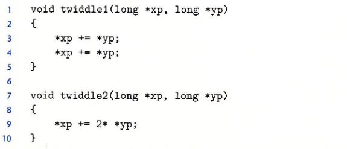

第一眼，两个程序执行的行为是相同的，都是将yp指向位置值的两倍加到xp指向位置的值上，并写到xp位置；但是twiddle1是需要作两次读xp位置数据、两次读yp位置数据、两次写xp位置；而twiddle2是需要作一次读yp、一次读xp、一次写xp，因此相对来说twiidle2是更容易编译成更高效的代码

但是需要考虑一种`内存别名使用memory aliasing`的情况，假如xp、yp均指向同一个位置，那么twiddle1最后的结果是4\*xp，twiddle2是3\*xp，导致编译器对twiddle1的优化一定不会产生twiddle2风格的代码——这也是一个`妨碍优化Optimization blockers`的因素：如果编译器无法确定两个指针是否可能被别名，则必须假设这两种情况都是可能的，从而限制了可能的优化集合

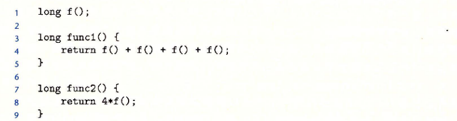

再考虑上面两个函数， 第一眼看上去func1和func2执行的行为是一样的，但是func1需要调用4次f，而func2只需要调用1次。但是因为函数调用可能会改变全局程序状态，那么假如f内容如下：

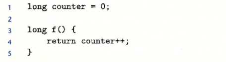

func1执行完成后结果是0+1+2+3=6，而func2是4\*0=0，因此编译器并不能够将func1编译成func2风格的代码。因此这也是一个`Optimization Blockers`——函数调用对全局状态的改变

> 用内联函数inline替换优化函数调用
>
> 包含函数调用的代码可以用一个称为“`内联函数替换inline substitution`”的过程进行优化，即将函数调用替换为函数体
>
> 以上述的func1为例，内联展开代码如下：
>
> ```c
> long func1_in(){
>   long t = counter++;
>   t += counter++;
>   t += counter++;
>   t += counter++;
>   return t;
> }
> ```
>
> 内联转换既减少了函数调用的开销，也允许对展开的代码作进一步的优化，例如对func1\_in统一t的计算和counter的更新，可以得到和func1完全一致的行为的函数如下：
>
> ```c
> long func1_inOpt(){
>   long t = 4 * counter + 6;
>   counter += 4;
>   return t;
> };
>
>
> ```
>
> 在GCC中，我们可以使用-finline、-O1或更高级别的优化来得到这种优化。但是具有以下缺点：
>
> 1.  GCC只支持在单个文件中定义的函数的内联
> 2.  当对某个函数调用使用了内联，则无法在该函数调用上使用断点和跟踪
> 3.  当对某个函数调用使用了内联，则无法使用代码剖析来分析函数调用

> 📌大多数编译器不会去判断函数是否没有副作用，因此可能会将func1优化成为func2的风格
> 编译器会做的是假设函数具有副作用并保持函数调用不变
>
> 在编译器中，gcc 的优化能力被认为是足够的，但并不是特别出色。它执行基本的优化，但不会像更“激进”的编译器那样对程序执行根本性的转换。因此，使用 gcc 的程序员必须投入更多精力来编写程序，以简化编译器生成高效代码的任务

# 5.2 *Expressing Program Performance*

引入度量标准`CPE`（每元素的周期数Cycles Per Element）作为一种表示程序性能并指导我们改进代码的方法，适用于需要执行重复计算的程序

处理器的活动是由时钟控制的，时钟通常是用千兆赫兹`GHz`即十亿周期每秒来表示，时钟周期的时间是时钟频率的倒数，通常是以`ns/ps`来表示

例如，一个4GHz的时钟，周期是0.25ns

一般从程序员的角度来看，用时钟周期而不是ps/ns来表示更有帮助；而用时钟周期表示，度量值是在这个周期内执行了多少条指令，而不是时钟执行得多快

下面以两个函数为例，介绍CPE的运算：

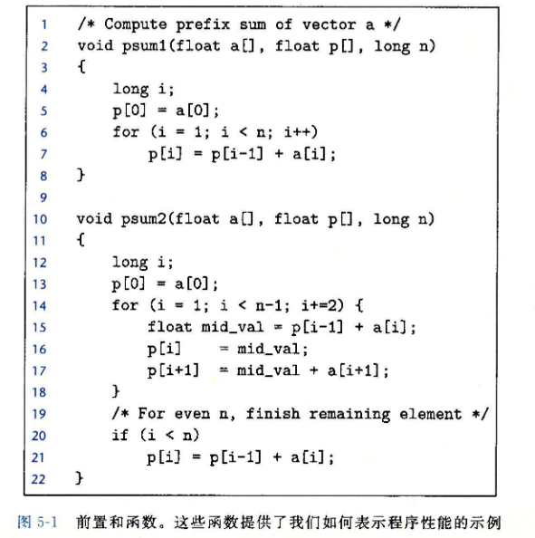

上面两个函数是求一个长度为n的向量的前置和，前置和的定义如下：

$$
\begin{array}{l}p_{0}=a_{0} \\ p_{i}=p_{r-1}+a_{i}, \quad 1 \leqslant i<n\end{array}
$$

psum1每次迭代计算结果向量中的一个元素，而psum2适当地进行循环展开，每次迭代计算两个元素


执行psum1和psum2所需要的时间可以用一个常数加上一个与被处理元素个数成正比的因子来描述，如下图。采用最小二乘法拟合函数方程，可以得到psum1的时间方程是$y=9.0n+368$，psum2所需的时间方程是$y=6.0n+368$。则**一元一次方程的系数即为对应函数的CPE，偏置量是表示代码计时、初始化过程、准备循环和完成过程的开销**

> 最小二乘法
>
> 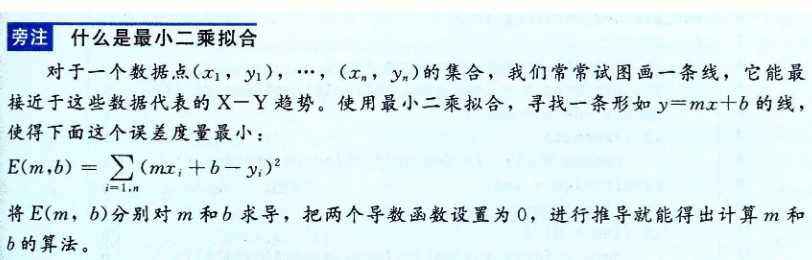

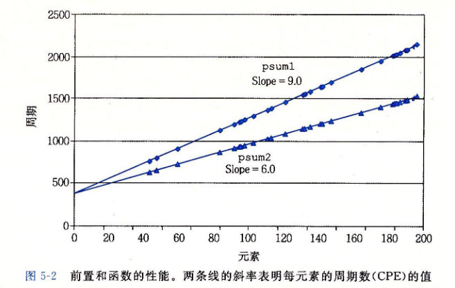

# 5.3 *Program Example*

使用基于下图的向量数据结构的运行实例，来说明一个程序是如何被系统地转换成更有效的代码

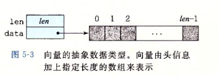

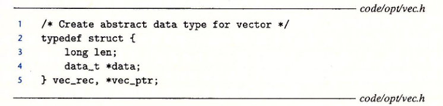

向量由两个内存块表示：头部和数据数组

头部是一个结构体，结构体中有两个成员：数据数组长度len和指向数据数组的指针data

数据数组是data\_t类型的指针，data\_t[^注释4]可以由`#typedef`宏定义

下图是给出的一些生成向量、访问向量元素和确定向量长度的基本过程：

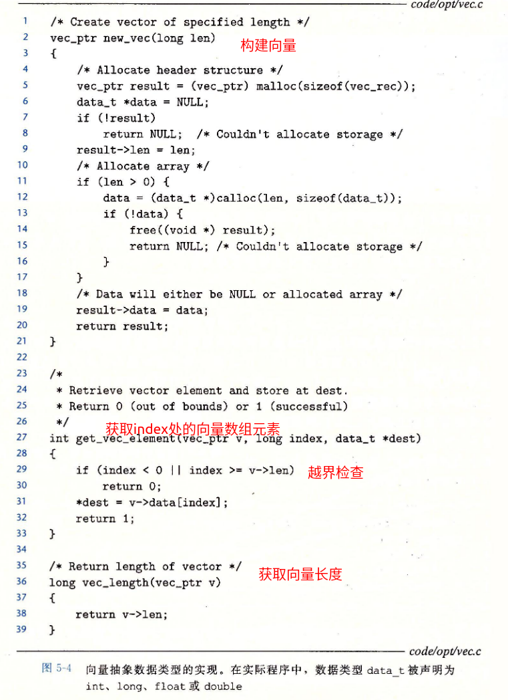

假设需要基于向量结构求数组的累加和以及累积，那么可以利用`#define`宏定义构造下列代码优化这一函数的实现

```c
#define IDENT 0//求累积时，该值为1
#define OP　+//求累积时，该值为*
/*
* vec_ptr是向量结构变量
* dest是存储结果位置指针
*/
void combine1(vec_ptr v,data_t *dest){
  long i;
  *dest = IDENT;
  for ( i = 0 ; i < vec_length(v) ; ++i ){
      data_t val;
      get_vec_element(v,i,val);
      *dest = *dest OP val;
  } 
}

```

之后会对这段代码进行一系列的变化，写出这个函数的不同版本，并评估性能变化

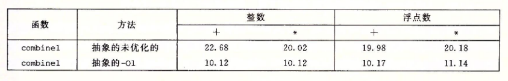

# 5.4 *Eliminating Loop Inefficiencies——Code Motion*

可以观察到combine1的循环中每次均需要调用vec\_length函数去获得向量数据数组的长度，但是这个值在整个过程中是不会改变的，因此可以只需要调用vec\_length一次，获得向量数据数组长度，修改版本如下：

```c
#define IDENT 0//求累积时，该值为1
#define OP　+//求累积时，该值为*
/*
* vec_ptr是向量结构变量
* dest是存储结果位置指针
*/
void combine2(vec_ptr v,data_t *dest){
  long i;
  long length = vec_length(v);
  *dest = IDENT;
  for ( i = 0 ; i < length ; ++i ){
      data_t val;
      get_vec_element(v,i,val);
      *dest = *dest OP val;
  } 
}
```

其CPE结果如下图

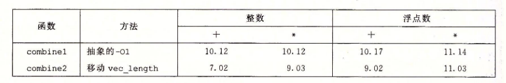

这种优化是一类称为“`代码移动`”的优化的一个例子，这类优化将要执行多次但计算结果不会改变的计算移动到不会被多次求值的部分（例如循环）

> 📌编译器会尝试着进行代码移动。不过正如之前讨论的一样，编译器不会去判断函数是否具有副作用，从而做最坏的打算——假设它具有副作用并保证函数调用不变。因此可能并不会将combine1优化成combine2的风格，因此程序员必须帮助编译器显式完成代码的移动

> 一个更坏的例子是下面的大写转小写函数
>
> 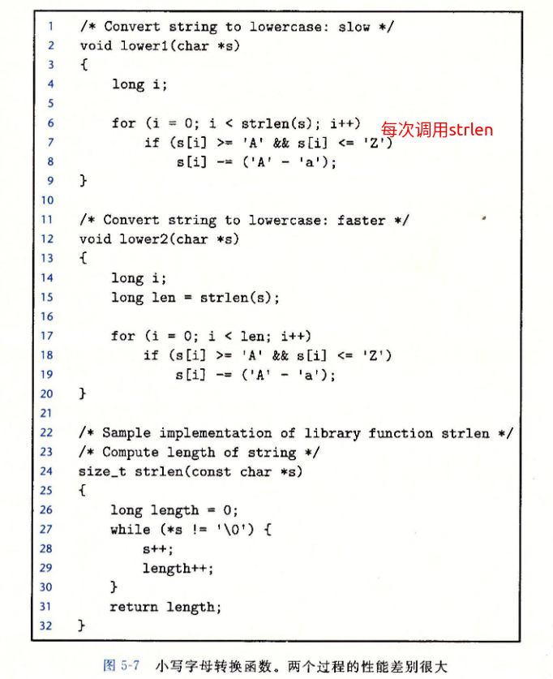
>
> lower1每次循环均需要调用strlen函数，假设字符串长度为n，则lower1需要的时间是n的二次项函数，而lower2是n的一次项函数
>
> 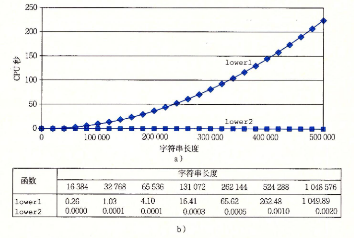
>
> n每次增加一倍，lower1需要的时间增加至约4倍，lower2需要的时间增加至约2倍
>
> 编译器并不能够将strlen函数优化进行代码移动，因为每次lower1每次调用strlen，字符串s均是发生变化的，编译器需要探测这些变化

# 5.5 *Reducing Procedure Calls*

**过程调用会带来开销，且会妨碍大多数形式的程序优化**

C 代码块从该代码块可以看出，每次循环迭代都会调用get\_vec\_element函数来获取下一个向量元素，且在这个函数内部会对索引i进行边界检查，**造成低效率**。而在每次循环迭代时的i是已经满足在0\~length-1的，因此边界检查是多余的

因此可以对原combine2代码修改如下

1.  直接获取数组元素的首地址，采用数组索引的方式进行访问，即可减少对get\_vec\_element函数的过程调用
2.  直接获取数组元素长度，减少对vec\_length函数的过程调用

```c
#define IDENT 0//求累积时，该值为1
#define OP　+//求累积时，该值为*
/*
* vec_ptr是向量结构变量
* dest是存储结果位置指针
*/
void combine3(vec_ptr v,data_t *dest){
  long i;
  long length = v->length;
  data_t *data = v->data;
  *dest = IDENT;
  for ( i = 0 ; i < length ; ++i ){
      *dest = *dest OP data[i];
  } 
}
```

但是可以得到combine3的性能并没有比combine2性能好很多，甚至整数是有下降的

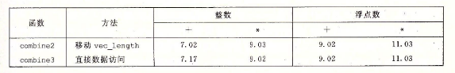

这个原因是：

# 5.6* Eliminating Unneeded Memory References*

> 📌从源程序的汇编程序入手，消除掉一些不必要的内存读写的汇编代码，然后再由该汇编代码得到C程序

将combine3程序（data\_t为double,OP为\*）汇编得到如下的汇编代码

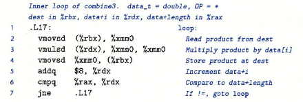

通过这段汇编代码可以得到：在.17过程内部，首先读累积变量dest指针%rbx位置的数据到%xmm0，然后将data索引的指针%rdx位置的数据与%xmm0相乘并写入%xmm0，紧接着将运算的结果写回(%rbx)，之后即增加循环变量索引，并进行循环条件的比较

可以很明显的发现，每次循环过程中读的(%rbx)就是之前写的%xmm0，因此并不需要每次循环都读(%rbx)写(%rbx)，所以可以消除这对“对(%rbx)的读写”[^注释5]对该汇编代码修改如下：

```nasm
     vmovsd (%rbx),%xmm0
.loop_revise:
     vmulsd (%rdx),%xmm0,%xmm0
     addq $8,%rdx
     cmpq %rax,%rdx
     jne .loop_revise
     vmosd %xmm0,(%rbx)

```

该汇编代码经过反汇编得到的源程序如下：

```c
#define IDENT 0//求累积时，该值为1
#define OP　+//求累积时，该值为*
/*
* vec_ptr是向量结构变量
* dest是存储结果位置指针
*/
void combine4(vec_ptr v,data_t *dest){
  long i;
  long length = v->length;
  data_t *data = v->data;
  data_t res_temp = IDENT;//用寄存器暂存中间结果
  for ( i = 0 ; i < length ; ++i ){
      res_temp = res_temp OP data[i];
  } 
  *dest = res_temp;
}
```

最终得到的程序的性能测试如下：

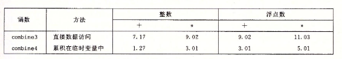

编译器并不能够将combine3自动编译成combine4的风格，因为会存在内存别名使用造成的问题

例如，对于整数数据，运算OP为乘法\*，标识元素IDENT为1。则对于下面两个函数调用：

```c
//v=[2,3,5]
combine3(v,get_vec_start(v)+2);//将结果写在v[2]
combine4(v,get_vec_start(v)+2);

```

那么combine3就会存在一个对同一个内存块的两种引用方法——内存别名，即data\[2]和\*dest

就会导致下面的问题：

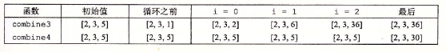

> 📌所以编译器并不能够判断函数会在什么情况下被调用，以及程序员的本意可能是什么
> 编译器会做的是采用保守的方法编译combine3——循环迭代中不断地读和写内存

# 5.7* Understanding Modern Processors*

之前所做的“代码移动”、“减少过程调用”、“消除不必要的内存引用”的优化都是不需要依赖于目标机器的任何特性的。这些优化只是简单地降低了过程调用的开销，以及消除了一些会给优化编译器造成困难的重大的“妨碍优化的因素”。随着试图进一步提高性能，必须考虑利用处理器微体系结构的优化，也就是处理器用来执行指令的底层系统设计

> 📌要想充分地提高性能，那么就既需要分析程序——做前面那些减少过程调用和消除妨碍优化的因素外的优化，也需要根据目标机器对代码进行调整

用于描述程序的最大性能的两种下界：

1.  延迟界限：
2.  吞吐量界限：

延迟界限能够限制程序的性能，吞吐量界限是程序性能的终极限制

## 5.7.1 整体操作

现代处理器的一个非常简单的示意图如下，这种处理器在工业界称为“超标量处理器”，指令顺序发射乱序执行。整个设计包括两个主要部分：指令控制单元ICU和执行单元EU

ICU：负责从内存中读出指令序列，并根据这些指令序列生成一组针对程序数据的基本操作

ICU会从指令高速缓存[^注释6]中取指，遇到分支时采用分支预测[^注释7]技术，投机执行[^注释8]的技术
分支预测技术+投机执行技术由取指控制单元管理

退役单元`Retirement unit`记录正在进行的运算，并确保它遵守机器级程序的顺序语义。指令译码时关于指令的信息会被放置在一个先进先出的队列中，这个信息会一直保存在队列中，直到要么这条指令操作完成，而且所有引起这条指令的分支点也都预测正确，那么这条指令就可以退役，它的结果也都可以写回寄存器或者内存；要么引起该指令的某分支点预测错误，这条指令就会被清空

EU：执行ICU所生成的操作

读写内存是通过加载和存储单元实现的。加载单元从内存读数据到处理器；存储单元从处理器写数据到内存；加载和存储单元内部都有一个加法器，用来进行地址的计算

使用投机执行技术时EU的运算结果不会写回寄存器堆和存储器，直到能够确认这些分支目的处指令能够被正确执行时才写回这些结果，但存在数据相关的指令结果是可以直接在各指令的执行阶段之间直接传递的[^注释9]；分支操作被送往EU并不是为了计算分支地址只是为了判断分支预测是否正确

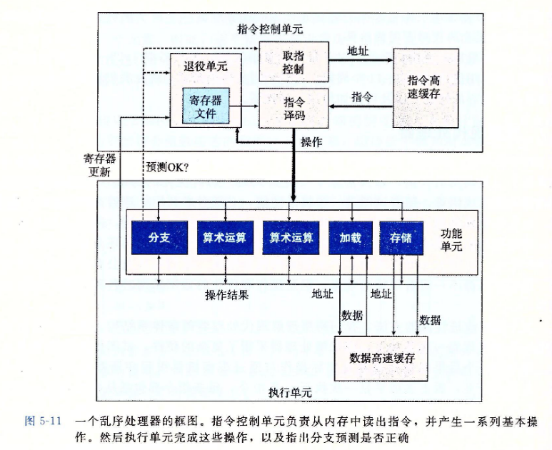

## 5.7.2 功能单元的性能

对每个运算采用以下三个数值来刻画：延迟，发射时间，容量

延迟：表示完成运算所需要的总时间

发射时间：表示两个连续的同类型的运算之间需要的最小时钟周期数，其倒数为最大吞吐量
&#x20;       发射时间为1的功能单元是完全流水线化的
&#x20;       延迟时间=发射时间，表明只有当上一个除法操作完全结束时，才能进行下一个除法操作

容量：表示能够执行该运算的功能单元的数量

具有多个功能单元可以进一步提高吞吐量：对一个容量为C，发射时间为I的操作来说，处理器可能获得的吞吐量是每时钟周期C/I个操作

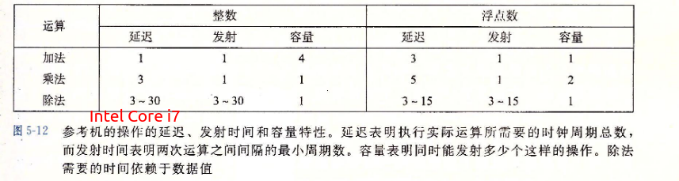

这些算术运算的延迟、发射时间和容量会影响合并函数的性能。我们用CPE值的两个基本界限来描述这种影响：

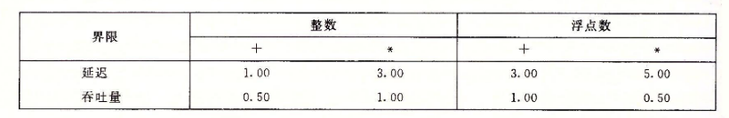

延迟界限给出了任何必须按照严格顺序完成合并运算的函数所需要的最小的CPE
根据功能单元产生结果的最大速率，吞吐量界限给出了CPE的最小界限

## 5.7.3 处理器操作的抽象类型

使用程序的数据流的图形化表示方法来分析在现代处理器上执行的机器级程序性能

数据流图可以展现不同操作之间的数据相关是如何限制它们的执行顺序的，这些限制构成了数据流图中的`关键路径critical path`——执行一组机器指令所需时钟周期数的下界

回顾combine4函数的CPE（延迟界限、吞吐量界限）

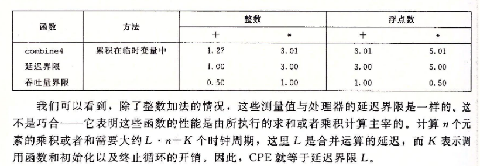

#### 从机器级代码到数据流图

以数据类型为double、合成运算为乘法的combine4为例，它所涉及到的循环语句[^注释10]的汇编语言如下

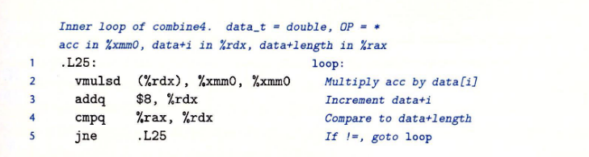

%xmm0寄存器中存储的是累积值，%rdx存储的是数组第i个元素的索引，%rax是指向数组末尾的指针

1.  图形化表示内循环代码，指令动态地被翻译为一个或两个操作。每个操作都从其他操作或寄存器接收值，并为其他操作和寄存器生成值

    combine4的4条汇编指令被翻译为5个操作（乘法翻译为load+mul），所涉及到的寄存器包括%rax,%rdx,%xmm0。可以得到下图：

    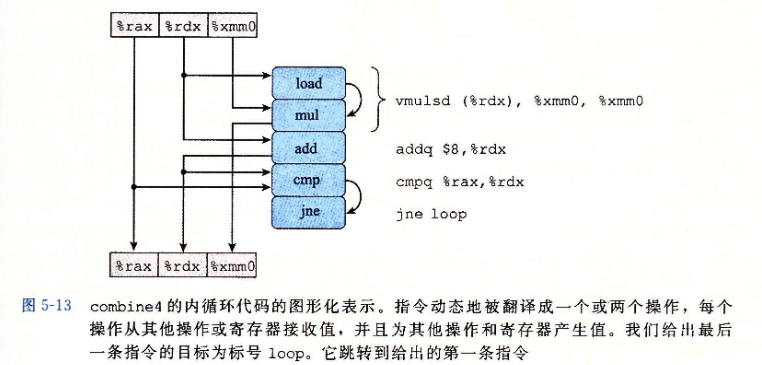

    %rax并没有改动，直接产生最后的%rax，且%rax需要作为cmp操作的源操作数

    %rdx需要作为load和add操作的源操作数，且add产生的结果需要写回%rax，这个结果也需要被cmp操作使用

    %xmm0需要作为mul的源操作数，且mul产生的结果需要写回%xmm0

    操作的中间隐式结果也需要在操作之间传递：load读出的结果需要作为mul的另一个源操作数，cmp所设置的条件码需要作为jne的判断条件
2.  改进内循环代码的程序流图

    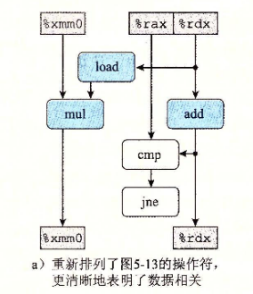
3.  结合每次循环的特性，产生迭代代码程序流图

    cmp、jne操作只作为最后的比较，因此每次迭代中只需要使用load、mul、add即可，涉及到的寄存器也只有循环寄存器和只写寄存器%xmm0、%rax

    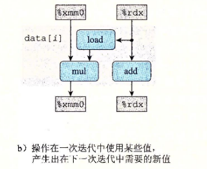
4.  迭代多次内循环，得到数据流表示

    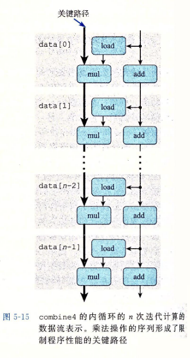

    有两条数据流，乘法产生累积变量以及加法产生数组索引

    假设浮点乘法延迟为5个周期，而整数的加法延迟只需要1个周期，那么左边的链会成为关键路径，因此combine4的延迟界限为5

> 📌对于形成循环的代码片段，可以将访问到的寄存器分为四类：
>
> 1.  只读：这些寄存器只用作源值，在循环中不会被修改
> 2.  只写：这些寄存器作为数据传送操作的目的
> 3.  局部：只在本次循环内部被修改和使用，每次循环之间并不相关
> 4.  循环：对于循环来说，这些寄存器既作为源值，又作为目的，一次迭代中产生的值会在领一次用到
>
> 对于所有情况，如果运算的延迟$T=L\times n +K$，L大于1，那么可以看到测量出来的CPE就是L,表明这个链是制约性能的关键路径。

#### 其他性能因素

对于整数加法的情况，我们对combine4的测试表明CPE为1.27，而根据沿着图5-15中左边和右边形成的相关链预测的CPE为1.00，测试值比预测值要慢。这说明了一个原则，那就是数据流表示中的关键路径提供的只是程序需要周期数的下界。还有其他一些因素会限制性能，包括可用的功能单元的数量和任何一步中功能单元之间能够传递数据值的数量。对于合并运算为整数加法的情况，数据操作足够快，使得其他操作供应数据的速度不够快

# 5.8 *Loop Unrolling*

循环展开是一种程序变换，是通过增加每次迭代计算的元素的数量，减少循环的迭代次数

循环展开可以减少不直接有助于程序结果的操作的数量

循环展开可以进一步的变化代码，减少整个计算中关键路径上的操作数量

可以采用每次循环处理数组中的两个元素优化combine4，来缩短循环次数，代码如下：

```c
//2 x 1 loop unrolling 
void combine5(vec_ptr v,data_t *dest) {
  long i;
  long length = vec_length(v);
  long limit = length-1;
  data_t *data = get_vec_start(v);
  data_t acc = IDENT;
  //Combine 2 elements at a time 
  for (i=0 ; i<limit ; i+=2){ //i从0到lengh-2
    acc=(acc OP data[i]) OP data[i+1];
  } 
  //Finish any remaining elements *
  for (;i<length;i++){ //如果length是偶数，那么就不会执行到这一步；如果length是奇数，那么就并没有计算length-1
    accacc OP data[i];
  }
  *dest = acc;
}
```

可以总结$K \times 1$循环展开的两次循环边界是：

```c
for (i=0;i<n-k+1;i+=k)
   ...

for (;i<length;++i)
   ...

```

展开次数k=2和k=3时代码的性能测量如下，从中可以得到整数加法的CPE有改进，但是其余基本没有改进。原因是：循环展开减少了循环的操作数量，CPE慢慢向整数加法的延迟界限靠近；而其余操作已经达到了延迟界限

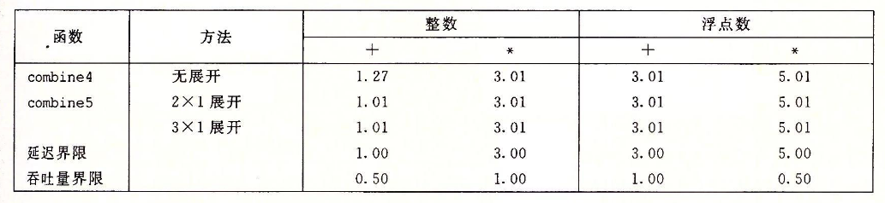

而为什么$K\times1$循环展开不能将性能改进超过延迟界限，原因如下：

k=2的combine5内循环汇编代码如下：

```c
Inner loop of combine5.  data_t = double,OP = *
i in %rdx,data in %rax,limit in %rbx,acc in %xmm0
.L35:
  vmulsd (%rax,%rdx,8),%xmm0,%xmmO #Multiply acc by data[i]
  vmulsd 8(%rax,%rdx,8),%xmm0,%xmmO #Multiply acc by data[i+1]
  addq $2,%rdx #Increment i by 2
  cmpq %rdx,%rbp #Compare to limit和i
  jg .L35 #If >,goto loop
```

对应的数据流图如下：

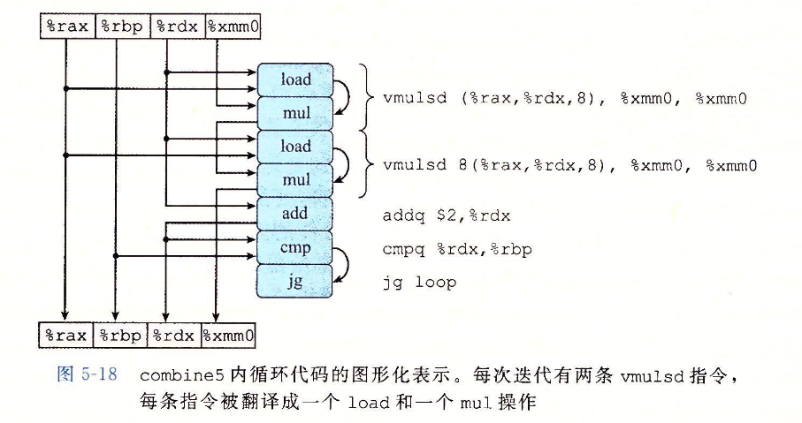

重新排列，简化为下图：

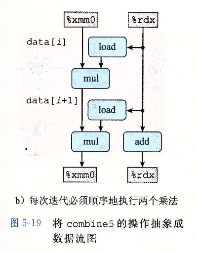

重复n/2次得到下图，可以看到关键路径上仍是有n个乘法，因此不能超过乘法的延迟界限

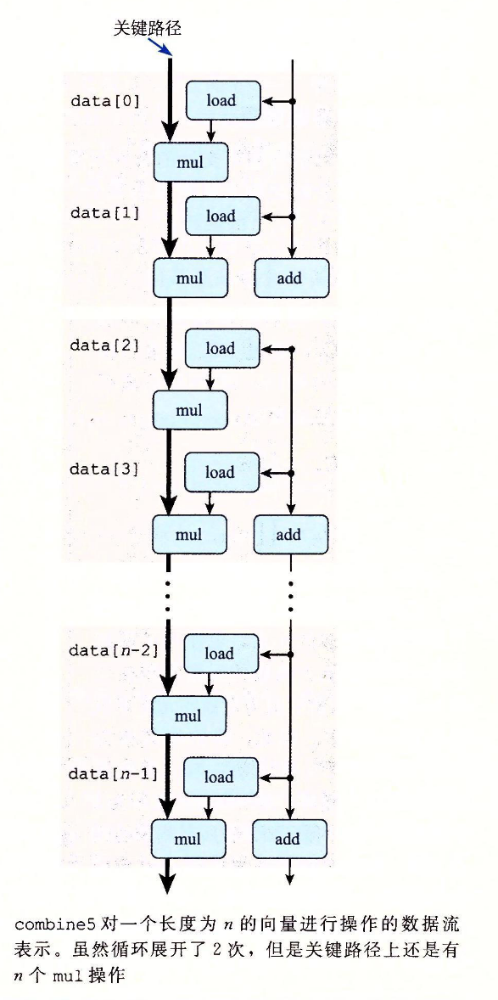

> 📌编译器是很容易进行循环展开的，一般用优化等级3或者更高等级调用GCC，就会执行循环展开

# 5.9 *Enhancing Parallelism*

## 5.9.1 多个累积变量

因为之前的函数实现将累积值放在一个单独的变量acc中导致在前面的计算完成之前都不能够计算acc新值，所以代码并不具备并行执行的能力——因此接下来使用**多个累积变量**的方法

对于一个可结合和可交换的合并运算（整数加法、乘法等）来说，可以通过**将一组合并运算分割成两个或者更多的部分，并在最后合并结果来提高性能**

例如：$P_n$表示元素$a_{0}, a_{1}, \cdots, a_{n-1}$的乘积$P_n = \prod _{i=0} ^{n-1} a_i$。若假设n为偶数，可以将$P_n$写成$P_n=P_{En} \times P_{On}$，其中$ P_{E_n}=\prod _{i=0} ^{\frac{n}{2}-1} a_{2i}  $是索引值为偶数的元素的乘积、$ P_{On}=\prod _{i=0} ^{\frac{n}{2}-1} a_{2i+1}  $是索引值为奇数的元素的乘积

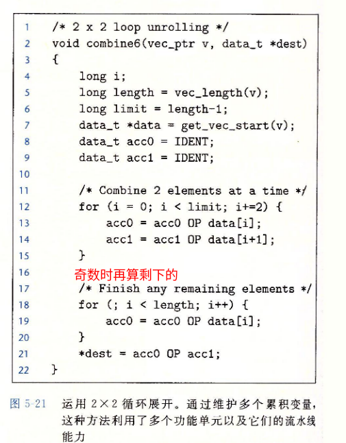

左图就是使用这种方法的代码，使用了两次循环展开求解

其测试性能如下，可以看到基本上所有的性能都有改进，除整数加法外，其余都改进了约2倍——打破了延迟界限

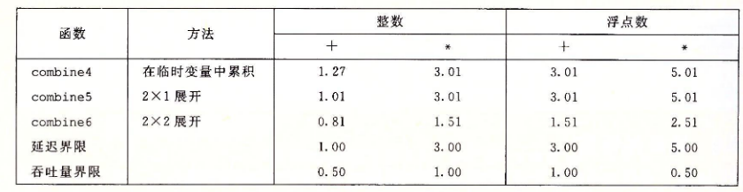

combine6的内循环汇编代码以及数据流图如下所示，OP为\*、TYPE为double

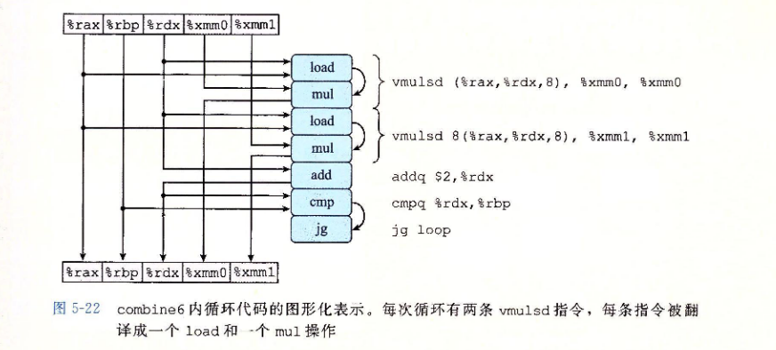

重新排列并简化得到下图5-23，将其重复n/2次即可以得到图5-24。图5-24中存在两条关键路径，每条路径做n/2次乘法，因此将延迟界限缩短到原来的一半

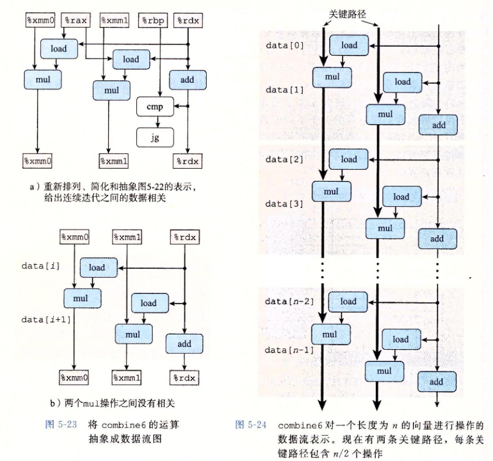

> 📌将多个累积变量的变换归纳为将循环展开k次以及并行累积k个值，得的k\*k循环展开
> 当k足够大时，程序在所有情况下几乎都可以达到吞吐量界限——对k的要求是需要使得能够执行该操作的所有功能单元的流水线都是满的，即**对延迟为L、容量为C的操作来说，循环展开因子k需要满足**$ k\geq L\times C  $
>
> 在执行k\*k循环展开变换时，必须要考虑所执行的操作是否是可交换和可结合的
>
> 整数加法和乘法的不嘛运算都是可交换、可结合的，因此优化编译器可以做这种优化来提高性能；但是浮点加法和乘法是不可结合的[^注释11]

## 5.9.2 重新结合变换

改变combine5内循环中acc和向量元素的合并顺序形成combine7

```c
//2 x 1a loop unrolling *
void combine7(vec_ptr v,data_t *dest){
  long i;
  long length = vec_length(v);
  long limit = length-1;
  data_t *data = get_vec_start(v);
  data_t acc = IDENT;
  //Combine 2 elements at a time *
  for (i 0;i<limit;i+=2){
    acc = acc OP (data[i] OP data[i+1]);
   }
  //Finish any remaining elements *
  for (; i<length ; ++i){
    acc=acc OP data[i];
  }
  *dest=acc;
}
```

即将$ acc = (acc \space OP \space data[i]) \space OP \space data[i+1];   $更改为$ acc = acc \space OP \space (data[i] \space OP \space data[i+1]);   $

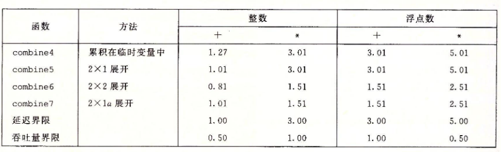

通过测量，可以从左图中得出，更改acc和数组元素的结合顺序对于除整数加以外的运算性能都有缩短为原来的一半，突破了延迟界限

下面对combine7内循环代码为何会突破延迟界限进行解释：

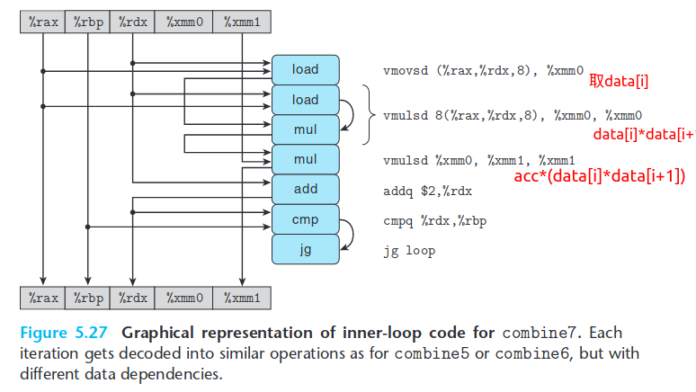

重新排列简化，得到下图5.28(a)，去掉循环的比较cmp、jg得到图5.28(b)。再重复n/2次得到图5-29如下

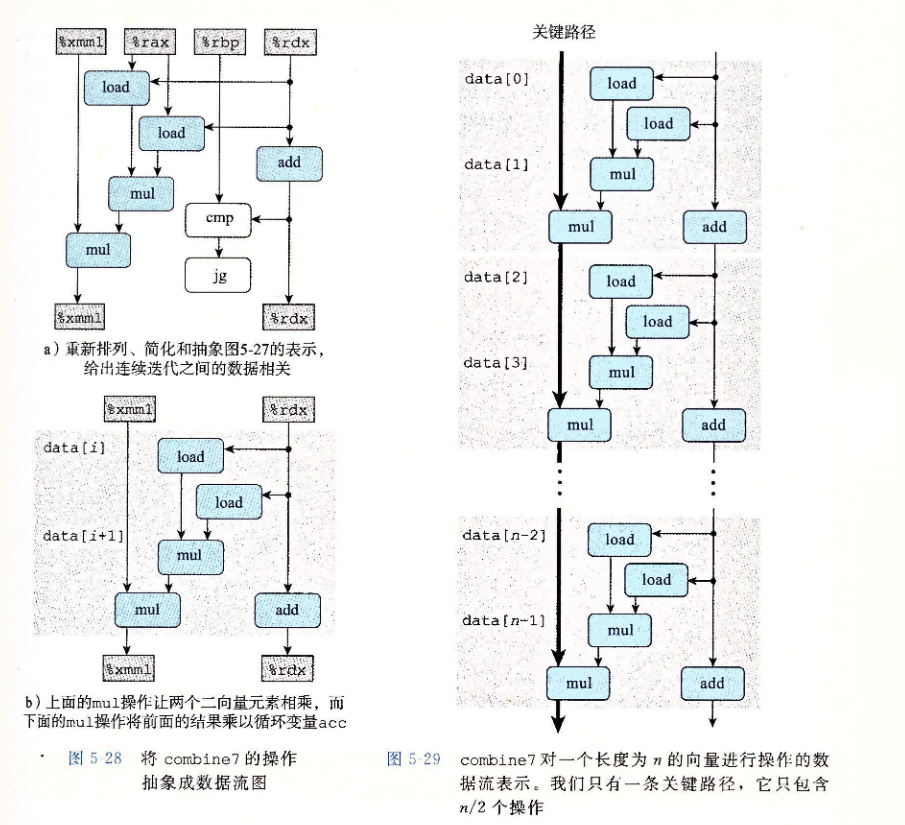

可以看到，关键路径上只有n/2个乘法——因为内部的乘法，不需要等待上一次迭代的累积值就可以进行。因此CPE缩小到了原来的两倍

> 📌重新结合变换这种方法也需要考虑运算的结合性和交换性，是否支持这种重新的变换
>
> 重新结合变换可以减少计算中关键路径上的操作数量，从而更好地利用功能单元的流水线能力得到更好的性能
>
> 大多数编译器不会尝试对浮点运算进行重新结合，当前的GCC版本会对整数进行重新组合

> 📌**一般来说，使用循环展开+多个累积变量这种**$K\times K$**的方法是提高程序性能的更可靠方法**

## 5.9.3 用向量指令达到更高的并行度

使用SSE[^注释12]的最新版本AVX[^注释13]这种SIMD执行模型

SIMD执行模型是用单条指令对整个向量数据进行操作，这些向量数据是保存在一组特殊的32字节的向量寄存器中，名字为%ymm0\~%ymm15

AVX指令可以对向量寄存器执行向量操作，比如并行执行8组数值或4组数值的加法或者乘法

例如，如果YMM寄存器%ymm0中包含8个单精度浮点数a0\~a7，而%rcx包含8个单精度浮点数的内存地址，这8个单精度浮点数是b0\~b7，那么指令vmulps (%rcx),%ymm0,%ymm1,即计算$ a_i\times b_i  $

GCC编译器支持对C语言的扩展，可以将程序中的向量操作编译成AVX的向量指令

# 5.10 优化合并代码的结果小结

## 5.11 一些限制因素


[^注释1]: 知道操作的时序信息，才能够确定是用一条乘法指令实现乘法，还是用移位和加法的某种组合来实现

[^注释2]: 关键路径是在循环的反复执行过程中形成的数据相关链

[^注释3]: 更专用的优化措施可以更多地提升程序的性能，但是它们也可能会扩大程序大小，使得程序更加难以调试

[^注释4]: 测试过程中data\_t被定义为整数(int/long)和浮点数(float/double)

[^注释5]: 每次迭代只需要读一次内存引用

[^注释6]: 存储的是最近经常访问的指令

[^注释7]: 猜测是否选择分支，预测分支的目标地址

[^注释8]: 预测分支成功——从分支目标地址处取指并执行，若在执行阶段确定预测错误，那么会将处理器状态重新设置为分支点的状态，并开始取出并执行不分支地址处的指令

[^注释9]: 使用寄存器重命名机制

[^注释10]: 对于大向量来说，最耗时的部分

[^注释11]: 假设，所有索引值为偶数的元素都是绝对值非常大的数，而索引值为奇数的元素都非常接近于0，那么即使最后的乘积和不会溢出，但乘积PE和PO也可能会上溢或者下溢

[^注释12]: Streaming SIMD Extensions

[^注释13]: Adavanced vector extension
