5 Optimizing Program
Performance
===========

## 目录

-   [英语](#英语)
-   [5.1 Capabilities and Limitations of Optimizing Compilers](#51-Capabilities-and-Limitations-of-Optimizing-Compilers)
    -   [5.1.1 编译器优化级别的选择](#511-编译器优化级别的选择)
    -   [5.1.2 限制编译器只执行安全的优化](#512-限制编译器只执行安全的优化)
-   [5.2 Expressing Program Performance](#52-Expressing-Program-Performance)
-   [5.3 Program Example](#53-Program-Example)
-   [5.4 Eliminating Loop Inefficiencies——Code Motion](#54-Eliminating-Loop-InefficienciesCode-Motion)
-   [5.5 Reducing Procedure Calls](#55-Reducing-Procedure-Calls)
-   [5.6 Eliminating Unneeded Memory References](#56-Eliminating-Unneeded-Memory-References)
-   [5.7 Understanding Modern Processors](#57-Understanding-Modern-Processors)

# 英语

1.  objective目标
2.  concise精简的
3.  make sense of弄懂，理解
4.  in real time实时地
5.  approach办法
6.  trade-off折中
7.  in a matter of times顷刻间
8.  modularity模块化
9.  susceptible敏感的，易受影响的
10. extensive大量的
11. elegance优雅
12. Ideally理想状态下
13. thwart阻挠
14. designate指定
15. metric度量
16. abbreviat缩写
17. systematically系统地
18. underlying潜在的
19. gauge测量
20. dramatic戏剧性的
21. proceed继续、进行

> 章简介
>
> 1.  编写高效程序需要做到以下几点：
>     1.  必须选择一组恰当的算法和数据结构
>     2.  必须编写出编译器能够有效优化的源代码，以便能够将其转换成高效可执行代码
>
>         对于第二点的实现，理解优化编译器的能力和局限性是十分重要的——编写方式中看上去只是一点小小的变动，都会引起编译器优化方式很大的变化
>     3.  针对计算量特别大的任务，将任务划分成多个部分，这些部分可以在多核和多处理器的某种组合上并行地计算
> 2.  通常来说程序员必须在实现和维护程序的简单性与它的运行速度之间做出权衡
>
>     在算法级上，几分钟就能编写一个简单的插入排序，而一个高效的排序算法程序可能需要一天或者更长的时间来实现和优化
>
>     在代码级上，许多低级别的优化往往会降低程序的可读性和模块性使得程序容易出错且难以修改和扩展
> 3.  即便是最好的编译器也受到妨碍优化的因素opyimization blockers的阻碍，妨碍优化的因素是指程序行为中那些严重依赖于执行环境的方面
> 4.  程序优化的步骤
>     1.  消除不必要的工作，让代码尽可能有效地执行所期望的任务——不依赖于目标机器的任何属性
>
>         这些不必要的工作包括：不必要的函数调用、条件测试和内存引用
>     2.  利用处理器提供的指令级并行能力，同时执行多条指令
>
>         优化第二步的实现需要了解处理器的运作——需要一个目标机器模型，指明如何处理指令以及各个操作的时序特性[^注释1]
>     3.  使用代码剖析程序（Profiler）来测量程序各部分性能，找到代码中效率最低的部分
> 5.  常常通过确认关键路径[^注释2]来决定执行一个循环所需要的时间（或者是时间下界）
> 6.  大多数编译器，包括GCC，一直都在更新和改进。一个很有用的策略是只重写程序到编译器由此就能产生有效代码所需要的程度就好——尽量避免损害代码的可读性、模块性和可移植性

# 5.1 *Capabilities and Limitations of Optimizing Compilers*

#### 5.1.1 编译器优化级别的选择

包括GCC在内的大多数编译器都为用户提供了一些对其应用的优化的控制，正如之前所讨论的，最简单的控制是优化级别——例如使用GCC的-Og参数可以调用一些最基本的优化；使用-O1,-O2可以调用一些更专用的优化措施[^注释3]

虽然-O2已经成为了目前大多数软件项目所接受的优化版本，但是本章将更多考虑使用-O1去编译代码。且会发现，编写更高效的C代码使用-O1编译得到的性能也优于使用更高优化级别去编译一个原始的C代码

#### 5.1.2 限制编译器只执行安全的优化

编译器的优化也必须保证最终得到的程序与原始未优化的程序对于程序可能遇到的所有情况，在C标准的保证下均采取完全相同的行为——使用安全的优化

限制编译器只进行安全的优化，消除了一些可能造成不希望的运行时行为的原因，但也意味着程序员必须花费更多的力气去写出编译器能够将之转换成有效机器代码的程序

为了理解判断一种程序转化是否安全的难度，考虑以下两个程序

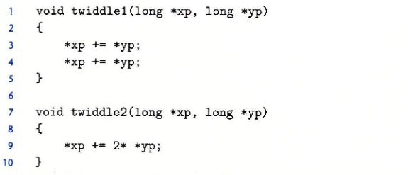

第一眼，两个程序执行的行为是相同的，都是将yp指向位置值的两倍加到xp指向位置的值上，并写到xp位置；但是twiddle1是需要作两次读xp位置数据、两次读yp位置数据、两次写xp位置；而twiddle2是需要作一次读yp、一次读xp、一次写xp，因此相对来说twiidle2是更容易编译成更高效的代码

但是需要考虑一种`内存别名使用memory aliasing`的情况，假如xp、yp均指向同一个位置，那么twiddle1最后的结果是4\*xp，twiddle2是3\*xp，导致编译器对twiddle1的优化一定不会产生twiddle2风格的代码——这也是一个`妨碍优化Optimization blockers`的因素：如果编译器无法确定两个指针是否可能被别名，则必须假设这两种情况都是可能的，从而限制了可能的优化集合

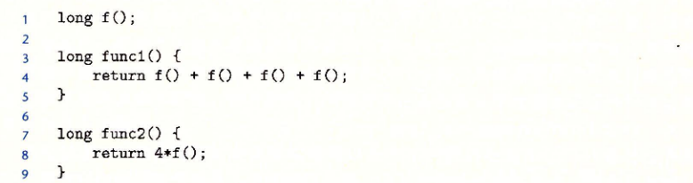

再考虑上面两个函数， 第一眼看上去func1和func2执行的行为是一样的，但是func1需要调用4次f，而func2只需要调用1次。但是因为函数调用可能会改变全局程序状态，那么假如f内容如下：

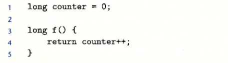

func1执行完成后结果是0+1+2+3=6，而func2是4\*0=0，因此编译器并不能够将func1编译成func2风格的代码。因此这也是一个`Optimization Blockers`——函数调用对全局状态的改变

> 用内联函数inline替换优化函数调用
>
> 包含函数调用的代码可以用一个称为“`内联函数替换inline substitution`”的过程进行优化，即将函数调用替换为函数体
>
> 以上述的func1为例，内联展开代码如下：
>
> ```c
> long func1_in(){
>   long t = counter++;
>   t += counter++;
>   t += counter++;
>   t += counter++;
>   return t;
> }
> ```
>
> 内联转换既减少了函数调用的开销，也允许对展开的代码作进一步的优化，例如对func1\_in统一t的计算和counter的更新，可以得到和func1完全一致的行为的函数如下：
>
> ```c
> long func1_inOpt(){
>   long t = 4 * counter + 6;
>   counter += 4;
>   return t;
> };
>
>
> ```
>
> 在GCC中，我们可以使用-finline、-O1或更高级别的优化来得到这种优化。但是具有以下缺点：
>
> 1.  GCC只支持在单个文件中定义的函数的内联
> 2.  当对某个函数调用使用了内联，则无法在该函数调用上使用断点和跟踪
> 3.  当对某个函数调用使用了内联，则无法使用代码剖析来分析函数调用

> 📌大多数编译器不会去判断函数是否没有副作用，因此可能会将func1优化成为func2的风格
> 编译器会做的是假设函数具有副作用并保持函数调用不变
>
> 在编译器中，gcc 的优化能力被认为是足够的，但并不是特别出色。它执行基本的优化，但不会像更“激进”的编译器那样对程序执行根本性的转换。因此，使用 gcc 的程序员必须投入更多精力来编写程序，以简化编译器生成高效代码的任务

# 5.2 *Expressing Program Performance*

引入度量标准`CPE`（每元素的周期数Cycles Per Element）作为一种表示程序性能并指导我们改进代码的方法，适用于需要执行重复计算的程序

处理器的活动是由时钟控制的，时钟通常是用千兆赫兹`GHz`即十亿周期每秒来表示，时钟周期的时间是时钟频率的倒数，通常是以`ns/ps`来表示

例如，一个4GHz的时钟，周期是0.25ns

一般从程序员的角度来看，用时钟周期而不是ps/ns来表示更有帮助；而用时钟周期表示，度量值是在这个周期内执行了多少条指令，而不是时钟执行得多快

下面以两个函数为例，介绍CPE的运算：

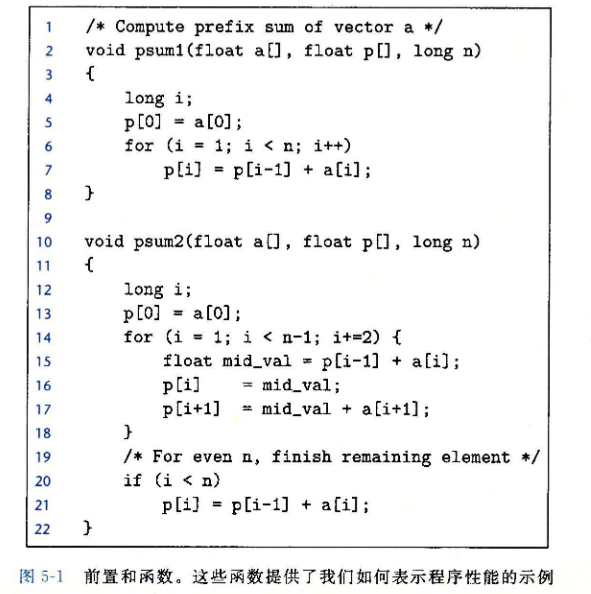

上面两个函数是求一个长度为n的向量的前置和，前置和的定义如下：

$$
\begin{array}{l}p_{0}=a_{0} \\ p_{i}=p_{r-1}+a_{i}, \quad 1 \leqslant i<n\end{array}
$$

psum1每次迭代计算结果向量中的一个元素，而psum2适当地进行循环展开，每次迭代计算两个元素

执行psum1和psum2所需要的时间可以用一个常数加上一个与被处理元素个数成正比的因子来描述，如下图。采用最小二乘法拟合函数方程，可以得到psum1的时间方程是$y=9.0n+368$，psum2所需的时间方程是$y=6.0n+368$。则**一元一次方程的系数即为对应函数的CPE，偏置量是表示代码计时、初始化过程、准备循环和完成过程的开销**

> 最小二乘法
>
> 

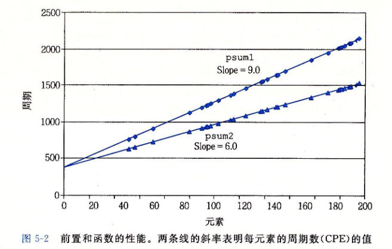

# 5.3 *Program Example*

使用基于下图的向量数据结构的运行实例，来说明一个程序是如何被系统地转换成更有效的代码

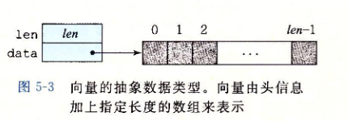

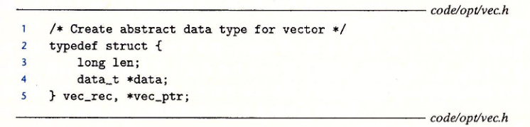

向量由两个内存块表示：头部和数据数组

头部是一个结构体，结构体中有两个成员：数据数组长度len和指向数据数组的指针data

数据数组是data\_t类型的指针，data\_t[^注释4]可以由`#typedef`宏定义

下图是给出的一些生成向量、访问向量元素和确定向量长度的基本过程：

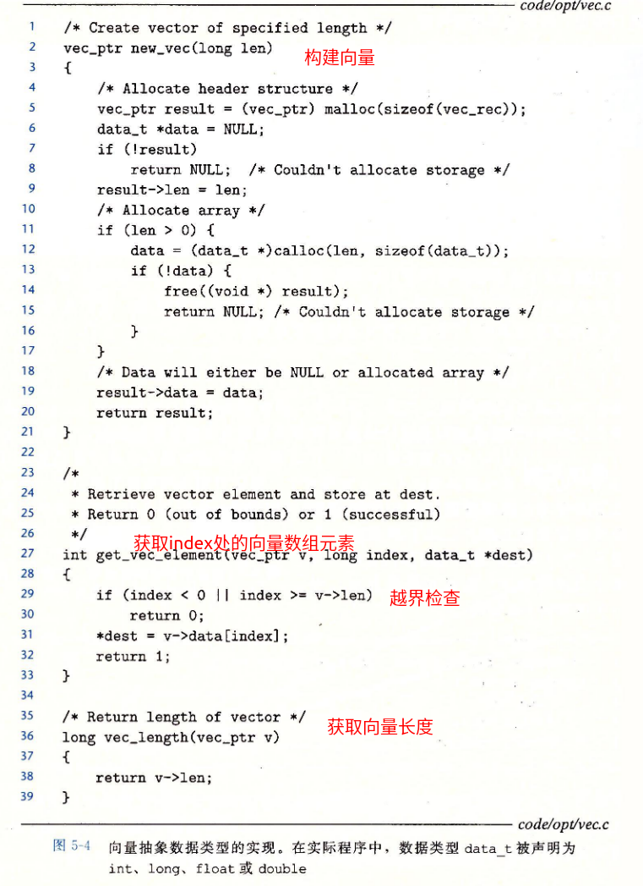

假设需要基于向量结构求数组的累加和以及累积，那么可以利用`#define`宏定义构造下列代码优化这一函数的实现

```c
#define IDENT 0//求累积时，该值为1
#define OP　+//求累积时，该值为*
/*
* vec_ptr是向量结构变量
* dest是存储结果位置指针
*/
void combine1(vec_ptr v,data_t *dest){
  long i;
  *dest = IDENT;
  for ( i = 0 ; i < vec_length(v) ; ++i ){
      data_t val;
      get_vec_element(v,i,val);
      *dest = *dest OP val;
  } 
}

```

之后会对这段代码进行一系列的变化，写出这个函数的不同版本，并评估性能变化

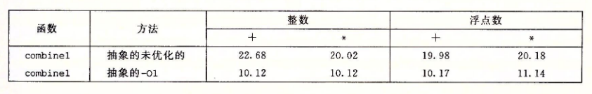

# 5.4 *Eliminating Loop Inefficiencies——Code Motion*

可以观察到combine1的循环中每次均需要调用vec\_length函数去获得向量数据数组的长度，但是这个值在整个过程中是不会改变的，因此可以只需要调用vec\_length一次，获得向量数据数组长度，修改版本如下：

```c
#define IDENT 0//求累积时，该值为1
#define OP　+//求累积时，该值为*
/*
* vec_ptr是向量结构变量
* dest是存储结果位置指针
*/
void combine2(vec_ptr v,data_t *dest){
  long i;
  long length = vec_length(v);
  *dest = IDENT;
  for ( i = 0 ; i < length ; ++i ){
      data_t val;
      get_vec_element(v,i,val);
      *dest = *dest OP val;
  } 
}
```

其CPE结果如下图

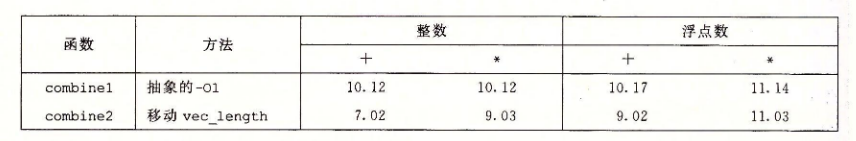

这种优化是一类称为“`代码移动`”的优化的一个例子，这类优化将要执行多次但计算结果不会改变的计算移动到不会被多次求值的部分（例如循环）

> 📌编译器会尝试着进行代码移动。不过正如之前讨论的一样，编译器不会去判断函数是否具有副作用，从而做最坏的打算——假设它具有副作用并保证函数调用不变。因此可能并不会将combine1优化成combine2的风格，因此程序员必须帮助编译器显式完成代码的移动

> 一个更坏的例子是下面的大写转小写函数
>
> 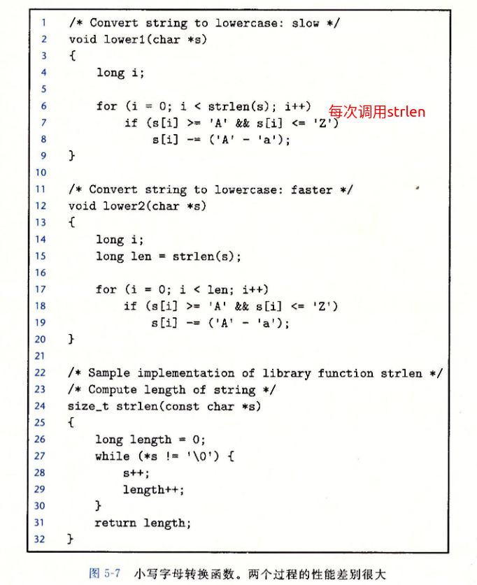
>
> lower1每次循环均需要调用strlen函数，假设字符串长度为n，则lower1需要的时间是n的二次项函数，而lower2是n的一次项函数
>
> 
>
> n每次增加一倍，lower1需要的时间增加至约4倍，lower2需要的时间增加至约2倍
>
> 编译器并不能够将strlen函数优化进行代码移动，因为每次lower1每次调用strlen，字符串s均是发生变化的，编译器需要探测这些变化

# 5.5 *Reducing Procedure Calls*

# 5.6\* Eliminating Unneeded Memory References\*

# 5.7\* Understanding Modern Processors\*

[^注释1]: 知道操作的时序信息，才能够确定是用一条乘法指令实现乘法，还是用移位和加法的某种组合来实现

[^注释2]: 关键路径是在循环的反复执行过程中形成的数据相关链

[^注释3]: 更专用的优化措施可以更多地提升程序的性能，但是它们也可能会扩大程序大小，使得程序更加难以调试

[^注释4]: 测试过程中data\_t被定义为整数(int/long)和浮点数(float/double)
